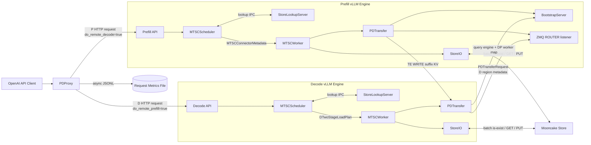
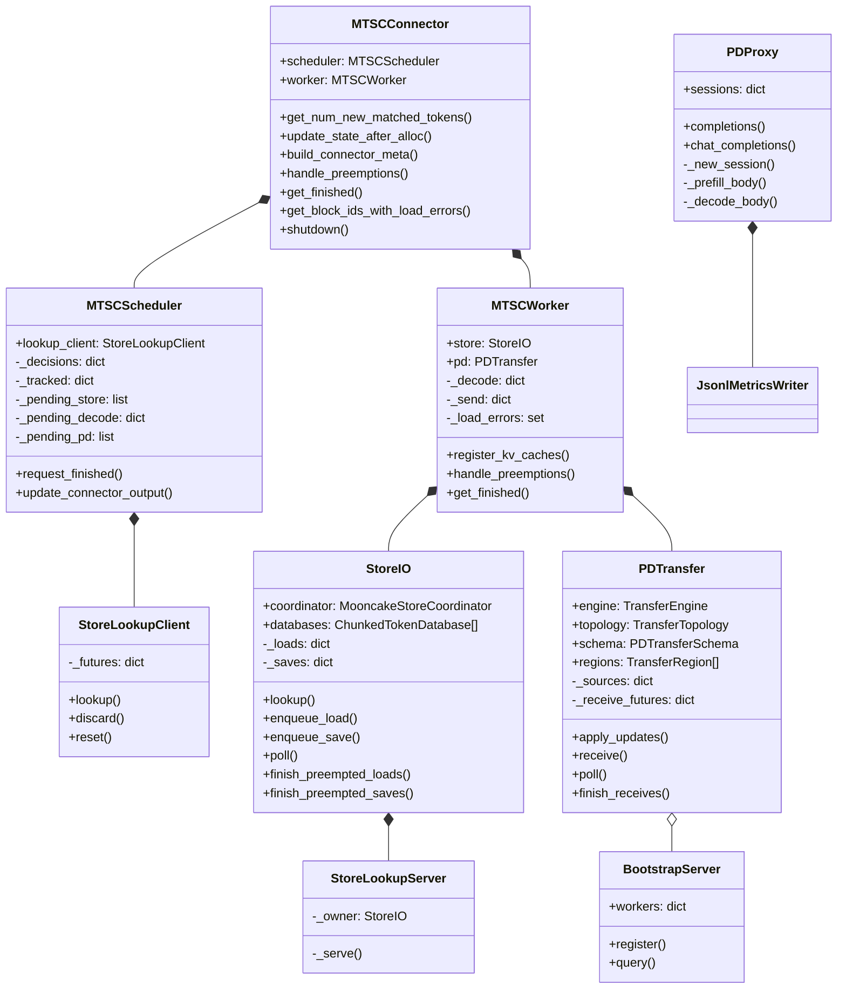
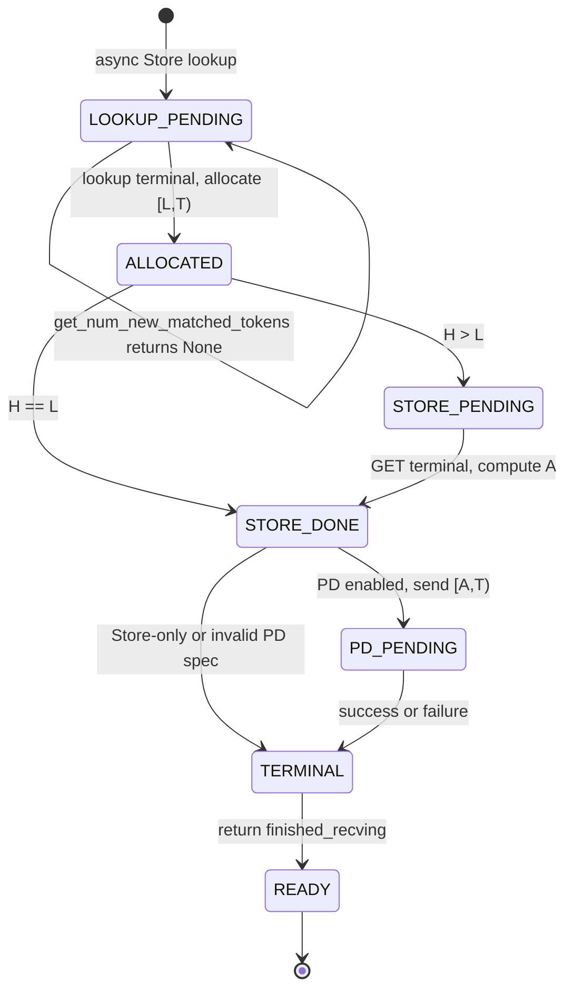
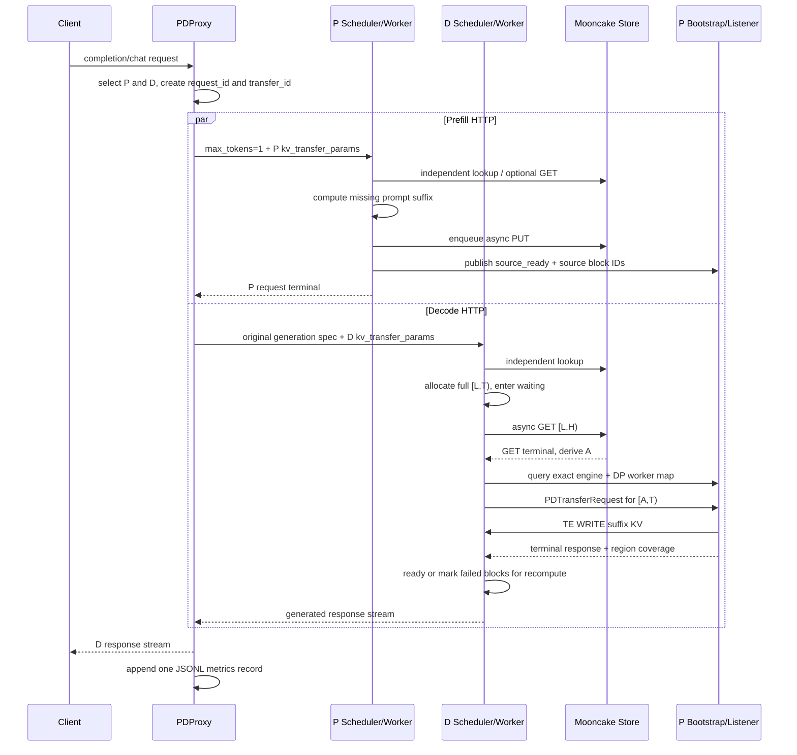

# MTSC 整体设计

> MTSC: Mooncake Two-Stage Connector  
> 文档状态：与当前代码实现同步

## 1. 背景

MTSC 是一个不依赖 UCS Control Plane 的 vLLM 外部 KV Connector。它把两条数据路径组合成一次 Decode external-load 生命周期：

1. Decode（以下简称 D）优先从 Mooncake Store 加载可复用的连续 prompt KV；
2. Store 未覆盖或实际 GET 失败的剩余 KV，由 Prefill（以下简称 P）通过 Mooncake Transfer Engine（TE）直接写入 D。

MTSC 参考 vLLM 原生 Mooncake PD Connector 和 Mooncake Store Connector，但不实例化、包装或委托给它们：

- Store 数据面直接使用 `MooncakeDistributedStore`；
- PD 数据面直接使用 `TransferEngine`；
- Store lookup RPC、GET/PUT future、P bootstrap、ZMQ listener、两阶段状态机和 completion ownership 均由 MTSC 自己实现；
- 只复用 vLLM 中无状态的 Store key/mask、KV cache layout 和 transfer topology helper。

vLLM 的 `MultiConnector` 不能表达“同一请求先由 Store 写入一部分 destination blocks，再由 P 写入剩余 blocks”，因此 MTSC 必须以单个复合 Connector 统一管理 block ownership、阶段切换和终态。

“D pull P”描述的是控制语义，真实数据方向是：

```text
D --PDTransferRequest(destination metadata)--> P listener
P --TransferEngine batch_transfer_sync_write--> D KV cache
P --PDTransferResponse-----------------------> D
```

## 2. 目标与实现边界

### 2.1 已实现目标

1. 不启动 UCS Catalog、Orchestrator 或 LoadPlan API。
2. P/D 共用同一个 `MTSCConnector`、`MTSCScheduler`、`MTSCWorker` 和 metadata protocol，根据 `kv_role` 与请求参数选择路径。
3. Proxy 并发投递 P/D 请求，为两侧分发相同且全局唯一的 `transfer_id`。
4. P 和 D 都能独立查询并异步加载 Mooncake Store；两侧不共享 lookup 结果。
5. D 一次性分配完整 external interval，严格执行 Store 阶段后再启动 PD 阶段。
6. Store GET 部分失败时，从首个失败 logical block 开始改由 P 覆盖；PD 再失败时把对应 block IDs 返回 vLLM 本地重算。
7. P 和 D 都支持 bulk async save；Decode save 可通过 `mtsc_decode_save` 关闭。
8. preemption、timeout、cancel 和 shutdown 都会 fence 可能访问 GPU block 的 Store/PD 操作，避免 block 回收后的 late read/write。
9. PD 支持整数倍异构 TP、异构 PP layer fan-out、精确 DP 路由、MLA replicated KV 和 region coverage 校验。
10. CUDA 与 Ascend 使用各自的 event、buffer registration 和 cache layout 适配路径。
11. Proxy 不重试后端请求，直接暴露错误，并异步写入每请求 JSONL metrics。

### 2.2 正确性不变式

- Store lookup pending 不是新的 request status，也不等于 `WAITING_FOR_REMOTE_KVS`。pending 时尚未分配 destination blocks，scheduler 返回 `(None, False)`，由 vLLM 稍后重试。
- D 只进入一次 `WAITING_FOR_REMOTE_KVS`。Store 和 PD 必须都进入终态，worker 才返回 `finished_recving`。
- Store lookup 命中只是候选边界；PD 的真实起点由 Store GET 的实际结果决定。
- 一个 Store logical block 只有在 topology namespace 下所有必需 TP/PP/PCP/DCP rank object 都存在时才算命中。
- PD 写入前必须通过 schema、TP/PP pairing、region identity、page length 和 exact coverage 校验。
- P source block 或 D destination block 仍可能被后台 I/O 访问时，不得交还 vLLM 重用。
- `kv_load_failure_policy` 必须是 `recompute`；任何 terminal load failure 都通过 invalid block IDs 回退本地计算，而不是永久等待。

### 2.3 当前能力边界

| 维度 | 当前实现 |
|---|---|
| 部署 | 以 1P1D 为主要部署形态；Proxy 可配置多个 P/D endpoint 并 round-robin，但没有动态负载、重选或重试 |
| DP | Proxy 将选中的 P DP rank 同时写入 HTTP header 和 D spec；D bootstrap 查询校验 exact engine ID + DP rank |
| TP | PD 支持 P/D TP 为整数倍关系；Store 通过 topology namespace 隔离不兼容拓扑，不跨异构 topology 复用 object |
| PP | PD 支持相同或不同 PP，通过 layer identity 取交集并聚合所有必需 P worker 响应；Store key/lookup 包含 PP rank |
| KV 类型 | FullAttention、MLA、Mamba/HMA 与多 KV cache group 均有对应代码路径；Mamba 只传 convolution state，最后一个 prompt token 在 D 重算 SSM state |
| 平台 | CUDA；Ascend normal/NZ、分离 K/V tensor、HCCL region registration 和整数倍异构 TP 重排 |
| Store save | 单个有序 PUT worker；GET worker 数可配置；当前不是“有界队列满则丢弃”模型 |
| 日志 | 关键路径使用 vLLM logger；完整 S04 trace system 尚未接入 connector stats hooks |

Ascend NZ layout 下会关闭 Decode Store save，避免把 Decode 物理布局写入 P/D 共用的 Store namespace。平台代码已适配，但仍需在目标 CANN/Mooncake 构建上完成生产级 NPU E2E 认证。

## 3. 总体架构

### 3.1 系统架构



系统中有三类彼此独立的平面：

1. Proxy 到 P/D 的 HTTP request plane；
2. scheduler-worker IPC、bootstrap HTTP 和 P/D ZMQ 的 metadata/control plane；
3. Mooncake Store GET/PUT 与 TE WRITE 的 KV data plane。

### 3.2 核心类图



`MTSCConnector` 只做 vLLM hook 适配和生命周期编排。长期请求状态在 scheduler/worker 中，Mooncake 资源 ownership 分别归 `StoreIO` 和 `PDTransfer`。

### 3.3 vLLM hook 映射

Scheduler side：

```text
get_num_new_matched_tokens
  -> StoreLookupClient lookup
  -> pending 返回 None；terminal 返回 external token 数

update_state_after_alloc
  -> 绑定 vLLM 已分配的 block IDs
  -> 生成 StoreRequest / DTwoStageLoadPlan / PDSendUpdate

build_connector_meta
  -> 将当前 schedule step 的 delta 封装为 MTSCConnectorMetadata
  -> 过滤 preempted request 的未发布 I/O

request_finished
  -> P 发布 source-ready 或 abort
  -> 为 Store save / PD send 返回 delay_free_blocks

update_connector_output
  -> 消费 finished_sending，清理 scheduler 长生命状态
```

Worker side：

```text
register_kv_caches
  -> StoreIO.register + PDTransfer.register

start_load_kv / wait_for_layer_load / save_kv_layer / wait_for_save
  -> 当前 bulk I/O 实现均为 no-op

get_finished
  -> 接收 metadata delta
  -> 发布/轮询 Store GET、Store PUT 和 PD transfer
  -> 返回 finished_sending / finished_recving

handle_preemptions
  -> fence Store PUT、Store GET 和 PD receive 后再允许 block 回收
```

I/O 集中在 `get_finished()`，而不是 layer hook。这与当前 bulk async load/save 设计一致，也使 D 能在 Store terminal 后再确定 PD suffix。

### 3.4 Scheduler-worker metadata

每个 schedule step 使用一个 `MTSCConnectorMetadata`：

```text
MTSCConnectorMetadata
  store_requests          Store GET/PUT specs
  decode_plans            D immutable two-stage plans
  pd_send_updates         P placeholder/source-ready/abort deltas
  send_requirements       request 的 Store/PD sending barrier
  finished_request_ids    vLLM finished requests
  preempted_request_ids   本 step 必须先 fence 的 requests
```

核心数据对象与当前 `mtsc/protocol.py` 对齐：

- `StoreLoadSpec(local_tokens, store_tokens, enabled)`；
- `StoreRequest(request_id, token_count, block_ids, block_hashes, load, save, save_from, token_ids, prompt_tokens)`；
- `DTwoStageLoadPlan(request_id, transfer_id, L, H, T, all_block_ids, external_block_ids, group_block_sizes, sliding_window, pd_enabled, wait_for_completion, kv_transfer_params)`；
- `PDSendUpdate(request_id, transfer_id, block_ids, source_ready, abort)`；
- `SendRequirement(store, pd)`。

metadata 是 scheduler 到 worker 的一次性 delta，不是跨请求共享的 Catalog，也不携带 Mooncake object descriptor。

### 3.5 Proxy session 与请求 Spec

Proxy 内部创建：

```text
request_id  = UUID
transfer_id = "xfer-" + request_id
```

`TransferSession` 只存在于 Proxy 内存，不会整体发送给 P/D。P 请求只增加：

```json
{
  "do_remote_decode": true,
  "do_remote_prefill": false,
  "transfer_id": "xfer-<request_id>"
}
```

D 请求增加：

```json
{
  "do_remote_decode": false,
  "do_remote_prefill": true,
  "remote_engine_id": "<selected-prefill-engine>",
  "remote_bootstrap_addr": "http://<prefill-bootstrap>",
  "remote_dp_rank": 0,
  "transfer_id": "xfer-<request_id>"
}
```

P request 固定为非流式、`max_tokens=1`；D 保留用户原始生成参数。Proxy 使用同一个 `X-Request-Id` 并发启动 P/D，P 失败、D 失败、首 token 超时或客户端取消都会形成明确终态，不执行 retry/attempt-id 逻辑。

### 3.6 Store key、lookup 与 topology namespace

`StoreIO` 使用 vLLM 的 `MooncakeStoreCoordinator`、`ChunkedTokenDatabase` 和 `PoolKey` 生成 object key。`KeyMetadata` 包含：

```text
model_name
cache_prefix
tp_rank
pp_rank
pcp_rank
dcp_rank
group_id
block_hash
```

MTSC 默认在用户 `cache_prefix` 后追加 `mtsc-v1-<sha256-prefix>` topology namespace。签名覆盖 model/revision、cache dtype/layout、TP/PP/PCP/DCP、block sizes、MLA 标志和 KV group schema，因此不兼容部署不会误命中彼此的 Store objects。

lookup 由 scheduler 的 `StoreLookupClient` 通过本机 ZMQ REQ/REP 调用 worker rank 0 的 `StoreLookupServer`。worker 使用 `batch_is_exist()` 检查所有必需 rank/group key，再通过 coordinator 计算最长连续命中：

```text
lookup pending  -> scheduler return (None, False)
lookup timeout  -> warning + reset REQ socket + treat as Store miss
lookup hit      -> return longest complete prefix
```

Store GET/PUT 是 worker 侧线程池任务：GET 可并发，PUT 使用单 worker 保证每个请求的 save high-water mark 有序。save 前记录 device event，后台线程同步 event 后才读取本 step 生成的 GPU KV。

### 3.7 D 两阶段状态方程

对一次 D 请求定义：

- `L`：D 本地 APC 已有的连续 prefix 终点；
- `H`：Store lookup 给出的候选 prefix 终点；
- `A`：Store GET terminal 后实际成功的连续 prefix 终点；
- `T`：remote prefill 需要覆盖的目标终点。

```text
0 <= L <= A <= H <= T

Stage 1 = Store GET [L,H)
Stage 2 = P TE WRITE [A,T)
Ready   = Store terminal AND PD terminal
```

若 Store block `f` 首次失败，则 `A` 截断到 `f` 对应 token 边界，P 从该 block 开始覆盖写入。`T` 不要求对 block size 向下取整，因此 prompt 最后一个未满 block 也包含在 `[A,T)` 的 PD suffix 中。



`LOOKUP_PENDING` 是图中的概念状态，不是新增的 `RequestStatus`。worker 实际保存的 `_DLoadState.stage` 只有 `STORE_PENDING`、`STORE_DONE` 和 `PD_PENDING`；terminal 后立即从 `_decode` 删除。

### 3.8 PD topology 与 wire protocol

P 每个 worker 启动一个 ZMQ ROUTER listener，并向 `BootstrapServer` 注册：

```text
(engine_id, dp_rank, tp_rank, tp_size, pp_rank, pp_size, listener address)
```

D 使用 `remote_bootstrap_addr + remote_engine_id + remote_dp_rank` 查询精确的 P worker map，要求 TP/PP ranks 完整注册，再通过 `handshake_target_ranks()` 选择与当前 D worker 对应的 P workers。

D 发出的 `PDTransferRequest` 与代码字段一致：

```text
hostname, rpc_port
tp_size, tp_rank, pp_size, pp_rank
schema
requests: decode_request_id -> (transfer_id, destination block IDs per group)
region_base_addresses
block_lengths, kv_block_lengths
layer_names, layer_indices, group_indices
```

`PDTransferSchema` 校验：

```text
topology_version
model_id, model_revision
cache_dtype, cache_layout
block_size
is_mla
```

P 根据 layer/group identity 对齐 source/destination regions，使用 `sender_transfer_plan()` 计算整数倍异构 TP 的 source/destination slice，然后调用 `batch_transfer_sync_write()`。D 汇总所有 response 的 `covered_regions`，要求每个 data-carrying region 获得精确 fan-in；缺失、重复或多余 coverage 均视为失败。

MLA 或 KV heads 少于 TP ranks 时，KV 可能在多个 P rank 上复制。此时每个 D region 只允许一个实际 sender，避免重复覆盖。

### 3.9 P source 配对与 completion

P 的 `_Source` 以 `transfer_id` 索引，因此支持两种到达顺序：

```text
D request 先到 -> 创建 placeholder，listener 等待 source.ready
P prefill 先完成 -> 发布 source blocks，后到 D request 立即传输
```

P request 正常以 length-capped 结束时，scheduler 发出 `source_ready=True` 和全部 source block IDs；取消或异常结束则发出 `abort=True`。`expected/terminal/active_writes` 共同保证：

- 所有目标 worker 均进入终态后才完成 PD send；
- timeout 不会释放仍在执行 TE WRITE 的 source blocks；
- 一部分 fan-out 失败或缺席最终也会清理 source；
- Store save 与 PD send 都需要时，由 `_SendState` 聚合后才返回 `finished_sending`。

### 3.10 端到端时序



### 3.11 失败、preemption 与 shutdown

| 场景 | 当前处理 |
|---|---|
| Store lookup error/timeout | 记录 warning，按零命中继续；不会进入永久 lookup pending |
| Store GET object failure | 记录失败 block；D 将首个失败点之后交给 PD，普通 Store load 返回 invalid blocks 给 vLLM |
| Store GET timeout | 因 Mooncake 同步 GET 不支持安全 cancel，先标记 timeout，继续 fence 到底层调用返回，再把涉及 blocks 标为 invalid |
| PD schema/topology/coverage/TE 失败 | 当前 suffix blocks 标为 invalid，解除 waiting 后由 vLLM recompute |
| request preemption | `handle_preemptions()` 同步 fence PUT、GET 和 PD receive，之后删除 request state |
| P source timeout | 仅在 `active_writes==0` 时回收；活跃 TE WRITE 不会被超时路径提前释放 |
| client/backend error | Proxy 取消或 drain 对侧 task，记录明确 outcome，不重试 |
| shutdown | 拒绝/终止新控制任务，fence receive/write 和线程池，关闭 ZMQ/bootstrap，最后注销 memory 并关闭 TE/Store |

Store 或 PD 加载失败并不直接把“未写成功的 KV”当作 ready；`get_block_ids_with_load_errors()` 把物理 block IDs 交还 vLLM，配合强制的 `recompute` policy 从首个无效 block 本地恢复。

### 3.12 平台适配

CUDA 路径要求非 MLA attention cache 使用 HND layout，并通过 `torch.cuda.Event`、storage-level buffer registration 和 Mooncake CUDA/RDMA/进程内 P2P 能力工作。

Ascend 路径包括：

- 默认 TE protocol 为 `ascend`；
- 使用 `torch.npu.Event`；
- 合并共享 storage 的小间隙 region，控制 HCCL register region 数；
- 支持分离的 K/V tensor registration；
- 支持 P TP 大于 D TP 时的 shard transpose；
- NZ layout 在加载后使用 `npu_gather_pa_kv_cache` / `npu_scatter_pa_kv_cache` 重排；
- NZ 下关闭 D Store save。

### 3.13 运行配置约束

MTSC 有两套相互独立的 Mooncake transport 配置：

```text
MOONCAKE_CONFIG_PATH 中的 protocol
  -> MooncakeDistributedStore GET/PUT

kv_connector_extra_config.mooncake_protocol
  -> P/D direct TransferEngine WRITE
```

Store 可使用其支持的 TCP/RDMA/Ascend backend；direct-PD 必须选择能直接访问 accelerator memory 的 backend，例如跨机 RDMA、单机 CUDA P2P 对应的 `nvlink_intra`，或 Ascend。不能因为 Store TCP 可用，就默认 direct-PD 也能用普通 TCP 直接读写 GPU pointer。

核心 vLLM 配置约束：

| 配置 | 含义 |
|---|---|
| `kv_connector=MTSCConnector` | 外部 Connector 类名 |
| `kv_connector_module_path=mtsc.connector` | out-of-tree 模块路径 |
| `kv_role=kv_producer/kv_consumer` | P/D 引擎角色 |
| `engine_id` | bootstrap 与 D 精确选择 P engine 的身份 |
| `kv_load_failure_policy=recompute` | 必须配置；terminal load failure 的本地恢复策略 |
| `load_async=true` | 必须配置；MTSC 不支持同步 hook 模式 |
| `lookup_async=true/false` | scheduler 是否在 lookup future 未完成时先跳过本轮 |
| `lookup_rpc_port` | 组成本机 IPC path；同一主机上的独立 P/D engine 应使用不同值 |
| `mooncake_protocol` / `device_name` | direct-PD TE backend |
| `mtsc_pd_timeout_seconds` | P source 等待、listener 启动与 source TTL |
| `mtsc_store_lookup_timeout_seconds` | scheduler-worker lookup RPC timeout |
| `mtsc_store_get_timeout_seconds` | Store GET timeout 标记；底层调用仍会安全 fence |
| `mtsc_store_load_workers` | 并行 Store GET worker 数，默认 2 |
| `num_workers` | P 侧 TE WRITE worker 数，默认 10 |
| `mtsc_decode_save` | 是否保存 D 新生成的完整 blocks，默认 true |
| `mtsc_store_topology_namespace` | 是否自动隔离不兼容 Store topology，默认 true |
| `cache_prefix` | topology namespace 之前的用户命名空间 |

P bootstrap 端口使用 vLLM 环境变量 `VLLM_MOONCAKE_BOOTSTRAP_PORT`。Proxy 的 P endpoint 中配置同一 bootstrap 地址，并将选中的 `engine_id/dp_rank` 写入 D request。

### 3.14 代码模块

```text
MTSC/
  mtsc/
    connector.py    vLLM KVConnectorBase_V1 入口与 hook 转发
    scheduler.py    lookup、allocation binding、save/PD lifetime
    worker.py       Store/PD 编排与 D 两阶段状态机
    protocol.py     scheduler metadata 与 P/D wire structs
    store.py        topology namespace、lookup RPC、async GET/PUT
    pd.py           bootstrap、worker topology、ZMQ listener、TE WRITE
    device.py       CUDA/Ascend event、tensor 和 registration helper
    metrics.py      connector stats 容器；S04 尚未完整接线
  proxy/
    pd_proxy.py     concurrent P/D proxy 与 JSONL metrics
  tests/
    test_mtsc.py    状态机、fallback、topology、NPU、Proxy/协议测试
```

## 4. Proxy 设计

Proxy 负责 round-robin 选定 P/D、生成并分发同一 `transfer_id`、并发请求两侧、返回 D 流并异步落盘 JSONL metrics；它不参与 KV 命中与 ready 判定，详细设计见 [S01-Proxy 设计](./S01-proxy设计.md)。

## 5. P 侧设计

P 侧负责独立 Store prefix 复用、缺失 prompt KV 计算、source-ready/abort 发布、向 D 执行 TE WRITE 以及有序 async save，详细设计见 [S02-Prefill 设计](./S02-prefill设计.md)。

## 6. D 侧设计

D 侧负责一次性分配 `[L,T)`、Store-first 的 `[L,A)` 加载、从 P 补齐 `[A,T)`、coverage/fallback 判定和可选 async save，详细设计见 [S03-Decode 设计](./S03-decode设计.md)。

## 7. 日志与验证状态

关键生命周期当前使用常规 vLLM logger，Proxy 已实现每请求 JSONL timing record；完整 trace/off 模式仍按 [S04-Log Trace 设计](./S04-log-trace设计.md) 后续演进。

当前单元测试覆盖：

- Store 成功、部分失败和 PD fallback 边界；
- prompt 最后一个未满 block 的 PD 拉取；
- recompute policy 强制校验；
- 整数倍异构 TP、异构 PP 和 exact region coverage；
- MLA Store/PD 特殊路径；
- Ascend event、K/V registration、TP reorder 和 NZ gather/scatter；
- preemption late-write fence、P source completion 与 timeout；
- Store lookup/GET timeout；
- Proxy P/D spec、精确 DP bootstrap 查询、metrics 和错误竞争。

CUDA 1P1D E2E 已使用 Qwen2.5-0.5B-Instruct 在 GPU 8/9 验证：重启 D 清空本地 KV 后，D local prefix hit 为 0%、external prefix hit 为 100%，Mooncake Master 记录 Store GET，剩余 KV 由 TE direct-PD 路径补齐。
