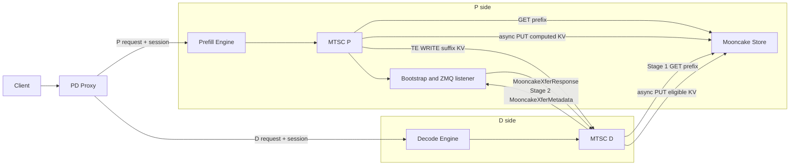

# MTSC 整体设计

> MTSC: Mooncake Two-Stage Connector  
> 状态：初始设计  
> 适用范围：单机 CUDA、1P1D、P/D 默认 TP=2、vLLM v0.26.0

## 1. 背景

现有 `UCSConnector` 依赖 UCS Control Plane 管理 KV metadata，并由 UCS Catalog 和 Orchestrator 为 Decode 侧生成按 logical block、TP rank 和数据源细分的 LoadPlan。UCS worker 已实现类似的两阶段加载：

1. Decode（以下简称 D）先从 Mooncake Store 加载可命中的 prompt KV；
2. 剩余 KV 通过 Mooncake Transfer Engine（TE）从 Prefill（以下简称 P）传输到 D。

MTSC 将这个能力简化为不依赖 UCS Control Plane 的 vLLM KV Connector。它复用两类现有 Mooncake 能力：

- Mooncake Store Connector 的 prefix lookup、GET、PUT 和 CUDA buffer 注册；
- Mooncake PD Connector 的 bootstrap 发现、ZMQ 控制通道和 TE 直传。

vLLM 原生 Mooncake PD Connector 的传输语义是：

```text
D --MooncakeXferMetadata--> P listener
P --TE batch_transfer_sync_write--> D KV cache
P --MooncakeXferResponse--> D
```

因此“D pull”指的是控制意图：D 提供目标 block 和地址并请求 KV。真正的数据面操作是 P 发起 TE WRITE，不是 D 发起 TE READ。

vLLM 当前 `MultiConnector` 不适合直接组合该功能。它会选择第一个声明命中的 Connector，无法表达“Store 先加载一段，PD 再加载同一请求的剩余段”。MTSC 因此必须是一个拥有完整请求状态、block ownership 和 completion 语义的复合 Connector。

主要参考实现：

- `HiSchedule/hischedule-integration/cache_connector/ucs_connector.py`；
- `HiSchedule/hischedule-integration/cache_connector/ucs_scheduler.py`；
- `HiSchedule/hischedule-integration/cache_connector/ucs_worker.py`；
- `vllm/distributed/kv_transfer/kv_connector/v1/mooncake/mooncake_connector.py`；
- `vllm/distributed/kv_transfer/kv_connector/v1/mooncake/store/`；
- `examples/disaggregated/mooncake_connector/mooncake_connector_proxy.py`。

## 2. 目标

### 2.1 功能目标

1. 不启动 UCS Control Plane，不依赖 UCS Catalog 或 LoadPlan API。
2. Proxy 为每次 P/D 请求选定确定的 P 和 D，并分发全局唯一的 transfer session。
3. P 和 D 均可以从 Mooncake Store 加载 remote KV，但两者独立查询，不假设命中长度相同。
4. D 先完成 Store 加载，再根据实际成功的连续前缀向 P 请求剩余 KV。
5. D 发起第二阶段控制请求，P 在 Prefill KV ready 后使用 TE WRITE 将 KV 写入 D。
6. P 和 D 都具备 async save 到 Mooncake Store 的能力，并在保存期间正确 pin 住源 blocks。
7. 所有成功、超时、取消和错误路径都必须进入终态，不得使请求永久停留在 `WAITING_FOR_REMOTE_KVS`。
8. Proxy 保持 simple and fast：单次选择、单次投递，不自动重试或重选 P/D，错误直接向客户端暴露。
9. Proxy 为每个请求记录 P/D 关键时间点和终态，并将完整请求结构按 JSONL 格式写入配置文件。

### 2.2 正确性目标

1. `block_hash` 表示 logical block，不表示某个 TP rank 的物理 block。
2. 一个 logical block 只有在所有必需 TP rank/KV group 都有效时才能报告 ready。
3. Store 查询结果只是候选命中；D 必须以实际 GET 结果决定第二阶段切分点。
4. model、prompt、block size、KV layout 或并行配置不匹配时 fail closed。
5. Store object 只在 Mooncake Master 提交完整 descriptor 后才可用；读取前必须查询当前 descriptor。

### 2.3 MVP 范围

- CUDA；
- 1P1D；
- P/D 使用相同 model、block size、KV layout 和 TP；
- TP=2 为主要验证配置；
- FullAttention，单 KV cache group；
- 非 MLA 路径使用 Mooncake PD Connector 要求的 HND layout；
- 使用 vLLM 原生 Mooncake Store key schema；
- Store/PD 失败默认使用 D 本地 recompute；
- async save queue 过载时默认 skip。

### 2.4 非目标

初版不实现：

- UCS 全局 Catalog、拓扑感知副本选择和持久化恢复；
- Proxy 高可用和多 P/多 D 动态重调度；
- Proxy 自动重试和失败后重选 P/D；
- P/D 异构 TP、PP、Mamba/HMA 和多 KV cache group；
- UCS Store key 的透明兼容；
- 用 ZMQ metadata 事件替代 Mooncake Master 的实时查询。

## 3. 总体架构

### 3.1 系统架构



### 3.2 组件职责

| 组件 | 核心职责 | 不负责 |
|---|---|---|
| Proxy | 选择 P/D、生成 session、并发 HTTP 请求、传播 cancel | Store 命中判定、KV ready barrier |
| MTSC P | P 侧 Store load、Prefill ready 管理、TE WRITE、async save | 决定 D 的 Store 命中长度 |
| MTSC D | D 侧 Store load、两阶段切分、PD 请求、ready/fallback | 假设 P/D Store snapshot 一致 |
| Bootstrap | 返回 P engine/rank 对应的 ZMQ listener 地址 | 传输 KV 数据 |
| Mooncake Store | 按 object key GET/PUT，维护 object descriptor | PD request/session 同步 |
| Transfer Engine | P 到 D 的 KV 字节传输 | 请求级状态机 |

### 3.3 Session 和协议

Proxy 为每次调度生成：

```text
request_id   := 客户逻辑请求 ID
transfer_id  := 该 P/D 请求唯一的 ID，可使用 "xfer-" + request_id
session_key  := transfer_id
```

Proxy 对一个客户请求只生成一个 `transfer_id`，不在内部重试。P/D 以 `transfer_id` 索引 session，并丢弃已终止 session 的延迟消息。如果客户端重新发起请求，它是一个新 `request_id` 和新 `transfer_id`。

D 发给 P 的 `TransferRequest` 至少包含：

```text
protocol_version
request_id, transfer_id
model_fingerprint, parallel_config_fingerprint
prompt_fingerprint, block_size
start_block_index, num_blocks, prompt_block_count
tp_rank, kv_group_id
D TE hostname/port
D destination block IDs and registered regions
deadline
```

P 返回 D 的 `TransferResponse` 包含：

```text
status = CONTINUE | FINISH | ERROR
ok_requests
error_requests
error_message
```

### 3.4 两阶段数据模型

对一个 D 请求，以可复用的完整 logical block 为单位：

- `T`：P 为 prompt 准备好的目标 block 边界，范围 `[0,T)`；
- `L`：D 本地 APC 已有的连续前缀边界；
- `H`：Store lookup 声明可命中的连续前缀边界；
- `A`：D 完成 Store GET 后真正有效的连续前缀边界。

```text
0 <= L <= A <= H <= T
Stage 1 = Store GET [L,H)
Stage 2 = P TE WRITE [A,T)
```

如果 GET 在 block `f` 首次失败，则 `A=f`，P 从 `f` 开始覆盖写入。即使 `f` 之后的部分 GET 成功，也不将它们当作孤立命中，以保持连续前缀语义。

对 logical block `b`、TP rank `r` 和 KV group `g`：

```text
valid(b,r,g) = local_ok(b,r,g)
            OR store_ok(b,r,g)
            OR pd_te_ok(b,r,g)

D_READY = store_phase_terminal
       AND pd_phase_terminal
       AND all required valid(b,r,g) in [0,T)
```

### 3.5 Block 和资源生命周期

- D 在 Store GET 或 PD WRITE 未终态时 pin destination blocks；
- P 在 PD session 未终态时 pin source blocks；
- P/D 在 async save 未终态时 pin save source blocks；
- block pin 使用 reason/refcount，不使用单个布尔值；
- session cleanup 只解除本 session 拥有的 pin；
- Connector shutdown 先拒绝新任务，再 drain/cancel 后台操作，最后注销 GPU buffers 和 TE。

### 3.6 Store key 与完整性

MVP 使用 vLLM 原生 Mooncake Store key schema。key 必须包含能区分以下内容的字段：

```text
cache namespace
model fingerprint
parallel configuration
TP rank
PP rank
KV group
block hash
```

仅当一个 logical block 的所有必需 rank/group objects 都可查询、可读取且通过验证时，才能将它计入 Store 连续前缀。

### 3.7 实现模块

建议先实现 out-of-tree Connector：

```text
MTSC/
  mtsc/
    connector.py          # KVConnectorBaseV1 入口
    scheduler.py          # prefix match、request metadata、block pin
    worker.py             # Store GET/PUT、TE WRITE、P/D state
    protocol.py           # session、TransferRequest/Response
    bootstrap.py          # P bootstrap 和 ZMQ listener
    async_save.py         # 有界保存队列
    completion.py         # worker 到 scheduler 的 completion queue
    metrics.py            # 指标和结构化日志
  proxy/
    pd_proxy.py
```

## 4. Proxy 设计

Proxy 负责选定 P/D、分发请求 Spec、并发执行、错误暴露和请求级 JSONL metrics，详细设计见 [S01-Proxy 设计](./S01-proxy设计.md)。

## 5. P 侧设计

Prefill 侧负责 Store prefix 复用、缺失 KV 计算、D 请求配对、TE WRITE 和 async save，详细设计见 [S02-Prefill 设计](./S02-prefill设计.md)。

## 6. D 侧设计

Decode 侧负责 Store 优先的两阶段加载、PD suffix 请求、KV 完整性判定、ready/fallback 和 async save，详细设计见 [S03-Decode 设计](./S03-decode设计.md)。
