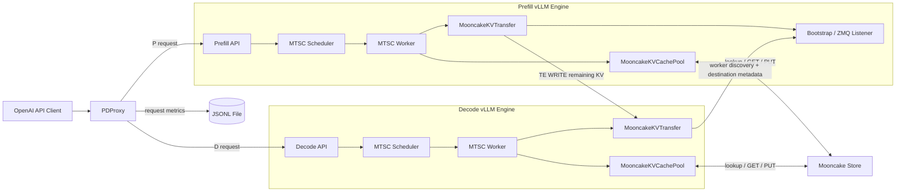
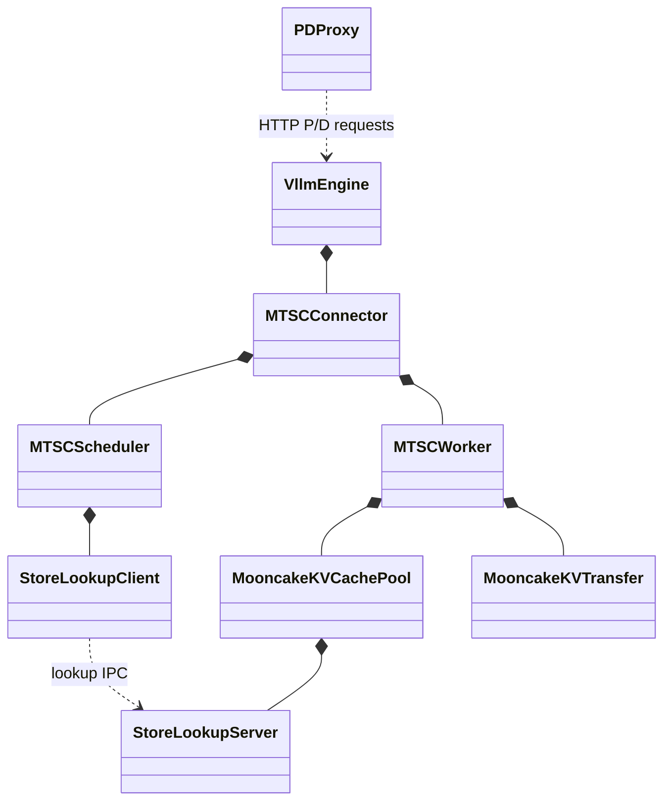
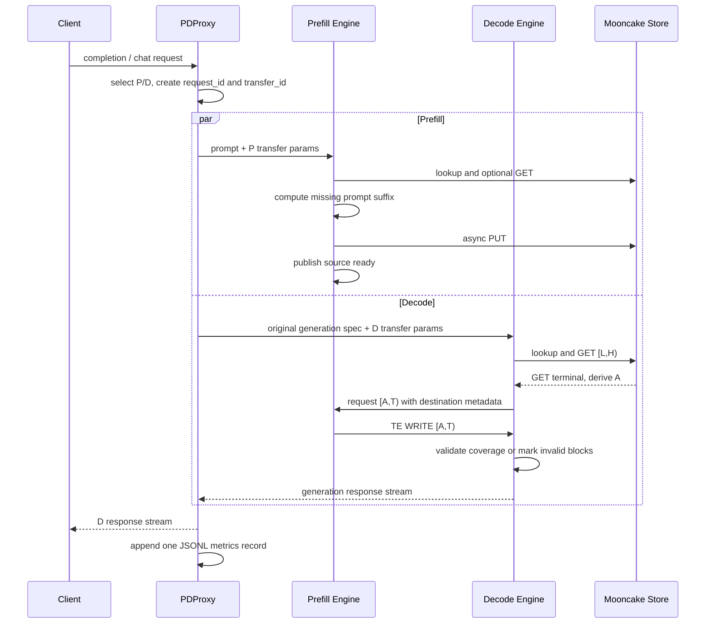

# MTSC 整体设计

> MTSC: Mooncake Two-Stage Connector

## 1. 背景

MTSC 是一个基于 vLLM KV Connector 机制的两阶段外部 KV 加载组件。对于同一个 Decode（以下简称 D）请求，它按以下顺序补齐 prompt KV：

1. 优先从 Mooncake Store 加载可复用的连续前缀；
2. Store 未覆盖或 GET 失败的剩余部分，由 Prefill（以下简称 P）通过 Mooncake Transfer Engine（TE）写入 D。

vLLM 原生 `MultiConnector` 可以组合多个 Connector，但不能表达“同一请求中，Store 先写一部分 destination blocks，P 再根据 Store 的实际结果补齐剩余 blocks”的串行依赖。因此 MTSC 在一个 Connector 内统一管理 Store 和 direct-PD 两条路径。

MTSC 参考 vLLM 原生 Mooncake PD Connector 和 Mooncake Store Connector，但只复用底层 `MooncakeDistributedStore` 和 `TransferEngine`，不复用它们的上层状态机。

## 2. 目标与边界

### 2.1 目标

1. P 和 D 均可以从 Mooncake Store 复用与自身 topology 兼容的连续 prefix KV。
2. D 在一次 external-load 生命周期内完成 Store-first 两阶段加载，两阶段全部终止后才允许 Decode。
3. direct-PD 支持兼容的异构 TP/PP 传输；其中 P/D 的 TP size 需互为整数倍。
4. 任何 Store 或 PD 加载失败都不将未写成功的 KV 视为可用，而是交给 vLLM 从首个无效 block 本地重算。

### 2.2 当前边界

- Store GET/PUT 不转换不同并行布局。不兼容的 model、cache layout 或 TP/PP/PCP/DCP topology 使用不同 Store namespace，不会相互命中。
- 不实现 layerwise load/save；当前使用 bulk 异步 I/O。
- Proxy 不判断 KV 命中、不转发 KV 数据，也不对后端请求做重试。
- P/D 共用一套 Connector 实现，不维护两套独立协议和状态机。

## 3. 总体设计

### 3.1 设计原则

- **Store 优先，PD 补齐**：PD 的起点由 Store GET 的实际结果决定，不使用 lookup 的候选结果提前推导。
- **单写者**：Store GET 终止后才启动 P 向 D 的 TE WRITE，避免两条路径同时写同一个 destination block。
- **控制面与数据面分离**：Proxy、bootstrap 和 ZMQ 只传递路由与内存元数据；KV 数据只经 Store 或 TE 传输。
- **Fail closed**：只有 Store/PD 覆盖和并行 rank 均符合预期时才报告 ready；其余情况均进入 recompute。
- **统一实现**：P/D 共用 Connector、scheduler、worker 和 metadata protocol，根据引擎 role 与请求参数选择路径。

### 3.2 系统架构


```mermaid
flowchart LR
    C[OpenAI API Client] --> X[PDProxy]
    X -->|P request| PAPI[Prefill API]
    X -->|D request| DAPI[Decode API]

    subgraph P[Prefill vLLM Engine]
        PAPI --> PS[MTSC Scheduler]
        PS --> PW[MTSC Worker]
        PW --> PStore[MooncakeKVCachePool]
        PW --> PPD[MooncakeKVTransfer]
        PPD --> PB[Bootstrap / ZMQ Listener]
    end

    subgraph D[Decode vLLM Engine]
        DAPI --> DS[MTSC Scheduler]
        DS --> DW[MTSC Worker]
        DW --> DStore[MooncakeKVCachePool]
        DW --> DPD[MooncakeKVTransfer]
    end

    PStore <-->|lookup / GET / PUT| MS[Mooncake Store]
    DStore <-->|lookup / GET / PUT| MS
    DPD -->|worker discovery + destination metadata| PB
    PPD -->|TE WRITE remaining KV| DPD
    X -->|request metrics| MF[(JSONL File)]
```

系统包含三类彼此独立的通信：

1. **HTTP request plane**：Proxy 并发请求 P/D，并将 D 的返回流透传给客户端。
2. **Metadata/control plane**：scheduler-worker metadata、Store lookup IPC、bootstrap HTTP 和 P/D ZMQ。
3. **KV data plane**：Mooncake Store GET/PUT 和 P 到 D 的 TE WRITE。

### 3.3 组件职责

| 组件 | 核心职责 |
|---|---|
| `PDProxy` | 选择 P/D endpoint，生成同一 `transfer_id`，并发请求两侧，返回 D 响应并记录请求级 metrics |
| `MTSCConnector` | 适配 vLLM KV Connector hooks，编排 scheduler/worker 生命周期 |
| `MTSCScheduler` | 发起 Store lookup，绑定 vLLM 分配的 blocks，生成当前 step 的 Connector metadata，管理 block 延迟释放 |
| `MTSCWorker` | 消费 metadata，编排 Store/PD I/O，驱动 D 两阶段状态，汇总完成与失败结果 |
| `MooncakeKVCachePool` | 实现 KVCachePool：lookup、load/save、pending 合并及 I/O 安全终态 |
| `MooncakeKVTransfer` | 实现 KVTransfer：会话匹配、并行映射、coverage、WRITE 及安全终态 |

### 3.4 类图


```mermaid
classDiagram
    class PDProxy
    class VllmEngine
    class MTSCConnector
    class MTSCScheduler
    class MTSCWorker
    class StoreLookupClient
    class MooncakeKVCachePool
    class StoreLookupServer
    class MooncakeKVTransfer

    PDProxy ..> VllmEngine : HTTP P/D requests
    VllmEngine *-- MTSCConnector
    MTSCConnector *-- MTSCScheduler
    MTSCConnector *-- MTSCWorker
    MTSCScheduler *-- StoreLookupClient
    MTSCWorker *-- MooncakeKVCachePool
    MTSCWorker *-- MooncakeKVTransfer
    StoreLookupClient ..> StoreLookupServer : lookup IPC
    MooncakeKVCachePool *-- StoreLookupServer
```

类图只表达主要依赖和 ownership。字段、协议结构与内部状态机见分项详细设计。

### 3.5 核心方法

#### 3.5.1 两阶段加载模型

对一次 D 请求定义：

- `L`：D 本地 KV 缓存已有的连续 prefix 终点；
- `H`：Store lookup 返回的候选 prefix 终点；
- `A`：Store GET 终止后实际成功的连续 prefix 终点；
- `T`：remote prefill 需要覆盖的目标终点。

```text
0 <= L <= A <= H <= T

Stage 1 = Store GET [L,H)
Stage 2 = P TE WRITE [A,T)
Ready   = Store terminal AND PD terminal
```

D 在进入 external load 时一次性分配 `[L,T)` 的 destination blocks。如果 Store 在 `[L,H)` 内部分失败，`A` 截断到首个失败 block 的 token 边界，然后 P 从 `A` 开始覆盖写入。`T` 可以落在未填满的最后一个 block 内，该 block 仍由 PD 阶段覆盖。

失败处理保持单一原则：Store lookup 失败按 miss 处理；Store GET 失败后尽量由 PD 补齐；PD 或最终 coverage 校验失败时将对应 blocks 标记为无效，交给 vLLM recompute。抢占、取消和 shutdown 均先 fence 在途 I/O，再回收 blocks 和资源。

#### 3.5.2 Proxy

Proxy 负责一次 P/D 请求的路由和关联：

1. 选择 P/D endpoint，生成 `request_id` 和唯一 `transfer_id`。
2. P 请求使用短生成配置，并标记 `do_remote_decode=true`。
3. D 请求保留原始生成参数，并携带 P engine、bootstrap、DP rank 和 `transfer_id`。
4. 并发请求 P/D，将 D 的结果返回客户端，同时 drain P task 并处理取消。
5. 请求终止后记录一条 JSONL metrics。

Proxy 不计算 `A`，也不参与 D ready 判定。P source ready 与 D 补齐请求的到达顺序由 Connector 内部按 `transfer_id` 协调。

#### 3.5.3 vLLM 生命周期钩子

| Hook | MTSC 行为 |
|---|---|
| `get_num_new_matched_tokens()` | 异步查询 Store，返回 external token 数 |
| `update_state_after_alloc()` | 绑定 vLLM 分配的 blocks，建立 Store load 或 D 两阶段计划 |
| `build_connector_meta()` | 将当前 schedule step 的增量计划下发给 worker |
| `get_finished()` | 发布并轮询 bulk Store/PD I/O，返回 receive/send 完成集合 |
| `request_finished()` | 发布 P source ready/abort 或 Store save，并决定是否延迟释放 blocks |
| `handle_preemptions()` | fence 可能访问已分配 blocks 的 GET/PUT/TE WRITE，再允许回收 |
| `get_block_ids_with_load_errors()` | 将加载失败的物理 blocks 交给 vLLM recompute |

`finished_recving` 用于解除 external-load 等待，`finished_sending` 用于解除 block 延迟释放。当前 `start_load_kv`、`wait_for_layer_load`、`save_kv_layer` 和 `wait_for_save` 不承载 bulk I/O，因此 I/O 不进入 layer forward hot path。

#### 3.5.4 P 侧流程

1. P 独立查询 Store，加载命中的 prefix，只计算缺失的 prompt suffix。
2. P worker 向 bootstrap 注册自身的 ZMQ listener 地址和并行信息。
3. P Prefill 完成后，按 `transfer_id` 发布 source blocks ready。
4. P 收到 D 的 destination metadata 后，等待 source ready，再通过 TE WRITE 写入 D。
5. Store save 和 PD send 均终止后，P 才允许 vLLM 释放 source blocks。

#### 3.5.5 D 侧流程

1. D 以本地 prefix `L` 为起点查询 Store，得到候选终点 `H`。
2. D 一次性分配 `[L,T)` 的 blocks，并在同一 external-load 生命周期内等待。
3. D 先执行 Store GET `[L,H)`，根据成功的连续区间确定 `A`。
4. D 通过 bootstrap 查询目标 P workers，将 `[A,T)` 的 destination blocks 和 region metadata 发给 P。
5. P 使用 TE WRITE 补齐 `[A,T)`。D 校验所有必需 rank 和 region 的 coverage 后才报告 load 完成。

“D 从 P 拉取”是控制语义：D 发起补齐请求，但数据面由 P 主动写入 D。

### 3.6 端到端时序


```mermaid
sequenceDiagram
    participant C as Client
    participant X as PDProxy
    participant P as Prefill Engine
    participant D as Decode Engine
    participant S as Mooncake Store

    C->>X: completion / chat request
    X->>X: select P/D, create request_id and transfer_id
    par Prefill
        X->>P: prompt + P transfer params
        P->>S: lookup and optional GET
        P->>P: compute missing prompt suffix
        P->>S: async PUT
        P->>P: publish source ready
    and Decode
        X->>D: original generation spec + D transfer params
        D->>S: lookup and GET [L,H)
        S-->>D: GET terminal, derive A
        D->>P: request [A,T) with destination metadata
        P->>D: TE WRITE [A,T)
        D->>D: validate coverage or mark invalid blocks
        D-->>X: generation response stream
    end
    X-->>C: D response stream
    X->>X: append one JSONL metrics record
```

P 和 D 的 HTTP 请求并发执行，二者通过同一 `transfer_id` 配对。

## 4. 详细设计

- [S01-Proxy 设计](./S01-proxy设计.md)：路由、P/D Request Spec、并发请求、取消与 metrics。
- [S02-Prefill 设计](./S02-prefill设计.md)：P Store load/save、source ready、TE WRITE 和 source block 生命周期。
- [S03-Decode 设计](./S03-decode设计.md)：D 两阶段状态机、异构 topology、coverage 校验和 fallback。
- [S05-Pool/Transfer 设计](./S05-pool&transfe.md)：抽象契约、Mooncake 实现、MLA 与异构并行映射。
- [S04-Log Trace 设计](./S04-log-trace设计.md)：请求关联、生命周期日志和可观测性演进。

## 5. 代码模型

```text
MTSC/
  mtsc/
    __init__.py    包入口，导出 Connector、接口及 Mooncake 实现
    connector.py    vLLM KV Connector 入口与 hook 适配
    scheduler.py    Store lookup、block 绑定与 scheduler 状态
    worker.py       Store/PD 编排与 D 两阶段状态机
    protocol.py     scheduler metadata 与 P/D wire structures
    kv_cache_pool.py    KVCachePool ABC、事件与结果、Mooncake Store 实现及 lookup IPC
    kv_transfer.py      KVTransfer ABC、事件与结果、Mooncake TE 实现及并行分片映射
    utils.py            CUDA/Ascend event、注册区域与共享 KV 布局转换
  proxy/
    pd_proxy.py     P/D Proxy 与 JSONL request metrics
  tests/
    test_mtsc.py    状态机、fallback、topology、平台和协议测试
    test_backends.py    后端契约、save 合并、session fencing 与模拟字节传输
```

Worker 的私有工厂函数负责后端创建与配置校验。两个 Mooncake 类直接实现接口，
lookup、内存注册和底层 I/O 均由对应具体类持有。`protocol.py` 保留跨 Scheduler/Worker
共享的 metadata 与 P/D wire 结构，设备与布局工具集中在 `utils.py`。

## 6. 验证状态

新接口与具体后端的契约测试见 `tests/test_backends.py`，不依赖真实 Mooncake 服务；包括
pending save 合并、错误累计、抢占 fence、迟到请求去重，以及模拟 TE 字节写入的异构 TP/PP/MLA 验证。
下述 CUDA E2E 记录来自重构前的版本，新的后端尚未进行真实 GPU/Mooncake E2E 验证。

当前单元测试覆盖：

- Store 成功、部分失败与 PD fallback 边界；
- prompt 最后一个未满 block 的 PD 补齐；
- `recompute` policy 强制校验；
- 整数倍异构 TP、异构 PP 和 region coverage；
- MLA Store/PD 路径；
- Ascend event、K/V registration、TP reorder 和 NZ gather/scatter；
- preemption late-write fence、P source completion 与 timeout；
- Store lookup/GET timeout；
- Proxy Request Spec、精确 DP bootstrap 查询、metrics 和错误竞争。

CUDA 1P1D E2E 已使用 Qwen2.5-0.5B-Instruct 验证：重启 D 清空本地 KV 后，D local prefix hit 为 0%、external prefix hit 为 100%，Mooncake Master 记录 Store GET，剩余 KV 由 direct-PD 路径补齐。

## 7. TODO

关键生命周期当前使用 vLLM logger，Proxy 已实现每请求 JSONL timing record。完整 trace/off 模式按 [S04-Log Trace 设计](./S04-log-trace设计.md) 后续演进。
