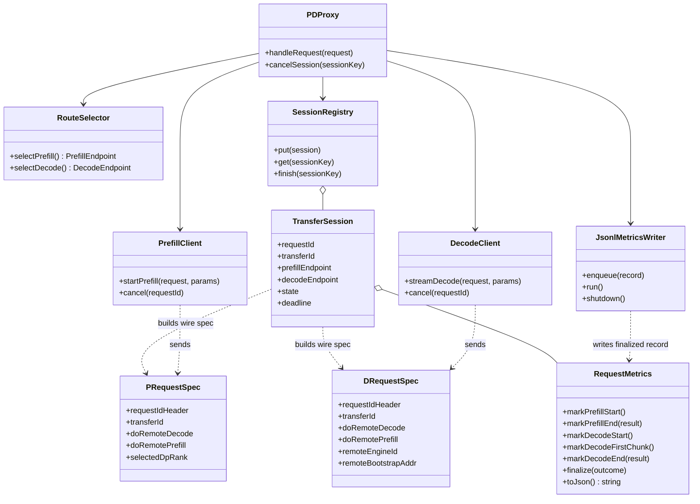
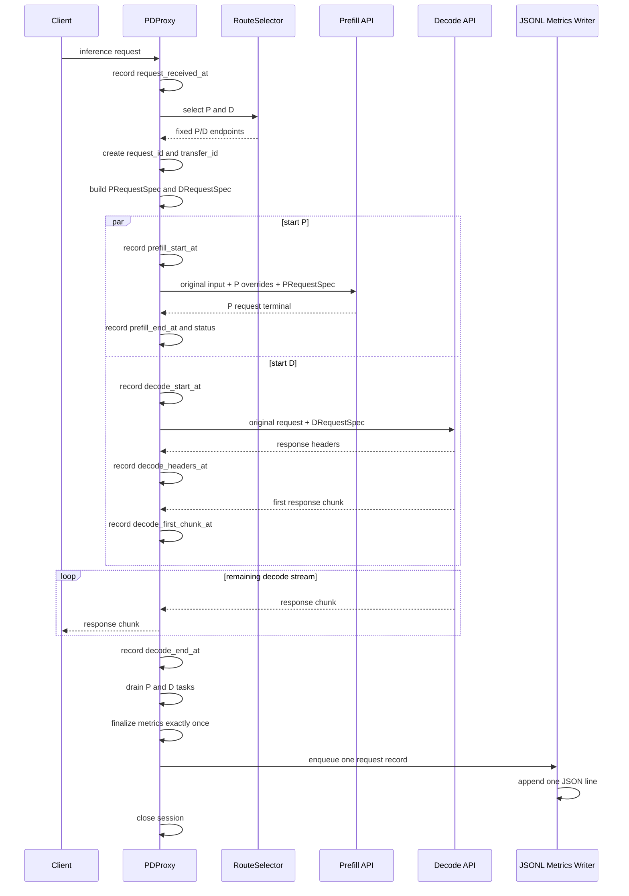
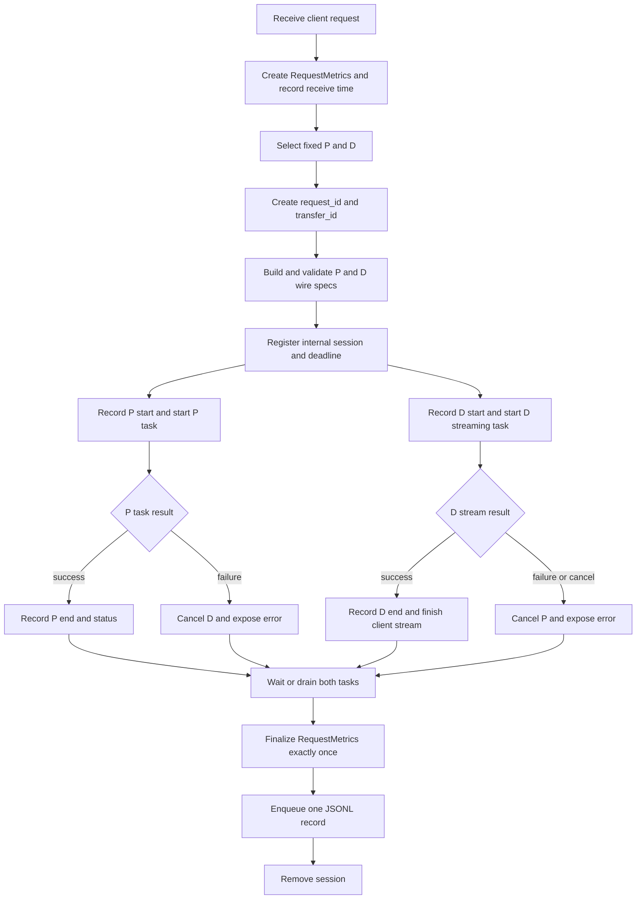

# MTSC Proxy 设计

> 上位文档：[S00-整体设计](./S00-整体设计.md)

## 1. 核心职责

Proxy 负责：

1. 为请求选定确定的 P 和 D；
2. 生成 `request_id/transfer_id`；
3. 从内部 `TransferSession` 投影出最小 wire fields，分别构造 P/D Request Spec；
4. 并发启动 P/D HTTP 请求；
5. 将 D 的流式结果返回客户端；
6. 保留并 drain P task，传播取消和记录两侧错误；
7. 收集请求级 P/D metrics，并在请求终态时写入一条 JSONL record。

Proxy 不负责 Store lookup，不计算 `A`，也不作为 D ready barrier。

## 2. 核心类图



`TransferSession` 仅存在于 Proxy 内部；`PRequestSpec` 和 `DRequestSpec` 是从 session 投影出的 wire data，而不是对 `TransferSession` 的序列化。

## 3. 核心 Spec

### 3.1 TransferSession

`TransferSession` 不整体发给 P 或 D。它是 Proxy 内部对一次 P/D 请求的管理对象，包含 endpoint、HTTP task handle、状态和 deadline 等运行态。将它序列化后下发会：

- 让 P/D 与 Proxy 内部类结构耦合；
- 传递 P/D 不需要的 endpoint、task 和调度状态；
- 形成 Proxy 状态与 Connector 状态的双向同步问题。

P/D 只接收不可变的最小 wire spec。MVP 不新增独立 `SessionSpec` 类，直接使用 vLLM 现有 HTTP header 和 `kv_transfer_params`。

`TransferSession` 内部 Spec：

```json
{
  "request_id": "<request-id>",
  "transfer_id": "xfer-<request-id>",
  "prefill_api_url": "http://prefill-host:port",
  "prefill_bootstrap_addr": "http://prefill-host:bootstrap-port",
  "prefill_engine_id": "<selected-prefill-engine>",
  "prefill_dp_rank": 0,
  "decode_api_url": "http://decode-host:port",
  "prefill_task": "<internal-task-handle>",
  "decode_task": "<internal-task-handle>",
  "metrics": "<RequestMetrics>",
  "state": "RUNNING",
  "deadline": "<monotonic-deadline>"
}
```

上述对象仅由 Proxy 保存，不序列化到 P/D 请求。P/D Connector 使用自身配置的 timeout/session TTL 做资源收敛，不依赖 Proxy 内部 deadline 对象。

### 3.2 PRequestSpec

P 请求用于生成 prompt KV，不向客户端返回正常生成结果。`PRequestSpec` 为：

```json
{
  "headers": {
    "X-Request-Id": "<request-id>",
    "X-data-parallel-rank": "<selected-prefill-dp-rank>",
    "Authorization": "Bearer <backend-token>",
    "Content-Type": "application/json"
  },
  "body": {
    "model": "<original-model>",
    "prompt_or_messages": "<original-input>",
    "stream": false,
    "max_tokens": 1,
    "max_completion_tokens": 1,
    "kv_transfer_params": {
      "do_remote_decode": true,
      "do_remote_prefill": false,
      "transfer_id": "xfer-<request-id>"
    }
  }
}
```

`model` 和 prompt/messages 从原始请求复制。仅当原请求存在 `max_completion_tokens` 时才在 P body 中保留它并设为 `1`；`stream_options` 不写入 P body。P 不需要 D hostname、TE port 或 destination block IDs，这些信息稍后由 D Connector 通过 `MooncakeXferMetadata` 发给 P listener。

### 3.3 DRequestSpec

D 请求保留原始 model、prompt/messages、sampling parameters、`max_tokens` 和 `stream` 语义，仅替换 `kv_transfer_params`。`DRequestSpec` 为：

```json
{
  "headers": {
    "X-Request-Id": "<request-id>",
    "Authorization": "Bearer <backend-token>",
    "Content-Type": "application/json"
  },
  "body": {
    "model": "<original-model>",
    "prompt_or_messages": "<original-input>",
    "sampling_parameters": "<original-sampling-parameters>",
    "stream": "<original-stream-value>",
    "max_tokens": "<original-max-tokens>",
    "kv_transfer_params": {
      "do_remote_decode": false,
      "do_remote_prefill": true,
      "remote_engine_id": "<selected-prefill-engine>",
      "remote_bootstrap_addr": "http://prefill-host:bootstrap-port",
      "transfer_id": "xfer-<request-id>"
    }
  }
}
```

`model`、prompt/messages、sampling parameters、`stream` 和 token limits 均从原始请求原样复制。`remote_engine_id` 必须与 P HTTP 请求选中的 DP engine 一致。`remote_bootstrap_addr` 只用于查询该 engine 下各 TP/PP worker 的 ZMQ listener，不是 KV 数据传输地址。

**P/D wire spec 字段不变式**

Proxy 发送 P/D 请求前必须校验：

```text
P.X-Request-Id == D.X-Request-Id == request_id
P.transfer_id  == D.transfer_id  == TransferSession.transfer_id
D.remote_engine_id == selected P engine_id
D.remote_bootstrap_addr == selected P bootstrap address
```

上述任一条不成立时，Proxy 在发送 backend HTTP 请求前直接返回内部配置错误。

## 4. 时序图



Proxy 不得等待 P HTTP 返回后才发 D。P 和 D 的 ready 关系由 MTSC 的 PD session 协议完成。

## 5. 流程图



## 6. Request Metrics 与 JSONL 落盘

Proxy 参考 UCS Proxy 的 `prefill_start/prefill_end/decode_start/decode_first_token/decode_end` 语义，但 MTSC 的 P/D 是并发请求，因此 P 和 D 两条时间线独立记录，不假设 `prefill_end_at < decode_start_at`。

### 6.1 时间点语义

- `request_received_at`：Proxy 收到请求的时间；
- `prefill_start_at`：Proxy 开始向 P 发送 HTTP 请求的时间；
- `prefill_end_at`：P HTTP 请求进入成功、失败或取消终态的时间；
- `decode_start_at`：Proxy 开始向 D 发送 HTTP 请求的时间；
- `decode_headers_at`：Proxy 收到 D HTTP response headers 的时间；
- `decode_first_chunk_at`：Proxy 收到 D 第一个 response body chunk 的时间；
- `decode_end_at`：D response stream 成功结束、失败或取消，且 response 已关闭的时间；
- `request_end_at`：P/D task 均进入终态并完成 metrics finalize 的时间。

Proxy 本身不能观测“P backend 真正收到请求”的精确时间，因此 `prefill_start_at` 明确表示 Proxy dispatch time，不将它命名为 backend arrival time。如果后续需要 backend arrival/KV-ready 时间，应由 P 显式返回 response header 或 metadata，再作为新字段记录。

所有 wall-clock 时间使用 UTC ISO-8601；所有 duration 使用 monotonic clock 计算，避免系统时钟回调导致负延迟。

### 6.2 每请求 JSON 结构

```json
{
  "schema_version": 1,
  "record_type": "mtsc_proxy_request",
  "request_id": "<request-id>",
  "client_request_id": "<client-request-id-or-null>",
  "transfer_id": "xfer-<request-id>",
  "endpoint": "/v1/completions",
  "model": "<model-name>",
  "stream": true,
  "max_tokens": 128,
  "prompt_tokens": 64,
  "prefill_host": "<prefill-host>",
  "prefill_port": 8100,
  "prefill_engine_id": "<prefill-engine-id>",
  "prefill_dp_rank": 0,
  "decode_host": "<decode-host>",
  "decode_port": 8200,
  "request_received_at": "2026-09-21T12:00:00.000000+00:00",
  "prefill_start_at": "2026-09-21T12:00:00.001000+00:00",
  "prefill_end_at": "2026-09-21T12:00:00.021000+00:00",
  "decode_start_at": "2026-09-21T12:00:00.002000+00:00",
  "decode_headers_at": "2026-09-21T12:00:00.024000+00:00",
  "decode_first_chunk_at": "2026-09-21T12:00:00.025000+00:00",
  "decode_end_at": "2026-09-21T12:00:00.105000+00:00",
  "request_end_at": "2026-09-21T12:00:00.106000+00:00",
  "prefill_duration_ms": 20.0,
  "decode_headers_latency_ms": 22.0,
  "decode_ttft_ms": 23.0,
  "decode_duration_ms": 103.0,
  "total_duration_ms": 106.0,
  "prefill_http_status": 200,
  "decode_http_status": 200,
  "outcome": "success",
  "error_stage": null,
  "error_type": null,
  "error_message": null
}
```

`prompt_tokens` 仅在 Proxy 能从 token-id list 准确得到时记录，否则为 `null`。文件不记录原始 prompt/messages、Authorization 或生成文本，避免泄露用户内容和凭据。

`outcome` 取值包括 `success`、`prefill_error`、`decode_error`、`timeout`、`client_cancelled` 和 `proxy_error`。某个阶段未开始或未产生时间点时，对应 JSON value 为 `null`，但 key 仍然保留，保证每行 schema 稳定。

### 6.3 文件和写入模型

Proxy metrics 配置：

```json
{
  "enabled": true,
  "file": "/tmp/mtsc_proxy_requests.jsonl",
  "queue_size": 4096,
  "flush_each_record": true
}
```

实际部署可用环境变量 `MTSC_PROXY_METRICS_FILE` 覆盖文件路径。文件使用 JSON Lines：每个请求恰好一行，行内是一个完整 JSON object。

写入路径为：

```text
request terminal
  -> wait until P and D tasks are terminal
  -> finalize RequestMetrics exactly once
  -> enqueue immutable JSON record
  -> single JsonlMetricsWriter
  -> append one line and flush
```

- `RequestMetrics` 在请求进入 Proxy 时立即创建，即使 JSON parse、路由或 backend connect 失败也要落盘；
- P/D callbacks 只更新对应阶段字段，不直接写文件；
- finalize 使用 once guard，防止 stream `finally`、P callback 和 error handler 重复写同一请求；
- 单个 writer task 按 queue 顺序写文件，文件 I/O 不在 inference event loop 中执行；
- 为保证“每请求一行”，queue full 时在请求终态阶段施加 backpressure，不静默丢弃 record；
- 文件写入失败时记录 error log 和 `metrics_write_failures` 计数，不改变已完成 inference 的返回结果；
- Proxy shutdown 时停止接收新请求，drain metrics queue，flush 并关闭文件。

MVP 假设单 Proxy process 持有该文件。如果后续使用多进程 Proxy，每个 process 应写独立文件，或引入单独 metrics collector，不让多进程共享普通 buffered file handle。

## 7. 同步、取消与错误暴露

- Proxy 必须保留 P task handle，不使用无人管理的 fire-and-forget task；
- 客户端取消、D HTTP 失败或 P HTTP 失败时，Proxy 尝试取消另一侧并立即结束请求；
- HTTP cancel 不能作为唯一的数据面清理机制，P/D Connector 必须仍有 session TTL；
- Proxy 不自动重试，不重选 P/D；
- 如果错误发生在 HTTP response headers 发出前，Proxy 直接返回明确的 5xx 和错误原因；
- 如果 D 已经开始流式响应，Proxy 终止该 stream 并记录 P/D 根因，不伪造成功完成事件；
- 需要再次尝试时由客户端发起新请求，新请求使用新 `request_id/transfer_id`；
- Proxy 将超时分为 P HTTP timeout、D first-token/stream timeout 和整体 request deadline；
- Proxy 可记录 session 错误，但不能在未知 KV 完整性的情况下宣告 D ready。
