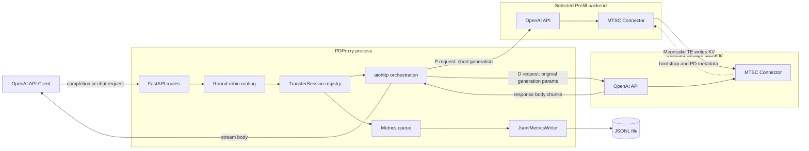
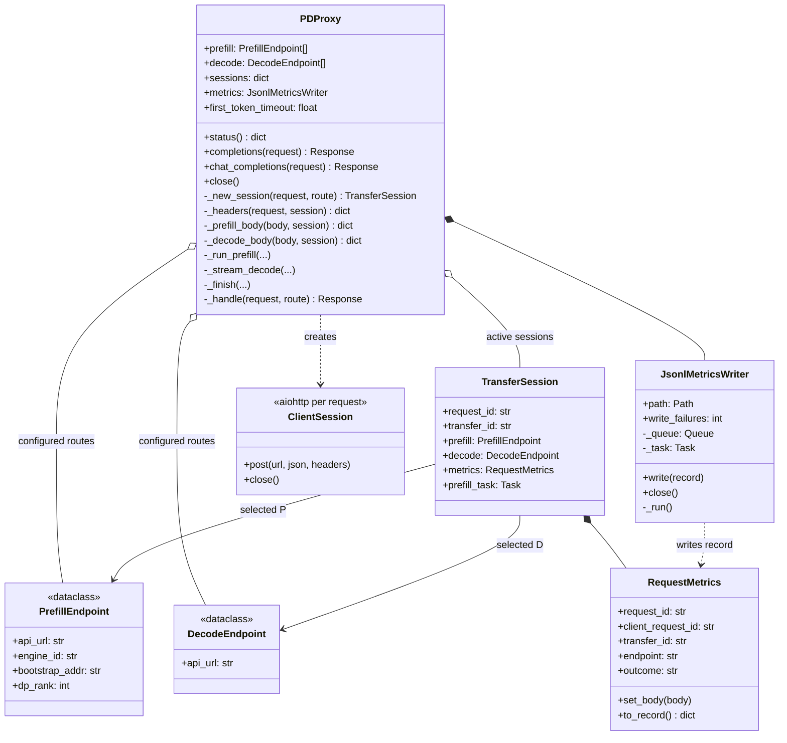
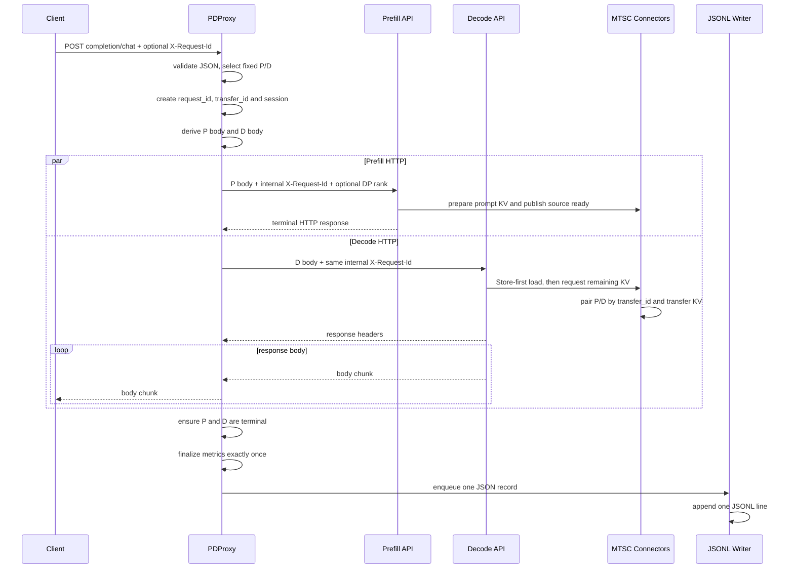

# MTSC Proxy 设计

> 上位文档：[S00-整体设计](./S00-整体设计.md)
>
> 本文以 `proxy/pd_proxy.py` 的当前实现为基准；尚未实现的能力统一收录在 [TODO](#5-todo) 中。

## 1. 背景

MTSC 将一次推理拆分为 Prefill（以下简称 P）和 Decode（以下简称 D）两个后端请求。P 负责准备 prompt KV，D 先从 Mooncake Store 加载可复用前缀，再通过 MTSC direct-PD 协议从 P 补齐剩余 KV，最后执行 decode。

在这个前提下，OpenAI API Client 只应感知一次普通的 completion 请求，不应感知 P/D 拆分、engine 位置或 KV 传输协议。因此需要一个 Proxy 作为入口，把一次客户端请求转换为一对可关联的 P/D HTTP 请求，并将 D 结果返回客户端。

Proxy 的目标是：

1. 为每次请求选定固定的 P/D endpoint，并生成唯一的 `request_id` 和 `transfer_id`；
2. 从原始 OpenAI 请求派生最小化的 P/D wire parameters，使两侧能够通过同一 `transfer_id` 配对；
3. 并发启动 P/D，不将 P HTTP 返回当作 D 的 ready barrier；
4. 将 D response body 透传给客户端，同时持有并收敛 P task；
5. 在失败、超时和取消时尽快终止另一侧 HTTP 工作，并记录请求级 metrics；
6. 保持客户端 API 与 OpenAI `/v1/completions` 和 `/v1/chat/completions` 的主要请求语义一致。

Proxy 的边界是：

- 不执行 Store lookup，不计算 Store 实际命中终点 `A`；
- 不转发 KV 数据，只转发 HTTP 请求及关联信息；
- 不参与 D ready 判定，ready barrier 由 MTSC Connector 内部协议完成；
- 不自动重试或在请求中途重选 P/D，失败后由客户端使用新 ID 重新发起请求。

## 2. 总体设计

### 2.1 核心特性

#### 2.1.1 P/D 并发启动

Proxy 在同一请求内同时启动 P task 和 D response-headers task。D 不需等待 P HTTP 请求结束；P source ready 与 D 补齐请求的到达顺序，由 Connector 按 `transfer_id` 协调。

这一设计避免了在 Proxy 中引入不必要的串行 barrier，也使 Proxy 无需理解 KV 加载状态机。

#### 2.1.2 精确的请求关联

Proxy 对外部 `X-Request-Id` 和内部 ID 分开处理：

- 客户端传入的 `X-Request-Id` 仅作为 `client_request_id` 记录到 metrics；
- Proxy 为本次执行生成新的 `request_id`，同时传给 P 和 D；
- `transfer_id = "xfer-" + request_id`，同时写入 P/D 的 `kv_transfer_params`。

因此，客户端 ID 可用于跨系统追踪，而 Proxy 内部 ID 始终满足唯一性和 P/D 关联要求。

#### 2.1.3 请求级可观测性

Proxy 分别记录 P/D 两条并行时间线，不假设 `prefill_end_at < decode_start_at`。请求终态通过 once guard 只 finalize 一次，并由单一 writer task 按队列顺序追加一条 JSONL record。

### 2.2 架构设计


```mermaid
flowchart LR
    C[OpenAI API Client]

    subgraph X[PDProxy process]
        API[FastAPI routes]
        R[Round-robin routing]
        S[TransferSession registry]
        H[aiohttp orchestration]
        Q[Metrics queue]
        W[JsonlMetricsWriter]
        API --> R --> S --> H
        S --> Q --> W
    end

    subgraph P[Selected Prefill backend]
        PAPI[OpenAI API]
        PC[MTSC Connector]
    end

    subgraph D[Selected Decode backend]
        DAPI[OpenAI API]
        DC[MTSC Connector]
    end

    C -->|completion or chat request| API
    H -->|P request: short generation| PAPI
    H -->|D request: original generation params| DAPI
    PAPI --> PC
    DAPI --> DC
    DC -.->|bootstrap and PD metadata| PC
    PC -->|Mooncake TE writes KV| DC
    DAPI -->|response body chunks| H
    H -->|stream body| C
    W --> F[(JSONL file)]
```

从 Proxy 视角看，整个系统分为三条路径：

1. **请求编排路径**：FastAPI 接收请求，选择 P/D，建立 session，再由 `aiohttp` 并发调用两侧。
2. **响应数据路径**：Proxy 不解析 D response body，而是将 chunk 透传给客户端。
3. **可观测路径**：请求执行过程更新 `RequestMetrics`，终态记录经异步队列追加到 JSONL 文件。

P/D Connector 之间的 bootstrap、ZMQ 和 KV 传输不经过 Proxy。它们在图中用虚线和 TE 数据流表示，仅用于解释 Proxy 下发的关联参数如何被消费。

### 2.3 组件职责

| 组件 | 职责 | 明确不负责 |
|---|---|---|
| FastAPI routes | 提供 `/v1/completions`、`/v1/chat/completions` 和 `/status` | 不解析 token，不修改生成结果 |
| `PDProxy` | 请求校验、路由、ID 生成、P/D body 构造、并发与失败收敛 | 不执行 Store lookup，不判定 KV ready |
| `PrefillEndpoint` | 描述 P API 地址、engine ID、bootstrap 地址及可选 DP rank | 不包含请求运行状态 |
| `DecodeEndpoint` | 描述 D API 地址 | 不包含 P 路由信息 |
| `TransferSession` | 保存一次请求的 ID、固定 P/D、metrics 和 P task handle | 不序列化给后端；当前不保存 D task/deadline/state enum |
| request-scoped `aiohttp.ClientSession` | 向 P/D 发送 HTTP 请求，读取 P 完整响应及 D response stream | 不在请求之间复用连接池 |
| `RequestMetrics` | 保存时间点、HTTP 状态、结果和错误，生成稳定 JSON schema | 不记录 prompt/messages、Authorization 或生成文本 |
| `JsonlMetricsWriter` | 通过有界队列串行化记录，在 worker thread 中 append 文件 | 写失败不改变已完成的 inference 响应 |
| P/D MTSC Connector | 使用 `transfer_id` 和 P 定位信息完成 Store-first + direct-PD KV 加载 | 不依赖 Proxy 判定 ready |

### 2.4 类图


```mermaid
classDiagram
    class PDProxy {
        +prefill: PrefillEndpoint[]
        +decode: DecodeEndpoint[]
        +sessions: dict
        +metrics: JsonlMetricsWriter
        +first_token_timeout: float
        +status() dict
        +completions(request) Response
        +chat_completions(request) Response
        +close()
        -_new_session(request, route) TransferSession
        -_headers(request, session) dict
        -_prefill_body(body, session) dict
        -_decode_body(body, session) dict
        -_run_prefill(...)
        -_stream_decode(...)
        -_finish(...)
        -_handle(request, route) Response
    }

    class TransferSession {
        +request_id: str
        +transfer_id: str
        +prefill: PrefillEndpoint
        +decode: DecodeEndpoint
        +metrics: RequestMetrics
        +prefill_task: Task
    }

    class PrefillEndpoint {
        <<dataclass>>
        +api_url: str
        +engine_id: str
        +bootstrap_addr: str
        +dp_rank: int
    }

    class DecodeEndpoint {
        <<dataclass>>
        +api_url: str
    }

    class RequestMetrics {
        +request_id: str
        +client_request_id: str
        +transfer_id: str
        +endpoint: str
        +outcome: str
        +set_body(body)
        +to_record() dict
    }

    class JsonlMetricsWriter {
        +path: Path
        +write_failures: int
        -_queue: Queue
        -_task: Task
        +write(record)
        +close()
        -_run()
    }

    class ClientSession {
        <<aiohttp per request>>
        +post(url, json, headers)
        +close()
    }

    PDProxy o-- PrefillEndpoint : configured routes
    PDProxy o-- DecodeEndpoint : configured routes
    PDProxy o-- TransferSession : active sessions
    PDProxy *-- JsonlMetricsWriter
    PDProxy ..> ClientSession : creates
    TransferSession --> PrefillEndpoint : selected P
    TransferSession --> DecodeEndpoint : selected D
    TransferSession *-- RequestMetrics
    JsonlMetricsWriter ..> RequestMetrics : writes record
```

类图只表达当前代码中存在的对象。路由选择由 `PDProxy` 内部的 `itertools.cycle` 完成，session registry 就是 `PDProxy.sessions`；当前没有独立的 `RouteSelector`、`SessionRegistry`、`PrefillClient` 或 `DecodeClient`。

### 2.5 核心方法

| 方法 | 核心行为 |
|---|---|
| `_new_session()` | 生成内部 ID，各自 round-robin 选择 P/D，创建 metrics 并注册 session |
| `_headers()` | 构造后端 headers；优先使用配置的 backend token，否则传递客户端 Authorization |
| `_prefill_body()` | 浅拷贝原 body，关闭 stream，移除 `stream_options`，将 token limit 改为 1，写入 P transfer params |
| `_decode_body()` | 浅拷贝原 body，保留生成参数，用被选 P 信息替换 `kv_transfer_params` |
| `_run_prefill()` | 发送 P 请求并完整读取 response；非 2xx 转为异常，无论成败都记录 P 终止时间 |
| `_handle()` | 验证请求，启动 P 和 D-headers task，处理 headers 前失败，成功时返回 `StreamingResponse` |
| `_stream_decode()` | 逐 chunk 读取 D，与 P task 竞争，尝试应用 first-chunk deadline，处理流式失败和客户端取消 |
| `_finish()` | 通过 `request_end_at` 实现 once guard，写入 outcome/error，移除 session，入队 JSON record |
| `JsonlMetricsWriter._run()` | 串行消费 metrics queue，使用 `asyncio.to_thread()` 将文件 I/O 移出 event loop |

### 2.6 E2E 时序图


```mermaid
sequenceDiagram
    participant C as Client
    participant X as PDProxy
    participant P as Prefill API
    participant D as Decode API
    participant MC as MTSC Connectors
    participant M as JSONL Writer

    C->>X: POST completion/chat + optional X-Request-Id
    X->>X: validate JSON, select fixed P/D
    X->>X: create request_id, transfer_id and session
    X->>X: derive P body and D body

    par Prefill HTTP
        X->>P: P body + internal X-Request-Id + optional DP rank
        P->>MC: prepare prompt KV and publish source ready
        P-->>X: terminal HTTP response
    and Decode HTTP
        X->>D: D body + same internal X-Request-Id
        D->>MC: Store-first load, then request remaining KV
        MC->>MC: pair P/D by transfer_id and transfer KV
        D-->>X: response headers
        loop response body
            D-->>X: body chunk
            X-->>C: body chunk
        end
    end

    X->>X: ensure P and D are terminal
    X->>X: finalize metrics exactly once
    X->>M: enqueue one JSON record
    M->>M: append one JSONL line
```

时序图表达正常路径。错误路径的关键不变式是：一侧失败后不再将本次请求视为成功，Proxy 尝试取消另一侧 HTTP task，等待已持有的 task 收敛后只写一条终态 metrics。HTTP cancel 只是控制面的尽快收敛手段，数据面资源清理仍依赖 P/D Connector 的 session TTL 和 fence 机制。

## 3. 详细设计

### 3.1 对外 HTTP API

#### 3.1.1 推理接口

| Method | Path | 说明 |
|---|---|---|
| `POST` | `/v1/completions` | 将请求转发到 P/D 的同名路由 |
| `POST` | `/v1/chat/completions` | 将请求转发到 P/D 的同名路由 |

请求要求：

- `Content-Type` 必须以 `application/json` 开头，否则返回 `415`；
- body 必须是合法 JSON object，否则返回 `400`；
- Proxy 不对 model、prompt/messages 或 sampling parameters 执行完整 OpenAI schema 校验，后端仍是最终参数校验者。

响应行为：

- D 返回 2xx 时，Proxy 使用 D 的 status code 和 media type 创建 `StreamingResponse`，并返回内部 `X-Request-Id`；
- D 返回非 2xx 时，Proxy 保留 D status code、body 和 media type；
- P 在 response headers 发送前失败时，Proxy 返回 `502`；
- D 已开始流式返回后才发生 P/D 失败时，HTTP status 已不可修改，Proxy 会终止 response stream 并在 metrics 中记录根因。

> 当前 Proxy 无论原始 `stream` 是 `true` 还是 `false`，都以 HTTP body streaming 方式透传 D 响应。这不会改变 body 内容，但 Proxy 不会为非流式 JSON 响应建立单独的解析路径。

#### 3.1.2 状态接口

`GET /status` 返回当前配置的 P/D endpoint：

```json
{
  "prefill": [
    {
      "api_url": "http://prefill-host:8100",
      "engine_id": "prefill-0",
      "bootstrap_addr": "http://prefill-host:8998",
      "dp_rank": 0
    }
  ],
  "decode": [
    {
      "api_url": "http://decode-host:8200"
    }
  ]
}
```

该接口只表示静态配置，不是后端 health check，也不暴露 active sessions。

### 3.2 路由与 Session 生命周期

#### 3.2.1 路由选择

Proxy 启动时必须至少配置一个 P 和一个 D，否则构造失败。P/D 各自使用一个 round-robin cycle：

```text
P route: P0 -> P1 -> ... -> Pn -> P0
D route: D0 -> D1 -> ... -> Dm -> D0
```

两个 cycle 相互独立。当前路由不感知健康度、负载、model 或请求类型；如果 P/D 列表长度不同，它们仍会按自己的周期独立轮转。

#### 3.2.2 `TransferSession`

当前内部对象的逻辑结构为：

```json
{
  "request_id": "<proxy-generated-id>",
  "transfer_id": "xfer-<proxy-generated-id>",
  "prefill": "<selected-PrefillEndpoint>",
  "decode": "<selected-DecodeEndpoint>",
  "metrics": "<RequestMetrics>",
  "prefill_task": "<asyncio.Task-or-null>"
}
```

Session 创建后立即放入 `PDProxy.sessions[request_id]`，便于在请求执行期间保持强引用和 shutdown 时取消 P task。`_finish()` 在首次 finalize 时移除该 session。

当前 `TransferSession` 不包含 `decode_task`、显式 state enum 或 request deadline。D-headers task 是 `_handle()` 的局部变量，D-body 读取在 `StreamingResponse` generator 中执行。

### 3.3 Header 设计

P/D 共享基础 headers：

```http
Content-Type: application/json
X-Request-Id: <proxy-generated-request-id>
Authorization: Bearer <backend-token>
```

Authorization 的优先级为：

1. Proxy 显式配置的 `backend_token`；
2. 客户端请求中的 `Authorization`；
3. 两者均不存在时不发送该 header。

如果被选 P 配置了 `dp_rank`，P request 额外携带：

```http
X-data-parallel-rank: <selected-prefill-dp-rank>
```

D request 不携带该 header；D 通过 body 中的 `remote_dp_rank` 查询远端 P replica。

### 3.4 P Request Spec

P 请求的目的是生成 prompt KV，不向客户端返回正常生成结果。`_prefill_body()` 对原 body 做浅拷贝后执行以下覆盖：

```json
{
  "model": "<copied-from-original-request>",
  "prompt": "<copied-from-original-completions-request>",
  "stream": false,
  "max_tokens": 1,
  "max_completion_tokens": 1,
  "kv_transfer_params": {
    "do_remote_decode": true,
    "do_remote_prefill": false,
    "transfer_id": "xfer-<request-id>"
  }
}
```

具体规则：

- 保留原始 `model`、`prompt`/`messages` 及其他未被覆盖的字段；
- 强制 `stream=false` 并移除 `stream_options`；
- 始终写入 `max_tokens=1`；
- 仅在原请求已包含 `max_completion_tokens` 时，才将它覆盖为 `1`；
- 完整替换原有 `kv_transfer_params`，避免客户端注入与本次路由冲突的关联信息。

P 不需要 D hostname、TE port 或 destination block IDs。这些内存元数据稍后由 D Connector 通过 MTSC `PDTransferRequest` 发送给 P listener。

上述 JSON 以 `/v1/completions` 为例；`/v1/chat/completions` 使用原请求的 `messages` 字段，不会生成名为 `prompt_or_messages` 的实际 wire field。

### 3.5 D Request Spec

`_decode_body()` 保留原始 model、prompt/messages、sampling parameters、token limit 和 `stream` 值，只替换 `kv_transfer_params`：

```json
{
  "model": "<copied-from-original-request>",
  "prompt": "<copied-from-original-completions-request>",
  "temperature": "<copied-from-original-request>",
  "top_p": "<copied-from-original-request>",
  "stream": "<copied-from-original-request>",
  "max_tokens": "<copied-from-original-request>",
  "kv_transfer_params": {
    "do_remote_decode": false,
    "do_remote_prefill": true,
    "remote_engine_id": "<selected-prefill-engine-id>",
    "remote_bootstrap_addr": "<selected-prefill-bootstrap-address>",
    "remote_dp_rank": 0,
    "transfer_id": "xfer-<request-id>"
  }
}
```

`remote_bootstrap_addr` 只用于 D Connector 查询该 engine/DP replica 下各 TP/PP worker 的 ZMQ listener，不是 KV 数据传输地址。当 P endpoint 未显式配置 `dp_rank` 时，D body 中的 `remote_dp_rank` 默认为 `0`。

上述 JSON 同样以 `/v1/completions` 为例；chat 请求保留原始 `messages`。其他 sampling parameters 也保留在各自原有的顶层字段中，Proxy 不会把它们封装成新的 `sampling_parameters` 字段。

P/D wire fields 应始终满足：

```text
P.X-Request-Id == D.X-Request-Id == TransferSession.request_id
P.transfer_id  == D.transfer_id  == TransferSession.transfer_id
D.remote_engine_id      == selected P.engine_id
D.remote_bootstrap_addr == selected P.bootstrap_addr
D.remote_dp_rank        == (selected P.dp_rank or 0)
```

这些不变式目前由“两个 body builder 共享同一个 `TransferSession`”来保证，尚未实现独立的 pre-dispatch validator。

### 3.6 并发、失败与取消

#### 3.6.1 Headers 前阶段

`_handle()` 创建同一个 request-scoped `aiohttp.ClientSession`，然后同时启动：

- `prefill_task`：发送 P request，读完 P response body；
- `decode_headers_task`：发送 D request，等待 D response headers。

Proxy 等待两者中第一个完成：

| 情况 | 处理 |
|---|---|
| P 先失败 | 取消 D-headers task，关闭 client，返回 `502` |
| P 先成功 | 继续等待 D headers |
| D 返回非 2xx | 取消/drain P task，将 D status/body 返回客户端 |
| D 返回 2xx，P 已失败 | 释放 D response，返回 `502` |
| D 返回 2xx，P 未失败 | 进入 body streaming 阶段 |

#### 3.6.2 Body streaming 阶段

`_stream_decode()` 每次创建一个 `next_chunk` task，并在 P 尚未终止时同时等待 `next_chunk` 和 `prefill_task`。

- P 先失败：取消当前 chunk read，终止 stream；
- P 先成功：之后只继续读取 D chunks；
- D 返回首个 chunk：记录 `decode_first_chunk_at`；
- D body 结束：如 P 尚未终止，先等待 P，再 finalize success；
- 客户端取消 generator：取消 P，记录 `client_cancelled`，继续向上抛出 `CancelledError`；
- 其他异常：取消 P，按 `prefill_error` / `decode_error` / `timeout` 记录结果，终止 stream。

`finally` 始终释放 D response 并关闭 request-scoped HTTP client。

#### 3.6.3 Timeout

当前有两层 timeout：

1. `aiohttp.ClientTimeout(total=6h)`：作为每次 P/D HTTP client 的总超时；
2. `first_token_timeout`：默认 180 秒，deadline 从 `decode_start_mono` 起算，在进入 `_stream_decode()` 后尝试限制首个 body chunk。

当前实现存在两个边界：

- 等待逻辑只在获得 D response headers 并进入 stream generator 后运行。虽然 deadline 包含 headers 耗时，但它不能在 D headers 仍挂起时立即打断 `decode_headers_task`；
- 如果 P task 在首个 D chunk 之前成功，`asyncio.wait()` 会因 P 完成提前返回，随后对已创建的 `next_chunk` 直接 `await`，此分支不再带 timeout。

因此，`first_token_timeout` 目前不是完整保证，需按 TODO 改为覆盖 D headers 和首 chunk 的统一 deadline。

#### 3.6.4 数据面清理边界

Proxy 取消 HTTP task 不等价于 KV 操作已终止。P/D Connector 必须使用自身 timeout、session TTL 和 late-write fence 保证 Store GET/PUT 和 TE WRITE 最终收敛。Proxy 不能在未知 KV 完整性时宣告 D ready。

### 3.7 Metrics 与 JSONL 落盘

#### 3.7.1 时间点语义

| 字段 | 语义 |
|---|---|
| `request_received_at` | Proxy 创建 session/metrics 的时间 |
| `prefill_start_at` | Proxy 开始执行 P HTTP request 的时间 |
| `prefill_end_at` | P HTTP request 进入成功、失败或取消终态的时间 |
| `decode_start_at` | Proxy 创建 D-headers task 前的时间 |
| `decode_headers_at` | Proxy 收到 D HTTP response headers 的时间 |
| `decode_first_chunk_at` | Proxy 收到 D 第一个非终止 body chunk 的时间 |
| `decode_end_at` | D stream 成功结束、失败或取消的时间 |
| `request_end_at` | `_finish()` 首次 finalize 本次请求的时间 |

Wall-clock 时间使用 UTC ISO-8601 输出；duration 使用 monotonic clock 计算，避免系统时钟回调导致负延迟。Proxy 无法观测“backend 真正收到请求”或“KV ready”的精确时间，因此不对这些时间点做推断。

#### 3.7.2 记录 Schema

每个请求最多写入一条稳定 schema 的 JSON record：

```json
{
  "schema_version": 1,
  "record_type": "mtsc_proxy_request",
  "request_id": "<request-id>",
  "client_request_id": "<client-request-id-or-null>",
  "transfer_id": "xfer-<request-id>",
  "endpoint": "/v1/completions",
  "model": "<model-name>",
  "stream": true,
  "max_tokens": 128,
  "prompt_tokens": 64,
  "prefill_host": "<prefill-host>",
  "prefill_port": 8100,
  "prefill_engine_id": "<prefill-engine-id>",
  "prefill_dp_rank": 0,
  "decode_host": "<decode-host>",
  "decode_port": 8200,
  "request_received_at": "2026-09-21T12:00:00.000000+00:00",
  "prefill_start_at": "2026-09-21T12:00:00.001000+00:00",
  "prefill_end_at": "2026-09-21T12:00:00.021000+00:00",
  "decode_start_at": "2026-09-21T12:00:00.002000+00:00",
  "decode_headers_at": "2026-09-21T12:00:00.024000+00:00",
  "decode_first_chunk_at": "2026-09-21T12:00:00.025000+00:00",
  "decode_end_at": "2026-09-21T12:00:00.105000+00:00",
  "request_end_at": "2026-09-21T12:00:00.106000+00:00",
  "prefill_duration_ms": 20.0,
  "decode_headers_latency_ms": 22.0,
  "decode_ttft_ms": 23.0,
  "decode_duration_ms": 103.0,
  "total_duration_ms": 106.0,
  "prefill_http_status": 200,
  "decode_http_status": 200,
  "outcome": "success",
  "error_stage": null,
  "error_type": null,
  "error_message": null
}
```

`prompt_tokens` 仅在 `prompt` 是 token-id list 时能精确得到，否则为 `null`。记录不包含原始 prompt/messages、Authorization 或生成文本，避免泄露用户内容和凭据。

`outcome` 的当前取值为：

- `success`；
- `prefill_error`；
- `decode_error`；
- `timeout`；
- `client_cancelled`；
- `proxy_error`。

某个阶段未开始或未产生时间点时，对应 JSON value 为 `null`，但 key 仍保留。

#### 3.7.3 写入模型

```text
request terminal
  -> _finish() once guard
  -> RequestMetrics.to_record()
  -> bounded asyncio.Queue
  -> single JsonlMetricsWriter task
  -> asyncio.to_thread(append one line)
```

- metrics path 为 `None` 时禁用文件写入；
- queue 默认大小为 4096，满时 `_finish()` 等待入队，不静默丢弃 record；
- writer 串行化队列中的记录，每条记录以 append 模式打开、写入并关闭文件；
- 写失败会记录 exception 并递增 `write_failures`，不回滚已完成的 inference；
- Proxy shutdown 时取消 registry 中未完成的 P task，然后向 writer 队列发送 sentinel 并等待其退出。

当前实现默认单 Proxy process 独占一个 metrics 文件。多进程部署应对每个 process 使用独立文件，或引入独立 collector。

### 3.8 启动与配置

```bash
python -m proxy.pd_proxy \
  --prefill http://127.0.0.1:8100,prefill-0,http://127.0.0.1:8998,0 \
  --decode http://127.0.0.1:8200 \
  --metrics-file /workspace/logs/mtsc/requests.jsonl \
  --metrics-queue-size 4096 \
  --first-token-timeout 180 \
  --port 8000
```

| 参数 | 说明 |
|---|---|
| `--prefill API_URL,ENGINE_ID,BOOTSTRAP_ADDR[,DP_RANK]` | 可重复；定义 P endpoint 及精确 DP 路由 |
| `--decode API_URL` | 可重复；定义 D endpoint |
| `--host` / `--port` | Proxy 监听地址，默认 `0.0.0.0:8000` |
| `--metrics-file` | JSONL 文件；未配置时不落盘 |
| `--metrics-queue-size` | metrics 有界队列容量，默认 4096 |
| `--first-token-timeout` | D 首 chunk deadline，必须为正数，默认 180 秒 |
| `--backend-token` | 调用 P/D 的 token；默认读取 `OPENAI_API_KEY` |
| `--log-level` | Python/Uvicorn log level，默认 `INFO` |

`MTSC_PROXY_METRICS_FILE` 可作为 `--metrics-file` 的默认值。URL 未携带 scheme 时自动补全为 `http://`，末尾 `/` 会被移除。

## 4. 关键代码路径

### 4.1 文件职责

```text
proxy/
  __init__.py
  pd_proxy.py
    PrefillEndpoint / DecodeEndpoint    后端静态配置
    RequestMetrics                      请求级时间线与 JSON schema
    TransferSession                     Proxy 内部请求运行态
    JsonlMetricsWriter                  有界队列与串行 JSONL append
    PDProxy                             FastAPI 路由与 P/D 编排
    _parse_prefill / _parse_decode      CLI endpoint 解析
    main                                CLI 定义与 Uvicorn 启动

tests/
  test_mtsc.py
    ProxySpecTest                       P/D wire spec 和 metrics schema 测试
    AsyncControlPlaneTest               Proxy 并发错误收敛等异步测试
```

### 4.2 请求主路径

```text
FastAPI POST route
  -> PDProxy.completions() / chat_completions()
  -> PDProxy._handle()
     -> _new_session()
     -> Request.json()
     -> RequestMetrics.set_body()
     -> _headers()
     -> _prefill_body() + _decode_body()
     -> create _run_prefill() task
     -> create D client.post() headers task
     -> handle pre-header race and status
     -> StreamingResponse(_stream_decode())
        -> race next D chunk with P task
        -> yield D chunks
        -> _finish()
           -> RequestMetrics.to_record()
           -> JsonlMetricsWriter.write()
```
