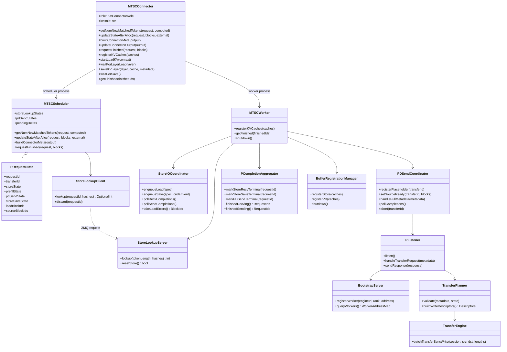
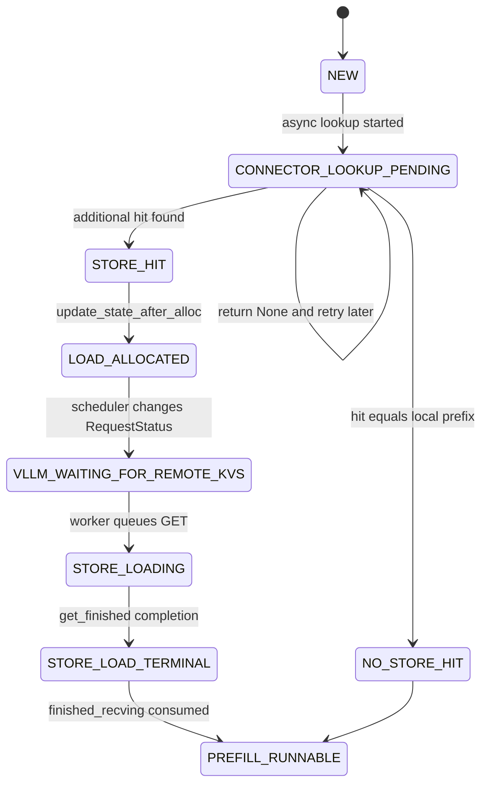
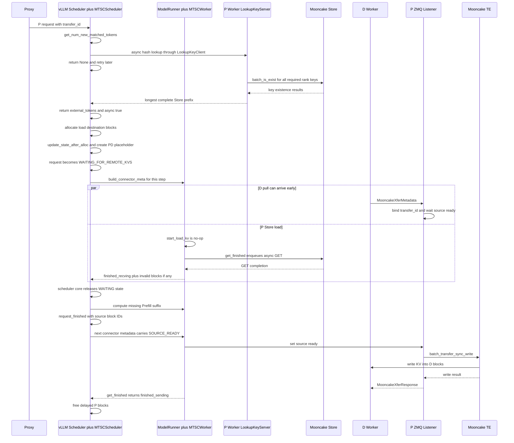
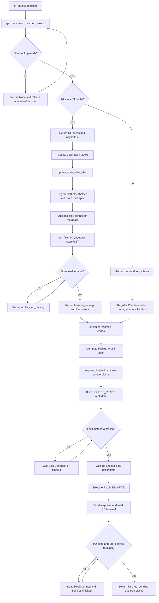

# MTSC Prefill 设计

> 上位文档：[S00-整体设计](./S00-整体设计.md)  
> 参考实现：`vllm/distributed/kv_transfer/kv_connector/v1/mooncake/mooncake_connector.py` 与 `mooncake/store/`

## 1. 设计定位

MTSC 不为 Prefill 和 Decode 实现两套 Connector。P/D 共用同一套 `connector.py`、`scheduler.py`、`worker.py` 和 metadata protocol，内部根据进程侧 role、引擎侧 role 和 request params 选择逻辑。

需区分两类 role：

- `KVConnectorRole.SCHEDULER/WORKER`：决定当前 Connector 实例运行在 scheduler process 还是 worker process；
- `kv_role` 及 request params：决定当前引擎/请求执行 P 路径还是 D 路径。

MVP 中 P 引擎配置为 producer，Proxy 发给 P 的请求包含：

```json
{
  "do_remote_decode": true,
  "do_remote_prefill": false,
  "transfer_id": "xfer-<request-id>"
}
```

P 侧主要完成两件事：

1. 读 Mooncake Store：查找并异步加载 remote prefix KV，然后只计算未命中的 Prefill suffix；
2. 写 D：通过 bootstrap/ZMQ listener 接收 D 的 pull metadata，在 P Prefill ready 后由 P 发起 TE WRITE。

这两条路径必须在一个 Connector 内协调，因为它们共用同一个 request、同一批 GPU blocks 和同一个最终 block-free 决策。

## 2. vLLM KV Connector Hook 契约

### 2.1 Scheduler-side hooks

#### `get_num_new_matched_tokens(request, num_computed_tokens)`

调用粒度：对 waiting request 调用，在 lookup 未完成时可能被重复调用。

P 侧行为：

```text
Store lookup pending  -> return (None, False)
Store additional hit  -> return (num_external_tokens, True)
No additional hit     -> return (0, False)
```

scheduler process 不直接创建 Mooncake Store client。它通过 `StoreLookupClient` 向 P worker rank 0 的 `StoreLookupServer` 发送 hash lookup，由 worker 查询 Store 并返回在所有必需 TP/PP rank 上完整的最长连续前缀。

`(None, False)` 只表示当前无法确定 hit length，scheduler 将请求放回 waiting queue 稍后重试；此时请求尚未进入 `WAITING_FOR_REMOTE_KVS`。

只有返回 `(N, True)` 且 vLLM 为这 N 个 tokens 分配好 destination blocks 后，vLLM scheduler 才将请求置为 `WAITING_FOR_REMOTE_KVS`。

#### `update_state_after_alloc(request, blocks, num_external_tokens)`

调用粒度：每次 request allocation 后调用。对 async load 请求，同一 request 可能调用两次：

1. 第一次为 Store hit tokens 分配加载目标 blocks；
2. Store load 完成后，第二次为本地 Prefill compute 分配后续 blocks。

P 侧必须保证幂等，并同时完成：

- 当 `num_external_tokens > 0` 时绑定 Store load destination block IDs；
- 为 `do_remote_decode=true` 的请求注册 PD-send placeholder，即使 Store 零命中也必须注册；
- 不因第二次调用重复创建 lookup、load 或 placeholder。

#### `build_connector_meta(scheduler_output)`

调用粒度：每次 schedule step 调用一次，而不是每个 request 调用一次。

它构造本 step 的统一 `MTSCConnectorMetadata`，包含：

- Store load specs；
- Store async-save specs；
- P 侧 PD placeholder/source-ready updates；
- finished/preempted request IDs；
- 清理信号。

该 hook 不得修改 `scheduler_output`。它在构造 metadata 后只清空“已打包进本 step”的 pending deltas，不清理 request 的长生命状态。

#### `update_connector_output(connector_output)`

调用粒度：每次 worker output 回到 scheduler 时调用。

MTSC 在这里聚合 KV events、connector stats 和 Connector 自身的请求级 bookkeeping。需要特别注意：

> `WAITING_FOR_REMOTE_KVS` 的解除不是由 `update_connector_output()` 直接完成的。vLLM scheduler core 会在该 hook 之后读取 `connector_output.finished_recving`，再将 request 标记为可在下一 step 继续调度。

#### `request_finished(request, block_ids)`

调用粒度：请求终止时恰好调用一次，vLLM 在调用后决定是否立即释放 blocks。

P 侧行为：

- 将 Prefill source block IDs 关联到 `transfer_id`；
- 产生 `PD_SOURCE_READY` delta，供下一次 `build_connector_meta()` 发给 worker；
- 如果 PD send 或 Store async save 仍未终止，返回 `delay_free_blocks=True`；
- 只有 worker `get_finished()` 最终返回该 request ID 后，vLLM 才释放 blocks。

P Proxy 将 `max_tokens=1`，因此正常 P 请求以 length-capped 状态结束。取消或异常结束不得伪造 source-ready，而应产生 PD abort/cleanup delta。

### 2.2 Worker-side hooks

#### `register_kv_caches(kv_caches)`

在 worker 初始化时调用，负责：

- 解析各 KV group/layer 的 base address、block stride 和 region length；
- 向 Mooncake Store client/TE 注册 GPU buffers；
- 向 PD Transfer Engine 注册相同 GPU buffers；
- 启动 Store recv/save 后台线程；
- P worker 启动 ZMQ listener，并向 bootstrap 注册 side-channel address。

由一个 `BufferRegistrationManager` 负责注册和销毁顺序。即使 Store 和 PD 初版使用两个 TE 实例，也不得让两个子组件独立抢占 Connector shutdown 所有权。

#### `start_load_kv(forward_context)`

vLLM 在 model forward context 进入时调用该 hook。

MVP 与 Mooncake Store Connector 保持一致：`start_load_kv()` 为 no-op，bulk Store GET 不在此处发布，而是在同一 execute-model lifecycle 末尾的 `get_finished()` 中入队。这样可以与本 step 的 GPU compute 重叠，也与当前 Store Connector 行为一致。

这是实现选择，不是 vLLM hook 的强制限制。未来如果改为 layerwise load，可以在 `start_load_kv()` 真正启动 I/O。

#### `wait_for_layer_load(layer_name)`

MVP 不支持 layerwise load，该 hook 为 no-op。P 请求在整个 Store prefix load 进入终态前停留在 `WAITING_FOR_REMOTE_KVS`，因此不会有 attention layer 在未完成的 destination blocks 上计算。

#### `save_kv_layer(...)`

MVP 使用 bulk async save，不在每层 attention 内发布 PUT，该 hook 为 no-op。Store-save specs 来自 scheduler metadata，PUT 由 `get_finished()` 入队。

#### `wait_for_save()`

MVP async save 不阻塞 forward 退出，该 hook 为 no-op。block lifetime 通过 `request_finished()` 的 delay-free 和 `get_finished()` 的 sending completion 保证，而不是在每个 forward 末尾同步等待 PUT。

#### `get_finished(finished_req_ids)`

该 hook 是 P worker 后台 I/O 的发布与完成聚合点，每个 execute-model lifecycle 末尾调用。

P 侧执行顺序：

1. 从当前 `MTSCConnectorMetadata` 中将未发布的 Store GET 加入 recv queue；
2. 为可保存的 blocks record CUDA event，将 Store PUT 加入 save queue；
3. 将 PD placeholder/source-ready/abort deltas 同步到 `PDSendCoordinator`；
4. 轮询 Store GET completion 和 failed block IDs；
5. 轮询 Store PUT completion；
6. 轮询 PD TE WRITE completion/timeout；
7. 通过 `PCompletionAggregator` 返回：

```text
(finished_sending, finished_recving)
```

其中：

- `finished_recving`：P 的 Store prefix load 已进入终态，vLLM 可解除 `WAITING_FOR_REMOTE_KVS`；
- `finished_sending`：已终止的 P request 所有 block 使用者都已完成，至少包括 PD send 和 Store save，vLLM 可释放延迟释放的 blocks。

`get_finished()` 必须对同一 metadata delta 只发布一次 I/O，因为该 hook 会在后续 steps 中持续被调用。

## 3. 核心类图



`MTSCConnector` 是 vLLM 看到的唯一 Connector 类。它在 scheduler process 中创建 `MTSCScheduler`，在 worker process 中创建 `MTSCWorker`。P/D 引擎使用相同类，只是各 hook 内根据 role 进入不同分支。

## 4. 统一 Metadata Spec

`build_connector_meta()` 每个 schedule step 生成一个统一 envelope：

```json
{
  "requests": [
    {
      "request_id": "<p-request-id>",
      "transfer_id": "xfer-<request-id>",
      "engine_role": "prefill",
      "store_load": {
        "vllm_cached_tokens": 0,
        "store_cached_tokens": 128,
        "destination_block_ids": [[11, 12]],
        "block_hashes": ["<hash-0>", "<hash-1>"]
      },
      "store_save": {
        "enabled": true,
        "newly_computed_only": true,
        "block_ids": [[13, 14]],
        "block_hashes": ["<hash-2>", "<hash-3>"]
      },
      "pd_send": {
        "state": "PLACEHOLDER_OR_SOURCE_READY",
        "source_block_ids": []
      }
    }
  ],
  "finished_request_ids": [],
  "preempted_request_ids": []
}
```

字段规则：

- `store_load` 只在本 step 需要发布新 load 时出现；
- `store_save` 可随 Prefill chunks 增量产生，不必等到 request finished；
- `pd_send.state=PLACEHOLDER` 表示 P request 已建立但 source blocks 尚未 ready；
- `pd_send.state=SOURCE_READY` 只在 `request_finished()` 提供 source block IDs 后产生；
- 每个 delta 带有内部单调 sequence 或 issued flag，worker 不重复发布 I/O；
- metadata 是 scheduler-to-worker 的每-step snapshot，不是完整 request state 的所有权转移。

## 5. 任务一：P 从 Mooncake Store 加载 Remote KV

### 5.1 Lookup 与 WAITING 状态

`LOOKUP_PENDING` 不是新的 vLLM `RequestStatus`。它是 MTSC scheduler 内部按 `request_id` 跟踪的 Connector 子状态，表示 `StoreLookupClient` 的异步查询尚未返回。

当 `get_num_new_matched_tokens()` 返回 `(None, False)` 时，vLLM scheduler 只会将请求从当前扫描中取出，放回 skipped-waiting queue，不修改它的 `RequestStatus`。下一 scheduler step 会重新调用 lookup hook。



关键区分：

```text
Connector LOOKUP_PENDING != vLLM WAITING_FOR_REMOTE_KVS
```

Connector lookup pending 时还没有 destination blocks，只是 scheduler 暂时无法决定 external hit。vLLM `WAITING_FOR_REMOTE_KVS` 时已经分配了 blocks，worker 正在向这些 blocks 异步写入 Store KV。

### 5.2 Worker async load

P worker 在第一个携带 `store_load` 的 metadata step 末尾执行：

```text
get_finished()
  -> enqueue Store GET once
  -> return no finished_recving yet
```

后续 step：

```text
get_finished()
  -> poll recv threads
  -> collect successful request IDs
  -> collect failed destination block IDs
  -> return finished_recving
```

Store GET 成功后，vLLM 下一次调度 P request，只计算 Store 前缀之后的缺失 tokens。

Store GET 部分失败时，worker 必须在同一轮 output 中提供：

```text
finished_recving = {request_id}
invalid_block_ids = {first_failed_block ... end_of_claimed_prefix}
```

vLLM scheduler 会截断 external-computed prefix，并让 P 本地重算缺失部分。只返回 error 而不返回 `finished_recving` 会导致请求永久卡在 `WAITING_FOR_REMOTE_KVS`。

## 6. 任务二：P 向 D 执行 TE WRITE

### 6.1 Placeholder 与 source ready

PD 传输有两个异步条件：

```text
d_pull_received := P listener 已收到 D MooncakeXferMetadata
p_source_ready  := P request_finished 已提供 source block IDs
can_write       := d_pull_received AND p_source_ready
```

P 在第一次 `update_state_after_alloc()` 时就为 `transfer_id` 创建 placeholder，而不等待 Prefill 完成。D 的 pull metadata 可以在 P Store load、Prefill compute 或 `request_finished()` 之前到达。

P source ready 只能在 Prefill 正常完成、scheduler 调用 `request_finished()` 并将 source block IDs 送到 worker 之后置位。

### 6.2 Bootstrap 和 listener

- P global rank 0 启动 bootstrap server；
- 每个 P TP/PP worker 启动 ZMQ `ROUTER` listener；
- worker 将 `(engine_id, tp_rank, pp_rank, listener_address)` 注册到 bootstrap；
- D 查 bootstrap 后直接连接各 P worker listener；
- bootstrap 只做地址发现，不转发 KV 和 transfer metadata。

### 6.3 TE WRITE

P listener 收到的 `MooncakeXferMetadata` 包含 D TE endpoint、D TP rank/size、destination block IDs 和 registered regions。P 在 source ready 后构造：

```text
remote_session = D_TE_hostname:D_TE_port
src_ptrs       = P_KV_base + P_source_block_offset
dst_ptrs       = D_KV_base + D_destination_block_offset
lengths        = aligned transfer lengths
```

数据面由 P 调用：

```text
batch_transfer_sync_write(remote_session, src_ptrs, dst_ptrs, lengths)
```

TE WRITE 完成后，P 在原 ZMQ request/response 通道上返回 `MooncakeXferResponse`。P 不会另外向 D 发送一份 xfer metadata 让 D 执行 TE READ。

## 7. P 侧完整时序图



如果 Store 零命中，lookup 直接返回 `(0, False)`，上图的 `WAITING_FOR_REMOTE_KVS` 和 Store GET 段被跳过；PD placeholder、Prefill compute 和 TE WRITE 流程不变。

## 8. P 侧流程图



## 9. P 侧状态与 Completion 聚合

P request 同时包含四类状态：

```json
{
  "store_load_state": "NONE|LOOKUP_PENDING|LOADING|SUCCESS|FAILED",
  "prefill_state": "NOT_STARTED|RUNNING|FINISHED|ABORTED",
  "pd_send_state": "PLACEHOLDER|WAITING_D|WAITING_P|WRITING|SUCCESS|FAILED|EXPIRED",
  "store_save_state": "NONE|QUEUED|SAVING|SUCCESS|FAILED|SKIPPED"
}
```

核心条件：

```text
P_RUNNABLE = no_store_load OR store_load_terminal

P_SOURCE_READY = P_RUNNABLE
              AND prefill_state == FINISHED
              AND source_block_ids_available

P_FINISHED_RECVING = store_load_terminal

P_FINISHED_SENDING = request_finished_seen
                  AND pd_send_terminal
                  AND store_save_terminal
```

`P_FINISHED_RECVING` 和 `P_FINISHED_SENDING` 是两个不同生命周期的 completion：

- `finished_recving` 用于解除 P 自己的 Store-load waiting，之后 P 开始 Prefill compute；
- `finished_sending` 用于释放已终止 P request 的 blocks，必须等待 PD send 和 Store save 都终止。

不能将 Store load completion 错误地当成 P request 的 block-free completion，也不能在 PD send 完成但 Store PUT 仍在读 GPU block 时提前释放 blocks。

## 10. P 侧 Async Save

Store save 和 Store load 共用 `StoreIOCoordinator`，但使用独立 queue 和 completion state。P 默认仅保存本次新计算的完整 prompt blocks，不重复保存从 Store 加载的 prefix。

```text
build_connector_meta emits save specs
  -> get_finished records one CUDA event for eligible work
  -> enqueue bulk Store PUT
  -> save thread waits CUDA event
  -> Mooncake batch PUT
  -> Store commit terminal
  -> get_finished observes save completion
```

`save_kv_layer()` 和 `wait_for_save()` 保持 no-op，因为保存是 request/block 粒度的真异步操作。

P→D TE WRITE 与 P→Store PUT 会竞争 HBM/NIC/TE 资源，默认优先级是：

```text
PD TE WRITE > Store PUT
```

对已配对的 PD request，save task 可提前入队，但实际 PUT 在 PD ACK 后启动。如果后续实测证明两者资源可隔离，再允许并行。

save queue 同时限制 task 数和字节数。MVP 过载时跳过 save，但必须将 state 设为 `SKIPPED` 以解锁 block-free 条件。save 失败不影响当前 inference，但必须产生 terminal completion。

## 11. 错误、超时与清理

### 11.1 Store load 错误

- lookup 错误按零命中处理，P 本地计算；
- GET 部分失败时返回 invalid blocks 和 `finished_recving`；
- 从首个失败 logical block 起回滚 external prefix；
- Store load 失败不得阻止 P 通过重算生成正确 source KV。

### 11.2 PD send 错误

- D metadata 与 P model/prompt/layout/rank 不匹配时 fail closed；
- 等待 D request 或 P source ready 超时后，向已连接 D 返回 error，并将 PD state 设为 terminal；
- TE WRITE 失败时不标记 success，返回 request/rank 级错误；
- D 取消或连接断开不得永久 pin P blocks；
- P request 异常结束时不等待不可能出现的 source ready，直接 abort session。

### 11.3 Shutdown

```text
reject new requests
  -> stop bootstrap registration
  -> close listener admission
  -> terminalize or cancel sessions
  -> drain Store queues and completion queues
  -> stop background threads
  -> unregister buffers
  -> close PD TE and Store client
```

## 12. 关键测试

- Store lookup pending 时返回 `None`，请求未进入 `WAITING_FOR_REMOTE_KVS`；
- Store hit 后分配 blocks，请求进入 `WAITING_FOR_REMOTE_KVS`；
- `update_state_after_alloc()` 调用两次不重复创建 load/PD placeholder；
- `build_connector_meta()` 每 step 同时打包多个 requests 的 Store/PD deltas；
- `start_load_kv()` no-op，`get_finished()` 只入队一次 Store GET；
- Store GET 成功后 `finished_recving` 解除 P waiting；
- Store GET 失败同时返回 invalid blocks 和 `finished_recving`；
- Store 零命中仍注册 PD placeholder；
- D pull 早于 P ready 和 P ready 早于 D pull 都只发起一次 TE WRITE；
- `request_finished()` 后 source-ready metadata 在下一 schedule step 到达 worker；
- PD send 完成但 Store save 未完成时不返回 `finished_sending`；
- Store save 完成但 PD send 未完成时不返回 `finished_sending`；
- PD timeout、D cancel、P abort 和 Connector shutdown 后无 session、thread 或 pinned-block 泄漏。
