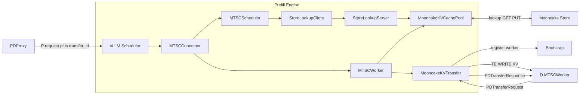
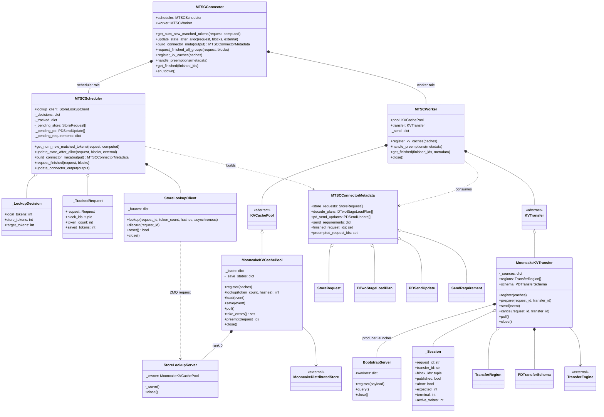
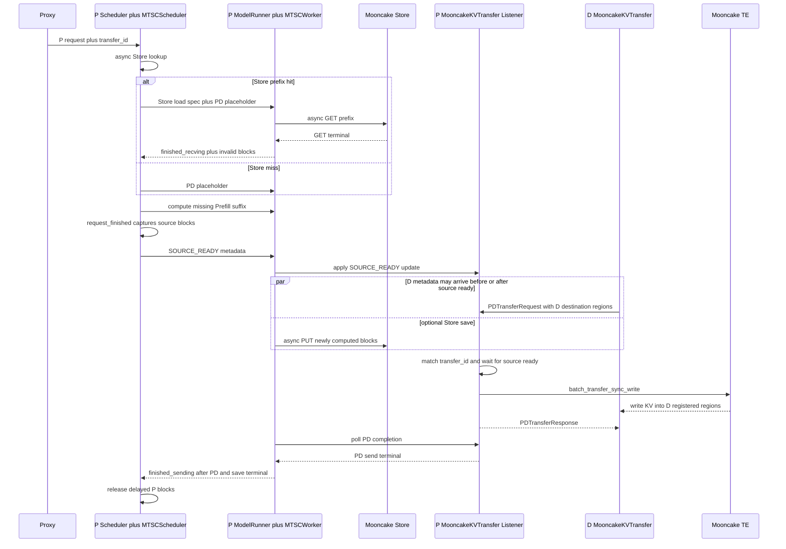
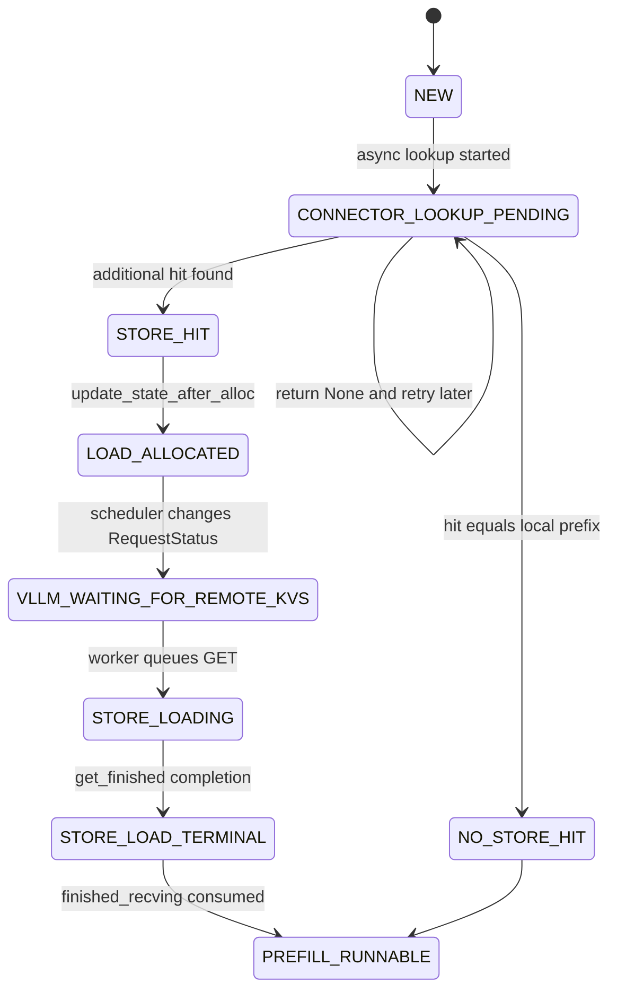

# MTSC Prefill 设计

> 上位文档：[S00-整体设计](./S00-整体设计.md)  
> Proxy 协议：[S01-proxy设计](./S01-proxy设计.md)
> D 侧设计：[S03-decode设计](./S03-decode设计.md)
> 参考实现：`vllm/distributed/kv_transfer/kv_connector/v1/mooncake/mooncake_connector.py` 与 `mooncake/store/`

> 实现边界：只复用底层 `MooncakeDistributedStore`、`TransferEngine` 和无状态 helper；不创建原生 Mooncake Connector/Scheduler/Worker 实例。

## 1. 背景

MTSC 不为 Prefill 和 Decode 实现两套 Connector。P/D 共用同一套 `connector.py`、`scheduler.py`、`worker.py` 和 metadata protocol，内部根据进程侧 role、引擎侧 role 和 request params 选择逻辑。

需区分两类 role：

- `KVConnectorRole.SCHEDULER/WORKER`：决定当前 Connector 实例运行在 scheduler process 还是 worker process；
- `kv_role` 及 request params：决定当前引擎/请求执行 P 路径还是 D 路径。

MVP 中 P 引擎配置为 producer，Proxy 发给 P 的请求包含：

```json
{
  "do_remote_decode": true,
  "do_remote_prefill": false,
  "transfer_id": "xfer-<request-id>"
}
```

P 引擎的前置条件是：Proxy 已经为本次请求选定 P/D，并向 P 下发带有唯一 `transfer_id` 的短生成请求。在此基础上，P 侧需要完成两件事：

1. 读 Mooncake Store：查找并异步加载 remote prefix KV，然后只计算未命中的 Prefill suffix；
2. 写 D：通过 bootstrap/ZMQ listener 接收 D 的 pull metadata，在 P Prefill ready 后由 P 发起 TE WRITE。

这两条路径必须在一个 Connector 内协调，因为它们共用同一个 request、同一批 GPU blocks 和同一个最终 block-free 决策。

本设计的目标是：

1. 优先从 Mooncake Store 复用与当前 topology 兼容的连续 prompt prefix，只计算缺失 suffix；
2. 允许 D pull metadata 与 P Prefill 任意先后到达，以 `transfer_id` 为关联键会合；
3. P source ready 后由 P 主动执行 TE WRITE，将 KV 写入 D 已注册的 destination blocks；
4. 在 Store save 和 PD send 都进入终态前保持 P source blocks 有效，防止异步读取过程中被提前回收；
5. Store load 失败时回退到 P 本地重算，PD send 失败时 fail closed，不把未完整 KV 报告为可用。

P 侧不负责选择 D，不根据 Store 命中修改 Proxy 路由，也不主动查找 D。D 通过 P bootstrap 发现 listener 并提供 destination metadata，P 只在本地 source ready 且远端 metadata 完整时写入。

## 2. 总体设计

### 2.1 核心特性

#### 2.1.1 Store 复用与缺失 suffix 计算

P 在进入 Prefill compute 前异步查询 Store。命中时，vLLM 为连续 prefix 分配 destination blocks，worker 完成 bulk GET 后通过 `finished_recving` 解除等待，后续只计算 Store 未覆盖的 prompt suffix。Store miss 或 GET 失败不阻断请求，未成功 blocks 由 vLLM 重算。

#### 2.1.2 早注册 Placeholder，解耦 D/P 到达顺序

P 在首次 allocation 时就为 `transfer_id` 注册 PD placeholder，不等 Prefill 完成。D pull 可以早于 P source ready 到达，P source ready 也可以先到；`MooncakeKVTransfer` 只在两个条件同时满足时启动 TE WRITE。

#### 2.1.3 控制面 pull，数据面 push

D 发起补齐请求并提供 destination addresses，但数据面由 P 调用 Mooncake TE WRITE 主动写入 D。Bootstrap 只用于 listener 发现，ZMQ 只传递 metadata 和 terminal response，KV bytes 不经过二者。

#### 2.1.4 接收与发送生命周期分离

P 的 `finished_recving` 仅表示 Store prefix load 终止，用于恢复 Prefill compute；`finished_sending` 表示 Store PUT 和 PD WRITE 都已终止，用于释放已完成请求的 source blocks。两者不可混用。

#### 2.1.5 Per-step Delta Metadata

Scheduler 不向 worker 转移完整 request state，而是在每个 schedule step 中发送一次性 delta，包括 Store request、PD placeholder/source-ready/abort 和 send requirements。Worker 只发布一次 I/O，长生命运行态保留在各自所有者中。

### 2.2 架构设计


```mermaid
flowchart LR
    X[PDProxy] -->|P request plus transfer_id| VS[vLLM Scheduler]

    subgraph P[Prefill Engine]
        VS --> C[MTSCConnector]
        C --> S[MTSCScheduler]
        C --> W[MTSCWorker]
        S --> LC[StoreLookupClient]
        W --> SI[MooncakeKVCachePool]
        W --> PD[MooncakeKVTransfer]
        LC --> LS[StoreLookupServer]
        LS --> SI
    end

    SI <-->|lookup GET PUT| MS[Mooncake Store]
    PD -->|register worker| B[Bootstrap]
    D[D MTSCWorker] -->|PDTransferRequest| PD
    PD -->|TE WRITE KV| D
    PD -->|PDTransferResponse| D
```

该架构包含三个协作面：

1. **vLLM 生命周期面**：`MTSCConnector` 适配 scheduler/worker hooks，`MTSCScheduler` 计算计划并构造 metadata，`MTSCWorker` 发布 I/O 并汇总 completion。
2. **Store 面**：Scheduler 通过 rank-0 `StoreLookupServer` 查询最长连续 prefix，worker 通过 `MooncakeKVCachePool` 异步 GET/PUT KV。
3. **PD 面**：P worker 在 bootstrap 注册 listener，接收 D metadata，等待 source ready 后执行 TE WRITE。

### 2.3 组件职责

| 组件 | P 侧职责 | 不负责 |
|---|---|---|
| `MTSCConnector` | 作为 vLLM 唯一入口，将 hooks 分派给 scheduler 或 worker 实例 | 不保存独立的 P 状态机 |
| `MTSCScheduler` | Store lookup、block 绑定、PD placeholder/source-ready delta、save spec 和 delay-free 决策 | 不直接访问 GPU KV 内存 |
| `MTSCWorker` | 消费 metadata，发布 Store/PD I/O，聚合 `finished_recving/finished_sending` | 不决定 vLLM request status |
| `StoreLookupClient/Server` | 在 scheduler 与 worker rank 0 之间传递 hash lookup，返回完整连续 prefix | 不传输 KV bytes |
| `MooncakeKVCachePool` | 生成 Store key/namespace，异步 GET/PUT，报告 completion 和 invalid blocks | 不处理 P/D 配对 |
| `MooncakeKVTransfer` | listener 注册、placeholder/source 管理、schema/region 校验、TE WRITE 与 terminal response | 不选择 D endpoint |
| `BootstrapServer` | 按 engine/DP/TP/PP 组织 P listener directory | 不转发 metadata 或 KV |
| `MTSCConnectorMetadata` | 承载单个 schedule step 的 Store/PD/cleanup deltas | 不作为完整 session state |

### 2.4 类图


```mermaid
classDiagram
    class MTSCConnector {
        +scheduler: MTSCScheduler
        +worker: MTSCWorker
        +get_num_new_matched_tokens(request, computed)
        +update_state_after_alloc(request, blocks, external)
        +build_connector_meta(output) MTSCConnectorMetadata
        +request_finished_all_groups(request, blocks)
        +register_kv_caches(caches)
        +handle_preemptions(metadata)
        +get_finished(finished_ids)
        +shutdown()
    }
    class MTSCScheduler {
        +lookup_client: StoreLookupClient
        -_decisions: dict
        -_tracked: dict
        -_pending_store: StoreRequest[]
        -_pending_pd: PDSendUpdate[]
        -_pending_requirements: dict
        +get_num_new_matched_tokens(request, computed)
        +update_state_after_alloc(request, blocks, external)
        +build_connector_meta(output) MTSCConnectorMetadata
        +request_finished(request, blocks)
        +update_connector_output(output)
    }
    class MTSCWorker {
        +pool: KVCachePool
        +transfer: KVTransfer
        -_send: dict
        +register_kv_caches(caches)
        +handle_preemptions(metadata)
        +get_finished(finished_ids, metadata)
        +close()
    }
    class _LookupDecision {
        +local_tokens: int
        +store_tokens: int
        +target_tokens: int
    }
    class _TrackedRequest {
        +request: Request
        +block_ids: tuple
        +token_count: int
        +saved_tokens: int
    }
    class StoreLookupClient {
        -_futures: dict
        +lookup(request_id, token_count, hashes, asynchronous)
        +discard(request_id)
        +reset() bool
        +close()
    }
    class StoreLookupServer {
        -_owner: MooncakeKVCachePool
        -_serve()
        +close()
    }
    class MooncakeKVCachePool {
        -_loads: dict
        -_save_states: dict
        +register(caches)
        +lookup(token_count, hashes) int
        +load(event)
        +save(event)
        +poll()
        +take_errors() set
        +preempt(request_id)
        +close()
    }
    class MooncakeKVTransfer {
        -_sources: dict
        +regions: TransferRegion[]
        +schema: PDTransferSchema
        +register(caches)
        +prepare(request_id, transfer_id)
        +send(event)
        +cancel(request_id, transfer_id)
        +poll()
        +close()
    }
    class BootstrapServer {
        +workers: dict
        +register(payload)
        +query()
        +close()
    }
    class _Session {
        +request_id: str
        +transfer_id: str
        +block_ids: tuple
        +published: bool
        +abort: bool
        +expected: int
        +terminal: int
        +active_writes: int
    }
    class MTSCConnectorMetadata {
        +store_requests: StoreRequest[]
        +decode_plans: DTwoStageLoadPlan[]
        +pd_send_updates: PDSendUpdate[]
        +send_requirements: dict
        +finished_request_ids: set
        +preempted_request_ids: set
    }
    class StoreRequest
    class DTwoStageLoadPlan
    class PDSendUpdate
    class SendRequirement
    class TransferRegion
    class PDTransferSchema
    class MooncakeDistributedStore {
        <<external>>
    }
    class TransferEngine {
        <<external>>
    }

    MTSCConnector *-- MTSCScheduler : scheduler role
    MTSCConnector *-- MTSCWorker : worker role
    MTSCScheduler *-- StoreLookupClient
    MTSCScheduler o-- _LookupDecision
    MTSCScheduler o-- _TrackedRequest
    MTSCScheduler ..> MTSCConnectorMetadata : builds
    StoreLookupClient ..> StoreLookupServer : ZMQ request
    class KVCachePool {
        <<abstract>>
    }
    class KVTransfer {
        <<abstract>>
    }
    MTSCWorker *-- KVCachePool
    MTSCWorker *-- KVTransfer
    KVCachePool <|-- MooncakeKVCachePool
    KVTransfer <|-- MooncakeKVTransfer
    MTSCWorker ..> MTSCConnectorMetadata : consumes
    MooncakeKVCachePool *-- StoreLookupServer : rank 0
    MooncakeKVCachePool --> MooncakeDistributedStore
    MooncakeKVTransfer *-- BootstrapServer : producer launcher
    MooncakeKVTransfer o-- _Session
    MooncakeKVTransfer o-- TransferRegion
    MooncakeKVTransfer *-- PDTransferSchema
    MooncakeKVTransfer --> TransferEngine
    MTSCConnectorMetadata o-- StoreRequest
    MTSCConnectorMetadata o-- DTwoStageLoadPlan
    MTSCConnectorMetadata o-- PDSendUpdate
    MTSCConnectorMetadata o-- SendRequirement
```

`MTSCConnector` 是 vLLM 看到的唯一 Connector 类。它在 scheduler process 中创建 `MTSCScheduler`，在 worker process 中创建 `MTSCWorker`。P/D 引擎使用相同类，只是各 hook 内根据 role 进入不同分支。

当前实现没有单独的 `PRequestState`、`StoreIOCoordinator`、`PDSendCoordinator`、`PCompletionAggregator` 或 `BufferRegistrationManager` 类：scheduler 长生命周期状态分别保存在 `_LookupDecision/_TrackedRequest` 和若干 pending collection 中；worker completion 聚合由 `MTSCWorker.get_finished()`、`MooncakeKVCachePool.poll()` 与 `MooncakeKVTransfer.poll()` 直接完成；注册与 shutdown 顺序也由 `MTSCWorker` 统一编排。

### 2.5 核心方法

| 方法 | P 侧核心行为 |
|---|---|
| `get_num_new_matched_tokens()` | 异步查询 Store，返回相对本地 prefix 新增的连续命中 token 数 |
| `update_state_after_alloc()` | 绑定 Store destination blocks，并为 remote-decode 请求注册 PD placeholder |
| `build_connector_meta()` | 将本 step 新增的 Store load/save、PD updates、send requirements 和 cleanup 打包给 worker |
| `request_finished()` | 正常 length-capped 结束时发布 source-ready blocks；其他终态发布 abort；决定是否延迟 block free |
| `MTSCWorker.get_finished()` | 接收 metadata，入队 Store I/O，应用 PD updates，轮询两条数据面并聚合 completion |
| `MooncakeKVTransfer.prepare()/send()/cancel()` | 创建 placeholder，将 source blocks 标记为 ready，或 abort 不可完成的 session |
| `MooncakeKVTransfer._serve()` / `_write_one()` | 接收 D request，校验 schema/region，会合 source ready，执行 TE WRITE 并返回结果 |
| `_aggregate_sends()` | 同时满足 Store-save 和 PD-send requirement 后才产生 `finished_sending` |

### 2.6 E2E 时序图


```mermaid
sequenceDiagram
    participant X as Proxy
    participant S as P Scheduler plus MTSCScheduler
    participant W as P ModelRunner plus MTSCWorker
    participant ST as Mooncake Store
    participant PP as P MooncakeKVTransfer Listener
    participant DP as D MooncakeKVTransfer
    participant TE as Mooncake TE

    X->>S: P request plus transfer_id
    S->>S: async Store lookup
    alt Store prefix hit
        S->>W: Store load spec plus PD placeholder
        W->>ST: async GET prefix
        ST-->>W: GET terminal
        W-->>S: finished_recving plus invalid blocks
    else Store miss
        S->>W: PD placeholder
    end
    S->>W: compute missing Prefill suffix
    S->>S: request_finished captures source blocks
    S->>W: SOURCE_READY metadata
    W->>PP: apply SOURCE_READY update
    par D metadata may arrive before or after source ready
        DP->>PP: PDTransferRequest with D destination regions
    and optional Store save
        W->>ST: async PUT newly computed blocks
    end
    PP->>PP: match transfer_id and wait for source ready
    PP->>TE: batch_transfer_sync_write
    TE-->>DP: write KV into D registered regions
    PP-->>DP: PDTransferResponse
    W->>PP: poll PD completion
    PP-->>W: PD send terminal
    W-->>S: finished_sending after PD and save terminal
    S->>S: release delayed P blocks
```

## 3. 详细设计

### 3.1 Scheduler-side Hooks

#### 3.1.1 `get_num_new_matched_tokens(request, num_computed_tokens)`

调用粒度：对 waiting request 调用，在 lookup 未完成时可能被重复调用。

P 侧行为：

```text
Store lookup pending  -> return (None, False)
Store additional hit  -> return (num_external_tokens, True)
No additional hit     -> return (0, False)
```

scheduler process 不直接创建 Mooncake Store client。它通过 `StoreLookupClient` 向 P worker rank 0 的 `StoreLookupServer` 发送 hash lookup，由 worker 查询 Store 并返回在所有必需 TP/PP rank 上完整的最长连续前缀。

`(None, False)` 只表示当前无法确定 hit length，scheduler 将请求放回 waiting queue 稍后重试；此时请求尚未进入 `WAITING_FOR_REMOTE_KVS`。

只有返回 `(N, True)` 且 vLLM 为这 N 个 tokens 分配好 destination blocks 后，vLLM scheduler 才将请求置为 `WAITING_FOR_REMOTE_KVS`。

#### 3.1.2 `update_state_after_alloc(request, blocks, num_external_tokens)`

调用粒度：每次 request allocation 后调用。对 async load 请求，vLLM 会把“外部 KV 加载”和“本地 Prefill 计算”拆成两个调度阶段，因此同一 request 可能进入两次该 hook。这不是 MTSC 重试了同一次 allocation，而是两次不同的 block allocation：

1. `get_num_new_matched_tokens()` 返回 `(N, True)` 后，scheduler 设置 `load_kv_async=true`，令 `num_new_tokens=0`；此时只为 N 个 Store hit tokens 分配异步 GET 的 destination blocks，然后第一次调用 `update_state_after_alloc(..., num_external_tokens=N)`。请求随后进入 `WAITING_FOR_REMOTE_KVS`，尚未执行本地 forward。
2. worker 上报 `finished_recving` 后，scheduler 将请求恢复到 waiting queue，并使用已加载的 token 数作为 `request.num_computed_tokens`。请求再次被调度时不再做 Store lookup，而是为剩余的 Prefill suffix（以及必要的 lookahead）分配 blocks，然后第二次调用 `update_state_after_alloc(..., num_external_tokens=0)`。

`blocks` 参数是 request 当前已分配的完整 block mapping，而不只是本次新增的 blocks；因此第二次调用时会同时看到前一阶段的加载 blocks 和新分配的计算 blocks。

P 侧必须保证幂等，并同时完成：

- 当 `num_external_tokens > 0` 时绑定 Store load destination block IDs；
- 为 `do_remote_decode=true` 的请求注册 PD-send placeholder，即使 Store 零命中也必须注册；
- 不因第二次调用重复创建 lookup、load 或 placeholder。

#### 3.1.3 `build_connector_meta(scheduler_output)`

调用粒度：每次 schedule step 调用一次，而不是每个 request 调用一次。

它构造本 step 的统一 `MTSCConnectorMetadata`，包含：

- Store load specs；
- Store async-save specs；
- P 侧 PD placeholder/source-ready updates；
- finished/preempted request IDs；
- 清理信号。

该 hook 不得修改 `scheduler_output`。它在构造 metadata 后只清空“已打包进本 step”的 pending deltas，不清理 request 的长生命状态。

#### 3.1.4 `update_connector_output(connector_output)`

调用粒度：每次 worker output 回到 scheduler 时调用。

当前 `MTSCScheduler.update_connector_output()` 读取 `finished_sending`，从 `_delayed` 移除已完成 request，并清理 `_tracked/_save_issued/_pd_registered` 中的长生命状态。`get_kv_connector_stats()` 和 KV event 输出当前尚未接入运行路径。需要特别注意：

> `WAITING_FOR_REMOTE_KVS` 的解除不是由 `update_connector_output()` 直接完成的。vLLM scheduler core 会在该 hook 之后读取 `connector_output.finished_recving`，再将 request 标记为可在下一 step 继续调度。

#### 3.1.5 `request_finished(request, block_ids)`

调用粒度：请求终止时恰好调用一次，vLLM 在调用后决定是否立即释放 blocks。

P 侧行为：

- 将 Prefill source block IDs 关联到 `transfer_id`；
- 产生 `PD_SOURCE_READY` delta，供下一次 `build_connector_meta()` 发给 worker；
- 如果 PD send 或 Store async save 仍未终止，返回 `delay_free_blocks=True`；
- 只有 worker `get_finished()` 最终返回该 request ID 后，vLLM 才释放 blocks。

P Proxy 将 `max_tokens=1`，因此正常 P 请求以 length-capped 状态结束。取消或异常结束不得伪造 source-ready，而应产生 PD abort/cleanup delta。

### 3.2 Worker-side Hooks

#### 3.2.1 `register_kv_caches(kv_caches)`

在 worker 初始化时调用，负责：

- 解析各 KV group/layer 的 base address、block stride 和 region length；
- 向 Mooncake Store client/TE 注册 GPU buffers；
- 向 PD Transfer Engine 注册相同 GPU buffers；
- 启动 Store recv/save 后台线程；
- P worker 启动 ZMQ listener，并向 bootstrap 注册 side-channel address。

当前由 `MTSCWorker.register_kv_caches()` 和 `MTSCWorker.close()` 统一编排注册、fence、销毁与异常回滚顺序。Store 和 PD 使用各自底层对象，但不各自抢占 Connector shutdown 所有权。

#### 3.2.2 `start_load_kv(forward_context)`

vLLM 在 model forward context 进入时调用该 hook。

MVP 与 Mooncake Store Connector 保持一致：`start_load_kv()` 为 no-op，bulk Store GET 不在此处发布，而是在同一 execute-model lifecycle 末尾的 `get_finished()` 中入队。这样可以与本 step 的 GPU compute 重叠，也与当前 Store Connector 行为一致。

这是实现选择，不是 vLLM hook 的强制限制。未来如果改为 layerwise load，可以在 `start_load_kv()` 真正启动 I/O。

#### 3.2.3 `wait_for_layer_load(layer_name)`

MVP 不支持 layerwise load，该 hook 为 no-op。P 请求在整个 Store prefix load 进入终态前停留在 `WAITING_FOR_REMOTE_KVS`，因此不会有 attention layer 在未完成的 destination blocks 上计算。

#### 3.2.4 `save_kv_layer(...)`

MVP 使用 bulk async save，不在每层 attention 内发布 PUT，该 hook 为 no-op。Store-save specs 来自 scheduler metadata，PUT 由 `get_finished()` 入队。

#### 3.2.5 `wait_for_save()`

MVP async save 不阻塞 forward 退出，该 hook 为 no-op。block lifetime 通过 `request_finished()` 的 delay-free 和 `get_finished()` 的 sending completion 保证，而不是在每个 forward 末尾同步等待 PUT。

#### 3.2.6 `get_finished(finished_req_ids)`

该 hook 是 P worker 后台 I/O 的发布与完成聚合点，每个 execute-model lifecycle 末尾调用。

P 侧执行顺序：

1. 从当前 `MTSCConnectorMetadata` 中将未发布的 Store GET 加入 recv queue；
2. 为可保存的 blocks record CUDA event，将 Store PUT 加入 save queue；
3. 通过 `MooncakeKVTransfer.prepare()/send()/cancel()` 同步 PD placeholder/source-ready/abort deltas；
4. 轮询 Store GET completion 和 failed block IDs；
5. 轮询 Store PUT completion；
6. 轮询 PD TE WRITE completion/timeout；
7. 由 `MTSCWorker._aggregate_sends()` 聚合 Store/PD send completion 并返回：

```text
(finished_sending, finished_recving)
```

其中：

- `finished_recving`：P 的 Store prefix load 已进入终态，vLLM 可解除 `WAITING_FOR_REMOTE_KVS`；
- `finished_sending`：已终止的 P request 所有 block 使用者都已完成，至少包括 PD send 和 Store save，vLLM 可释放延迟释放的 blocks。

`get_finished()` 必须对同一 metadata delta 只发布一次 I/O，因为该 hook 会在后续 steps 中持续被调用。

### 3.3 统一 Metadata Spec

`build_connector_meta()` 每个 schedule step 生成一个 `MTSCConnectorMetadata` dataclass。P 侧的逻辑形状为：

```text
MTSCConnectorMetadata(
  store_requests=[
    StoreRequest(
      request_id=...,
      token_count=...,
      block_ids=...,
      block_hashes=...,
      load=StoreLoadSpec(local_tokens=..., store_tokens=..., enabled=True)
      # 或 save=True, save_from=..., token_ids=..., prompt_tokens=...
    )
  ],
  decode_plans=[],
  pd_send_updates=[
    PDSendUpdate(
      request_id=...,
      transfer_id=...,
      block_ids=...,
      source_ready=False,
      abort=False,
    )
  ],
  send_requirements={request_id: SendRequirement(store=..., pd=...)},
  finished_request_ids={...},
  preempted_request_ids={...},
)
```

字段规则：

- `store_requests` 同时承载 load 和 save；`load.enabled=True` 表示 GET，`save=True` 表示 PUT；
- P 侧不产生 `decode_plans`；
- `PDSendUpdate` 的默认空 blocks 表示 placeholder，`source_ready=True` 表示 source blocks 已就绪，`abort=True` 表示终止 session；
- `send_requirements` 记录 request 释放 blocks 前必须等待 Store、PD 中的哪些发送路径；
- scheduler 在构建 metadata 后清空已打包的 pending collections；worker 通过 `_decode/_send`、`MooncakeKVCachePool._loads` 和 `MooncakeKVTransfer._sources` 等所有者状态避免重复发布，当前没有单独的 sequence 字段；
- metadata 是 scheduler-to-worker 的 per-step delta，不是完整 request state 的所有权转移。

### 3.4 P 从 Mooncake Store 加载 Remote KV

#### 3.4.1 Lookup 与 WAITING 状态

`LOOKUP_PENDING` 不是新的 vLLM `RequestStatus`。它是 MTSC scheduler 内部按 `request_id` 跟踪的 Connector 子状态，表示 `StoreLookupClient` 的异步查询尚未返回。

当 `get_num_new_matched_tokens()` 返回 `(None, False)` 时，vLLM scheduler 只会将请求从当前扫描中取出，放回 skipped-waiting queue，不修改它的 `RequestStatus`。下一 scheduler step 会重新调用 lookup hook。


```mermaid
stateDiagram-v2
    [*] --> NEW
    NEW --> CONNECTOR_LOOKUP_PENDING: async lookup started
    CONNECTOR_LOOKUP_PENDING --> CONNECTOR_LOOKUP_PENDING: return None and retry later
    CONNECTOR_LOOKUP_PENDING --> NO_STORE_HIT: hit equals local prefix
    CONNECTOR_LOOKUP_PENDING --> STORE_HIT: additional hit found
    STORE_HIT --> LOAD_ALLOCATED: update_state_after_alloc
    LOAD_ALLOCATED --> VLLM_WAITING_FOR_REMOTE_KVS: scheduler changes RequestStatus
    VLLM_WAITING_FOR_REMOTE_KVS --> STORE_LOADING: worker queues GET
    STORE_LOADING --> STORE_LOAD_TERMINAL: get_finished completion
    STORE_LOAD_TERMINAL --> PREFILL_RUNNABLE: finished_recving consumed
    NO_STORE_HIT --> PREFILL_RUNNABLE
```

关键区分：

```text
Connector LOOKUP_PENDING != vLLM WAITING_FOR_REMOTE_KVS
```

Connector lookup pending 时还没有 destination blocks，只是 scheduler 暂时无法决定 external hit。vLLM `WAITING_FOR_REMOTE_KVS` 时已经分配了 blocks，worker 正在向这些 blocks 异步写入 Store KV。

#### 3.4.2 Worker Async Load

P worker 在第一个携带 `store_load` 的 metadata step 末尾执行：

```text
get_finished()
  -> enqueue Store GET once
  -> return no finished_recving yet
```

后续 step：

```text
get_finished()
  -> poll recv threads
  -> collect successful request IDs
  -> collect failed destination block IDs
  -> return finished_recving
```

Store GET 成功后，vLLM 下一次调度 P request，只计算 Store 前缀之后的缺失 tokens。

Store GET 部分失败时，worker 必须在同一轮 output 中提供：

```text
finished_recving = {request_id}
invalid_block_ids = {first_failed_block ... end_of_claimed_prefix}
```

vLLM scheduler 会截断 external-computed prefix，并让 P 本地重算缺失部分。只返回 error 而不返回 `finished_recving` 会导致请求永久卡在 `WAITING_FOR_REMOTE_KVS`。

### 3.5 P 向 D 执行 TE WRITE

#### 3.5.1 Placeholder 与 Source Ready

PD 传输有两个异步条件：

```text
d_pull_received := P listener 已收到 D PDTransferRequest
p_source_ready  := P request_finished 已提供 source block IDs
can_write       := d_pull_received AND p_source_ready
```

P 在第一次 `update_state_after_alloc()` 时就为 `transfer_id` 创建 placeholder，而不等待 Prefill 完成。D 的 pull metadata 可以在 P Store load、Prefill compute 或 `request_finished()` 之前到达。

P source ready 只能在 Prefill 正常完成、scheduler 调用 `request_finished()` 并将 source block IDs 送到 worker 之后置位。

#### 3.5.2 Bootstrap 和 Listener

- P global rank 0 启动 bootstrap server；
- 每个 P TP/PP worker 启动 ZMQ `ROUTER` listener；
- worker 将 `(engine_id, tp_rank, pp_rank, listener_address)` 注册到 bootstrap；
- D 查 bootstrap 后直接连接各 P worker listener；
- bootstrap 只做地址发现，不转发 KV 和 transfer metadata。

#### 3.5.3 TE WRITE

P listener 收到的 MTSC `PDTransferRequest` 包含 D TE endpoint、D TP rank/size、destination block IDs 和 registered regions。P 在 source ready 后构造：

```text
remote_session = D_TE_hostname:D_TE_port
src_ptrs       = P_KV_base + P_source_block_offset
dst_ptrs       = D_KV_base + D_destination_block_offset
lengths        = aligned transfer lengths
```

数据面由 P 调用：

```text
batch_transfer_sync_write(remote_session, src_ptrs, dst_ptrs, lengths)
```

TE WRITE 完成后，P 在原 ZMQ request/response 通道上返回 MTSC `PDTransferResponse`。P 不会另外向 D 发送一份 xfer metadata 让 D 执行 TE READ。


### 3.6 P 侧状态与 Completion 聚合

P request 同时涉及四类生命周期，但当前代码没有定义一个统一 `PRequestState` 或下列字符串 enum。实际状态分散由各所有者维护：

| 生命周期 | 当前代码表示 |
|---|---|
| Store lookup/load | `StoreLookupClient._futures` 和 `MooncakeKVCachePool._loads/_load_events/_invalid` |
| Prefill compute | vLLM `RequestStatus` 及 `request_finished()` 回调 |
| PD send | `MooncakeKVTransfer._sources` 中 `_Session.ready/published/abort/expected/terminal/active_writes` |
| Store save | `MooncakeKVCachePool._save_states` |
| block-free 聚合 | `MTSCWorker._send` 中 `_SendState` |

下列方程是对这些对象的逻辑投影，不是另一套实现状态机：

核心条件：

```text
P_RUNNABLE = no_store_load OR store_load_terminal

P_SOURCE_READY = P_RUNNABLE
              AND prefill_state == FINISHED
              AND source_block_ids_available

P_FINISHED_RECVING = store_load_terminal

P_FINISHED_SENDING = request_finished_seen
                  AND pd_send_terminal
                  AND store_save_terminal
```

`P_FINISHED_RECVING` 和 `P_FINISHED_SENDING` 是两个不同生命周期的 completion：

- `finished_recving` 用于解除 P 自己的 Store-load waiting，之后 P 开始 Prefill compute；
- `finished_sending` 用于释放已终止 P request 的 blocks，必须等待 PD send 和 Store save 都终止。

不能将 Store load completion 错误地当成 P request 的 block-free completion，也不能在 PD send 完成但 Store PUT 仍在读 GPU block 时提前释放 blocks。

PD source 的 terminal 计数按实际接收方 fan-out 计算。TP 映射贡献 `handshake_target_ranks()` 的目标数；当 P/D PP size 不同时，每个 P PP worker 还会被所有 D PP ranks 请求，因此期望完成数为 `tp_fanout * d_pp_size`。只有所有目标 terminal 且没有 active TE WRITE 时，才允许报告 `finished_sending`。单个 write 抛错同样必须推进 terminal 计数；P 永久取消通过 `cancel()` 退休会话并唤醒等待者；未发布源内存的抢占保留会话以便恢复，不产生伪造的 send completion。

### 3.7 P 侧 Async Save

Store save 和 Store load 共用 `MooncakeKVCachePool`，但分别使用 `_save_pool/_save_states` 与 `_load_pool/_loads`，completion state 也相互独立。Scheduler 按完整 block 边界增量生成 save request；`MooncakeKVCachePool._save()` 通过 `batch_is_exist()` 过滤已存在的 Store keys，避免重复 PUT。

```text
build_connector_meta emits save specs
  -> get_finished records one CUDA event for eligible work
  -> enqueue bulk Store PUT
  -> save thread waits CUDA event
  -> Mooncake batch PUT
  -> Store commit terminal
  -> get_finished observes save completion
```

`save_kv_layer()` 和 `wait_for_save()` 保持 no-op，因为保存是 request/block 粒度的真异步操作。

当前 Store PUT 使用单 worker `ThreadPoolExecutor`，通过 `_SaveState` 串行推进显式 token 范围，并合并尚未开始且快照兼容的 pending saves；它没有独立的 task/字节数有界队列，也没有 `SKIPPED` 状态。Store PUT 与 PD TE WRITE 可并发运行，当前未实现“PD ACK 后才启动 PUT”的优先级调度。

Store PUT 失败累计在 `_SaveState.errors`；同一 request 的 running 与 pending saves 全部终止后，`SaveResult` 携带累计错误。Worker 在 request 结束且所有发送依赖终止后解锁 Store send requirement，不改变已完成的 inference 结果。

### 3.8 错误、超时与清理

#### 3.8.1 Store Load 错误

- lookup 错误按零命中处理，P 本地计算；
- GET 部分失败时返回 invalid blocks 和 `finished_recving`；
- 从首个失败 logical block 起回滚 external prefix；
- Store load 失败不得阻止 P 通过重算生成正确 source KV。

#### 3.8.2 PD Send 错误

- D metadata 与 P model/layout/block size/rank/region 不匹配时 fail closed；
- 等待 D request 或 P source ready 超时后，向已连接 D 返回 error，并将 PD state 设为 terminal；
- TE WRITE 失败时不标记 success，返回 request/rank 级错误；
- D 取消或连接断开不得永久 pin P blocks；
- P request 异常结束时不等待不可能出现的 source ready，直接 abort session。

#### 3.8.3 Shutdown

当前 `MTSCConnector.shutdown()` 依次关闭 worker 和 scheduler。`MTSCWorker.close()` 先关闭 `MooncakeKVTransfer`，再关闭 `MooncakeKVCachePool`：

```text
mark PD closing and wake source waiters
  -> fence all D receive futures and running TE WRITEs
  -> stop listener/event loop and bootstrap
  -> unregister PD buffers
  -> stop Store lookup server
  -> wait/cancel Store executor futures safely
  -> close Store handle
  -> close scheduler StoreLookupClient
```

当前 Connector 内部没有独立的“reject new requests”准入状态；停止新请求由上层 vLLM process shutdown 负责。

## 4. 关键代码路径

### 4.1 文件职责

```text
mtsc/connector.py      MTSCConnector：vLLM hook 入口与 role 分派
mtsc/scheduler.py      MTSCScheduler：lookup、block 绑定、P source/save 计划
mtsc/worker.py         MTSCWorker：后端创建、两阶段编排、completion 与 preemption
mtsc/protocol.py       Scheduler/Worker metadata 与 P/D wire structures
mtsc/kv_cache_pool.py  KVCachePool、MooncakeKVCachePool、lookup RPC、namespace 与 GET/PUT
mtsc/kv_transfer.py    KVTransfer、MooncakeKVTransfer、bootstrap、并行映射与 TE WRITE
mtsc/utils.py          共享设备事件、注册区域与 KV 布局转换
tests/test_mtsc.py     状态机、协议、平台及生命周期测试
tests/test_backends.py 后端契约、session fencing 与模拟字节传输
```

### 4.2 P 请求主路径

```text
Proxy P request
  -> MTSCConnector.get_num_new_matched_tokens()
     -> MTSCScheduler.get_num_new_matched_tokens()
        -> StoreLookupClient.lookup()
           -> StoreLookupServer._serve()
              -> MooncakeKVCachePool.lookup()
  -> MTSCConnector.update_state_after_alloc()
     -> MTSCScheduler.update_state_after_alloc()
        -> queue StoreRequest and PDSendUpdate placeholder
  -> MTSCConnector.build_connector_meta()
     -> MTSCScheduler.build_connector_meta()
  -> MTSCConnector.get_finished()
     -> MTSCWorker.get_finished()
        -> MooncakeKVCachePool.load() / poll()
        -> MooncakeKVTransfer.prepare()/send()/cancel() / poll()
  -> MTSCScheduler.request_finished()
     -> PDSendUpdate(source_ready or abort)
  -> MooncakeKVTransfer._serve()
     -> MooncakeKVTransfer._write_one()
        -> Mooncake TransferEngine batch write
  -> MTSCWorker._aggregate_sends()
     -> finished_sending
```

### 4.3 关键测试

- Store lookup pending 时返回 `None`，请求未进入 `WAITING_FOR_REMOTE_KVS`；
- Store hit 后分配 blocks，请求进入 `WAITING_FOR_REMOTE_KVS`；
- `update_state_after_alloc()` 调用两次不重复创建 load/PD placeholder；
- `build_connector_meta()` 每 step 同时打包多个 requests 的 Store/PD deltas；
- `start_load_kv()` no-op，`get_finished()` 只入队一次 Store GET；
- Store GET 成功后 `finished_recving` 解除 P waiting；
- Store GET 失败同时返回 invalid blocks 和 `finished_recving`；
- Store 零命中仍注册 PD placeholder；
- D pull 早于 P ready 和 P ready 早于 D pull 都只发起一次 TE WRITE；
- `request_finished()` 后 source-ready metadata 在下一 schedule step 到达 worker；
- PD send 完成但 Store save 未完成时不返回 `finished_sending`；
- Store save 完成但 PD send 未完成时不返回 `finished_sending`；
- PD timeout、D cancel、P abort 和 Connector shutdown 后无 session、thread 或 pinned-block 泄漏。
