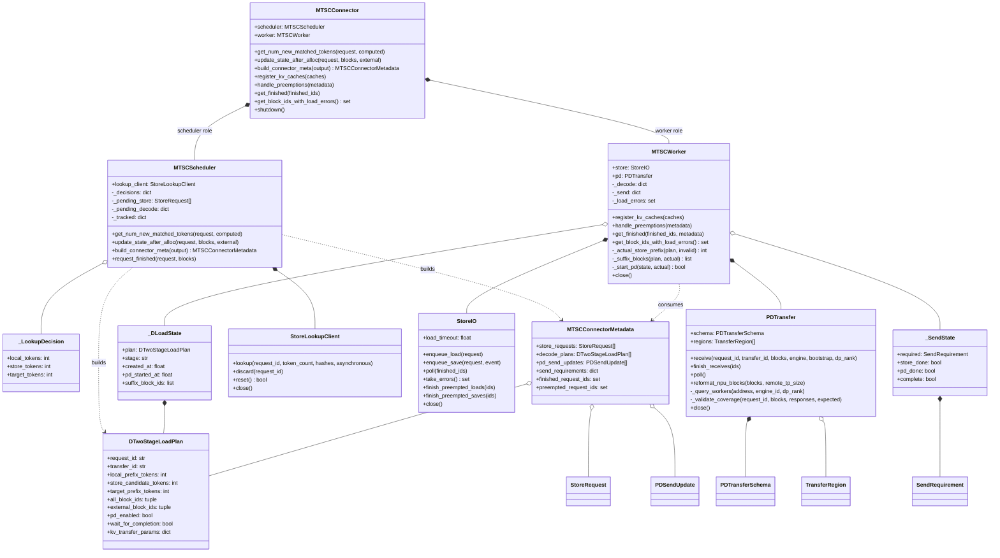
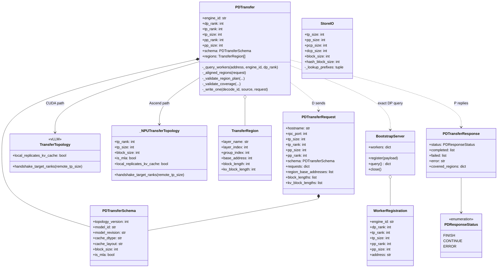
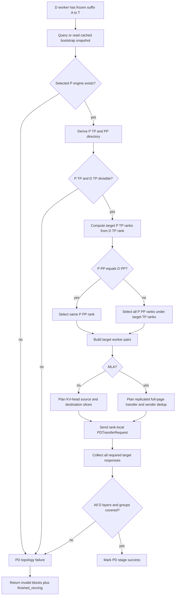
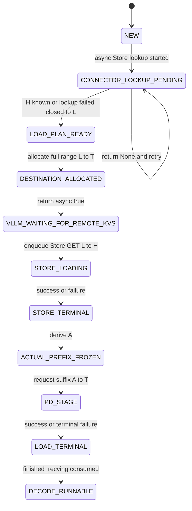
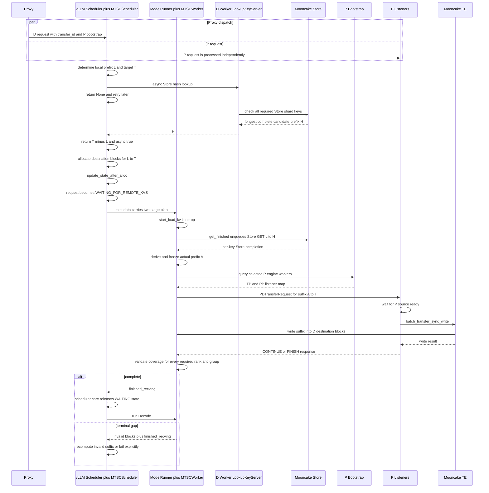
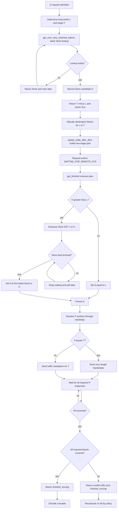

# MTSC Decode 设计

> 上位文档：[S00-整体设计](./S00-整体设计.md)  
> Proxy 协议：[S01-proxy设计](./S01-proxy设计.md)  
> P 侧设计：[S02-prefill设计](./S02-prefill设计.md)  
> 参考实现：`vllm/distributed/kv_transfer/kv_connector/v1/mooncake/mooncake_connector.py` 与 `mooncake/store/`

> 实现边界：只复用底层 `MooncakeDistributedStore`、`TransferEngine` 和无状态 helper；不创建原生 Mooncake Connector/Scheduler/Worker 实例。

## 1. 设计定位

MTSC 不为 Prefill 和 Decode 实现两套 Connector。P/D 共用同一套 `connector.py`、`scheduler.py`、`worker.py` 和 metadata protocol，内部根据进程侧 role、引擎侧 role 和 request params 选择逻辑。

MVP 中 D 引擎配置为 consumer，Proxy 发给 D 的请求包含：

```json
{
  "do_remote_decode": false,
  "do_remote_prefill": true,
  "remote_engine_id": "<selected-prefill-engine>",
  "remote_bootstrap_addr": "http://prefill-host:bootstrap-port",
  "remote_dp_rank": 0,
  "transfer_id": "xfer-<request-id>"
}
```

D 侧主要完成两件事：

1. 从 Mooncake Store 查询并异步加载可复用的连续 prefix KV；
2. Store 阶段终止后，通过 P bootstrap/listener 请求 P 补齐剩余 KV。

这里“D 从 P 拉取”描述的是控制语义。实际数据面仍沿用 Mooncake Connector 的 push/write 模式：D 将 endpoint、destination block IDs 和 registered region metadata 发给 P，P 调用 `batch_transfer_sync_write()` 将 KV 写入 D。

两阶段共享一次 vLLM external-load 生命周期：

```text
local APC [0,L)
  + Store GET [L,A)
  + P -> D TE WRITE [A,T)
  = Decode ready [0,T)
```

其中：

- `L`：D 本地 APC 已计算的连续 prefix 终点；
- `H`：Store lookup 声明可加载的连续 prefix 终点；
- `A`：Store GET 实际成功后的连续 prefix 终点，`L <= A <= H`；
- `T`：本次 remote prefill 需要覆盖的目标终点。

`H` 是计划值，`A` 才是第二阶段的真实切分点。

## 2. vLLM KV Connector Hook 契约

### 2.1 Scheduler-side hooks

#### `get_num_new_matched_tokens(request, num_computed_tokens)`

调用粒度：对 waiting request 调用；Store lookup 未完成时可能被重复调用。

D 侧先以当前本地连续 prefix `L=num_computed_tokens` 查询 Store，得到 Store 候选终点 `H`，同时根据 request 确定 remote-prefill 目标 `T`。

```text
Store lookup pending  -> return (None, False)
Lookup terminal       -> return (T - L, True)
Invalid PD request    -> return (H - L, H > L)
```

正常 P/D 请求返回的是完整外部区间 `T-L`，而不是仅返回 Store 命中的 `H-L`。这样 vLLM 一次性为 Store 阶段和 PD 阶段分配 `[L,T)` 的 destination blocks，并只进入一次 `WAITING_FOR_REMOTE_KVS`。

如果只返回 `H-L`，Store load 完成后 request 会提前离开 waiting，后续无法在同一 external-load 生命周期中安全地让 P 写入 `[A,T)`。

Store lookup 与 P 侧一致，由 scheduler process 的 `StoreLookupClient` 请求 D worker rank 0 的 `StoreLookupServer` 完成。lookup 必须验证所有必需 Store shard；任一必需 rank/group 缺失时，`H` 截断到首个不完整 logical block。

`(None, False)` 仍沿用 vLLM 的 `ext_tokens is None` 机制：request 只在本轮进入 `step_skipped_waiting`，不新增 `RequestStatus`，也尚未分配 destination blocks。

#### `update_state_after_alloc(request, blocks, num_external_tokens)`

调用粒度：每次 request allocation 后调用。

D 侧在首次 remote-prefill allocation 中完成：

- 保存 `[L,T)` 的全部 destination block IDs；
- 保存 Store lookup 得到的 `H` 和对应 block hashes；
- scheduler 建立不可变 `DTwoStageLoadPlan`；worker 接收 metadata 后建立 `_DLoadState`，初始状态为 `STORE_PENDING`；
- 将 Store 计划区间设为 `[L,H)`；
- 将 PD 候选区间设为 `[L,T)`，但此时不得固化或发送最终 suffix；
- 将 request 标记为 metadata 待发布。

实际 PD 起点只能在 Store GET 进入终态后由 worker 确定。scheduler 不应提前把 `H` 当成最终 `A`。

该 hook 必须幂等。preemption、恢复或重复 allocation 不得重复创建 Store GET、PD request 或 completion state。

#### `build_connector_meta(scheduler_output)`

调用粒度：每个 schedule step 调用一次，而不是每个 request 调用一次。

它构造统一 `MTSCConnectorMetadata`，包含：

- D 两阶段 load plan；
- `[L,T)` 的 destination block IDs；
- Store hashes 和候选区间 `[L,H)`；
- P engine/bootstrap/transfer identity；
- D 侧可选 async-save specs；
- finished/preempted request IDs 和 cleanup deltas。

metadata 只描述计划和物理绑定，不声称 Store 已实际成功。worker 必须根据 Store completion 计算 `A`。

#### `update_connector_output(connector_output)`

调用粒度：每次 worker output 回到 scheduler 时调用。

MTSC 在这里聚合：

- Store/PD metrics；
- request 级两阶段 bookkeeping；
- invalid destination block IDs；
- async-save completion。

`WAITING_FOR_REMOTE_KVS` 的解除不由该 hook 直接修改 request status。vLLM scheduler core 在处理完 connector output 后读取 `finished_recving`，再允许 request 在后续 step 继续运行。

#### `request_finished(request, block_ids)`

D request 正常进入 Decode 后，两阶段 load 已经终止，因此该 hook 主要负责：

- 清理 Store lookup future 和两阶段 session；
- 向未终止的 P control channel 发送 cancel/cleanup；
- 为 D 新计算的完整 blocks 生成可选 Store-save delta；
- 如果 async save 仍在读取这些 blocks，返回 `delay_free_blocks=True`；
- 若无需保存或保存已经终止，允许 vLLM 立即释放 blocks。

取消发生在 `WAITING_FOR_REMOTE_KVS` 时，必须同时终止 Store/PD 子任务；不得等待一个永远不会再被调度的 request。

### 2.2 Worker-side hooks

#### `register_kv_caches(kv_caches)`

在 D worker 初始化时完成：

- 解析各 KV group/layer 的 base address、block stride 和 region length；
- 向 Mooncake Store client/TE 注册 D KV cache buffers；
- 向 PD Transfer Engine 注册同一批 D destination buffers；
- 启动 Store load/save 后台线程；
- 启动 PD receiver event loop；
- 初始化 `StoreIO`、`PDTransfer` 及 `MTSCWorker` 内部的 `_DLoadState/_SendState` collection。

Store 与 PD 使用各自底层对象，但 buffer 注册、preemption fence、shutdown 和 block lifetime 由 `MTSCWorker` 统一编排。

#### `start_load_kv(forward_context)`

MVP 中保持 no-op。

原生 Mooncake PD Connector 在该 hook 发布 PD request；MTSC 为保证 Store GET 与 P WRITE 严格串行，将两阶段 load 统一放到 `get_finished()` 发布和推进。这样只有在 Store completion 已确定实际边界 `A` 后，才会产生最终 MTSC `PDTransferRequest`。

未来支持 layerwise load 时，可以重新划分发布点，但不能破坏同一 destination block 的单写者时序。

#### `wait_for_layer_load(layer_name)`

MVP 不支持 layerwise load，该 hook 为 no-op。D request 在两阶段整体终止前保持 `WAITING_FOR_REMOTE_KVS`，因此 model forward 不会读取尚未填充完成的 destination blocks。

#### `save_kv_layer(...)`

MVP 使用 bulk async save，不在每层 attention 内发布 PUT，该 hook 为 no-op。

#### `wait_for_save()`

MVP 不在 forward 尾部同步等待 Store PUT，该 hook 为 no-op。D blocks 的生命周期由 `request_finished()` 的 delay-free 与 `get_finished()` 返回的 `finished_sending` 管理。

#### `get_finished(finished_req_ids)`

该 hook 是 D worker 两阶段 load 的发布、状态推进和完成聚合点。

每次调用按以下顺序执行：

1. 接收当前 metadata 中尚未发布的 `DTwoStageLoadPlan`；
2. 对 `[L,H)` 非空的请求，将 Store GET 加入 recv queue；
3. 对 Store 区间为空的请求，直接令 `A=L`；
4. 轮询 Store GET completion 和 failed block IDs；
5. 对 Store 已终止的请求计算本 worker 的实际连续边界 `A`；
6. 固化 `A`，构造 `[A,T)` 的 PD destination block IDs；
7. 查询或复用 P bootstrap worker map，发送 `PDTransferRequest`；
8. 轮询所有必需 P worker 的 `CONTINUE/FINISH/ERROR` 响应；
9. 验证 local、Store、PD 对 `[0,T)` 的覆盖；
10. 轮询 D async-save completion；
11. 返回 `(finished_sending, finished_recving)` 以及 invalid block IDs。

只有整个两阶段 load 进入终态时才返回 `finished_recving`。Store GET 完成只是内部阶段转换，不能单独解除 vLLM waiting。

## 3. 核心类图



`MTSCConnector` 仍是 vLLM 看到的唯一 Connector 类。当前代码没有独立的 `DRequestState`、`DTwoStageLoadCoordinator`、`PDPullCoordinator`、`IntegrityTracker` 或 `DCompletionAggregator` 类。不可变计划由 `DTwoStageLoadPlan` 表示；worker 运行态由 `_DLoadState` 表示；`MTSCWorker.get_finished()` 直接推进 `STORE_PENDING -> STORE_DONE -> PD_PENDING -> terminal`，并组合 `StoreIO.poll()`、`PDTransfer.poll()` 和 `_load_errors` 得到 vLLM completion。

## 4. 统一 Metadata Spec

`build_connector_meta()` 为 D request 生成如下 per-step delta：

```json
{
  "requests": [
    {
      "request_id": "<d-request-id>",
      "transfer_id": "xfer-<request-id>",
      "engine_role": "decode",
      "two_stage_load": {
        "local_prefix_tokens": 0,
        "store_candidate_tokens": 128,
        "target_external_tokens": 512,
        "store_topology_signature": "<store-topology-signature>",
        "pd_topology_version": 1,
        "destination_block_ids": [[21, 22, 23, 24, 25, 26, 27, 28]],
        "block_hashes": ["<hash-0>", "<hash-1>", "<hash-2>", "<hash-3>"],
        "store_load": {
          "enabled": true,
          "start_tokens": 0,
          "end_tokens": 128
        },
        "pd_pull": {
          "enabled": true,
          "start_from_actual_store_prefix": true,
          "remote_engine_id": "<selected-prefill-engine>",
          "remote_bootstrap_addr": "http://prefill-host:bootstrap-port"
        }
      },
      "store_save": {
        "enabled": false,
        "newly_computed_only": true,
        "block_ids": []
      }
    }
  ],
  "finished_request_ids": [],
  "preempted_request_ids": []
}
```

字段规则：

- `destination_block_ids` 覆盖完整 `[L,T)`，不是只覆盖 Store 候选区间；
- `store_candidate_tokens` 表示 `H`，不是实际完成边界 `A`；
- `store_topology_signature` 防止不同 Store 并行布局的对象发生 key collision；
- `pd_topology_version` 固定 P/D 对 worker mapping 和 region slicing 的解释版本；
- metadata 中不伪造 `A`，`A` 只能由 worker 的 Store GET 结果产生；
- `pd_pull.start_from_actual_store_prefix=true` 表示 PD suffix 在 worker 内延迟绑定；
- `remote_bootstrap_addr` 只用于发现 P worker listener，不是 TE endpoint；
- 每个 delta 带内部 sequence 或 issued flag，`get_finished()` 不得重复入队；
- 同一个 schedule step 可以携带多个 requests，各 request 独立推进状态。

## 5. Transfer Topology 设计

### 5.1 两个独立的 topology domain

MTSC 必须区分 PD data plane topology 和 Store object topology：

```text
PD data plane
  -> 支持 P/D 使用不同 TP/PP
  -> 根据 TP ratio 对 KV region 切片或聚合
  -> MLA 按 replicated KV 处理

Store object namespace
  -> MVP 只读取与 D 同构的 Store objects
  -> 不在 Store GET 中做 TP shard 的切片、聚合或重排
  -> MLA 使用单 KV-head namespace 和 replicated load
```

两者不能共用一个简单的 `rank == rank` 判断。PD 的 P worker 是当前 request 动态选择的远端数据源；Store key 则是跨请求、跨 engine 共享的持久对象 namespace。

Store topology 不兼容时按 Store miss 处理：

```text
H = L
PD suffix = [L,T)
```

PD topology 不兼容时无法保证 P KV 正确落到 D destination regions，必须 fail closed，并返回 invalid blocks 与 `finished_recving`。

### 5.2 拓扑相关类图



代码中没有独立的 `TransferTopologyManager`、`PDTransferTopology`、`StoreTopologyPolicy` 或 `RegionPlan` 类。PD 拓扑入口就是 `PDTransfer`：CUDA 路径复用 vLLM `TransferTopology`，Ascend 路径使用 MTSC `_NPUTransferTopology`；region 对齐、slice 长度校验和 coverage 校验分别由其私有方法完成。

Store 兼容性也没有单独的 policy 对象。`store_topology_namespace()` 是纯函数，根据 model/revision、TP/PP/PCP/DCP、block/hash size、KV layout/dtype、MLA 和 group schema 生成稳定 namespace；`store_tp_layout()` 是 MLA/普通 KV 的 Store rank 映射纯函数。`StoreIO` 在构造 database/key prefix 时调用它们。不能因为 PD 已支持异构 TP/PP，就让 Store 路径未经 namespace 隔离地读取不同 topology 的对象。

### 5.3 Bootstrap worker directory

复用 Mooncake bootstrap 的索引方式。P worker 注册：

```json
{
  "engine_id": "<p-engine-id>",
  "dp_rank": 0,
  "tp_rank": 1,
  "pp_rank": 0,
  "addr": "tcp://p-worker-host:port"
}
```

bootstrap 查询返回：

```json
{
  "0": {
    "engine_id": "<p-engine-id>",
    "tp_size": 2,
    "pp_size": 1,
    "worker_addr": {
      "0": {
        "0": "tcp://p-tp0-pp0:port"
      },
      "1": {
        "0": "tcp://p-tp1-pp0:port"
      }
    }
  }
}
```

外层 key 是 P 的 DP rank。D 必须用 Proxy 下发的 `remote_dp_rank` 精确选择 entry，并校验 entry 的 `engine_id` 与 `remote_engine_id` 一致；不得扫描或回退到其他 DP replica。

D 从 `worker_addr` 推导 P 的 TP/PP worker directory：

```text
p_tp_size = number of tp_rank entries
p_pp_ranks[p_tp_rank] = registered pp_rank entries
```

MVP 延续 Mooncake 的地址发现模式：bootstrap 不转发 transfer metadata 和 KV bytes。具体 KV region metadata 由 D 在 MTSC `PDTransferRequest` 中发给目标 P listener，P 使用本地注册信息做最终 region validation。

bootstrap entry 必须满足：

- 同一 `engine_id` 下 `(tp_rank, pp_rank)` 唯一；
- TP ranks 从 `0` 连续到 `p_tp_size-1`；
- 每个 target TP rank 的 PP registration 完整；
- directory 在 request session 内形成 immutable snapshot；
- entry 缺失或变化时当前 transfer fail closed，不静默换 P engine。

### 5.4 PD TP mapping

PD 阶段复用 Mooncake `TransferTopology.handshake_target_ranks()` 的整数比例规则。

设：

```text
P = p_tp_size
D = d_tp_size
d = 当前 D tp_rank
```

只支持以下关系：

```text
D % P == 0
OR
P % D == 0
```

不互为整数倍时，MVP 不执行隐式 all-to-all 或临时重分片，直接判定 PD topology unsupported。

本阶段的“异构并行”明确指 TP/PP。Proxy 已选定唯一 P DP engine；PCP/DCP 的 KV 语义和 block ownership 必须一致，MVP 不在 PD transfer 中转换不同的 PCP/DCP 配置。

当 `D >= P`：

```text
r = D / P
target_p_tp_ranks(d) = [floor(d / r)]
```

一个 P rank 服务 `r` 个 D ranks。对于普通 MHA/GQA KV，P 从自己的较大 KV-head region 中取对应 slice，分别写入这些 D ranks。

示例：

```text
P TP=2, D TP=4

D0 -> P0, source slice 0
D1 -> P0, source slice 1
D2 -> P1, source slice 0
D3 -> P1, source slice 1
```

当 `P > D`：

```text
r = P / D
target_p_tp_ranks(d) = [d*r, d*r+1, ..., d*r+r-1]
```

一个 D rank 从 `r` 个 P ranks 接收 KV shards，并写入 D block 的不同 destination offsets。

示例：

```text
P TP=4, D TP=2

D0 <- P0 into destination slice 0
D0 <- P1 into destination slice 1
D1 <- P2 into destination slice 0
D1 <- P3 into destination slice 1
```

当 `P == D`：

```text
D rank d <-> P rank d
```

普通 MHA/GQA 的 region length 必须符合 TP ratio：

```text
D > P: P_kv_block_len == D_kv_block_len * (D / P)
P > D: D_kv_block_len == P_kv_block_len * (P / D)
P = D: P_kv_block_len == D_kv_block_len
```

实际 descriptor 由 P 侧根据 `p_tp_rank`、`d_tp_rank`、TP ratio、source/destination `kv_block_len` 计算。D 只负责选择目标 P ranks、提供 D regions，并等待计划要求的全部响应。

### 5.5 PD PP mapping

PP mapping 复用 Mooncake Connector 的 layer-alignment 语义。

当 `P_PP == D_PP`：

```text
D pp_rank q -> P pp_rank q
```

当 `P_PP != D_PP`：

```text
D worker -> 目标 P tp_rank 下的全部 P pp_ranks
```

每个 P PP worker 只传输本地与 D region metadata 中按 `layer_name` 对齐的 layers。匹配 key 至少包含：

```text
layer_name
layer occurrence
group_index
```

不能按 region list 的位置直接 zip，因为不同 PP 切分下 P/D worker 拥有的 layer 子集不同。

D completion 条件是所有 D 本地 required layers 都被目标 P PP workers 的并集恰好覆盖。出现以下任一情况都 fail closed：

- D required layer 没有 P owner；
- 同一个 D layer 被不兼容的多个 P regions 重复覆盖；
- group index、layer kind 或 region length 不兼容；
- P response 数少于 topology plan 的 required target 数。

未来 bootstrap 可以直接发布每个 PP worker 的 layer range，提前过滤无交集连接。MVP 为 simple & fast，先连接目标 TP 下的全部 P PP workers，由 P listener 按 layer name 过滤。

### 5.6 MLA 的 PD 特殊处理

MLA latent KV 不按普通 KV heads 在 TP 间切分；在当前 Mooncake 设计中视为 TP replicated KV：

```text
producer_cache_replicated = true
effective_num_kv_heads = 1
```

TP target 发现仍使用上一节的 ratio mapping，但真正发送 bytes 时去除重复 sender。

当 `P > D` 时，一个 D rank 会连接多个 P ranks，但每组中只选择一个 P rank发送完整 MLA block：

```text
P TP=4, D TP=2

D0 connects P0,P1; P0 sends, P1 returns success without data
D1 connects P2,P3; P2 sends, P3 returns success without data
```

sender 选择沿用 Mooncake 规则：

```text
p_tp_rank % (P / D) == 0
```

当 `D > P` 时，每个 D rank 连接一个 P rank，该 P rank 可将同一份 replicated MLA KV 写给映射到它的多个 D ranks：

```text
P TP=2, D TP=4

P0 -> D0 full MLA block
P0 -> D1 full MLA block
P1 -> D2 full MLA block
P1 -> D3 full MLA block
```

MLA 不使用普通 MHA/GQA 的 KV-head slice offsets：

```text
source_offset = 0
destination_offset = 0
transfer_length = full MLA page_size_bytes
```

P/D 必须同时声明 `is_mla=true`，并且 MLA page size、cache dtype、layer/group schema 一致。任一不一致都不能退化为普通 TP slice。

### 5.7 Store topology：MVP 只支持同构并行

Mooncake Store object 是已完成布局的数据对象，GET API 不负责把一个 TP shard 动态切片、聚合或重排成另一个 TP layout。因此 Store 阶段 MVP 要求 producer object topology 与当前 D 完全兼容：

```text
store_tp_size == d_tp_size
store_pp_size == d_pp_size
store_pcp_size == d_pcp_size
store_dcp_size == d_dcp_size
store_block_size == d_block_size
store_hash_block_size == d_hash_block_size
store_kv_layout == d_kv_layout
store_kv_cache_dtype == d_kv_cache_dtype
store_layer_group_schema == d_layer_group_schema
```

DP rank 不进入兼容判断，因为 Store 的目标就是让不同 DP replicas 共享同一份 KV objects。

为避免不同 topology 产生相同表面 key，MTSC 为 Store namespace 计算稳定签名：

```json
{
  "model_id": "<model-and-revision>",
  "tp_size": 2,
  "pp_size": 1,
  "pcp_size": 1,
  "dcp_size": 1,
  "block_size": 16,
  "hash_block_size": 16,
  "kv_layout": "HND",
  "kv_cache_dtype": "auto",
  "is_mla": false,
  "layer_group_schema_hash": "<hash>"
}
```

其 canonical serialization 的 hash 作为 `store_topology_signature`，并进入 `cache_prefix` 或 object key namespace。lookup 和 GET 只能访问当前 D signature 下的 keys。

如果发现签名不匹配：

```text
do not issue Store GET
H = L
continue with PD load [L,T)
```

不得尝试读取后再根据 byte length 猜测是否兼容。

因此当 P/D 使用不同 TP/PP 时，它们保存到不同 Store namespaces：P 保存的 objects 只供与 P topology 兼容的实例复用，D 保存的 objects 只供与 D topology 兼容的实例复用。D 不会直接 GET P 的异构 Store shards；当前请求的跨 topology 补齐始终走 PD Transfer Engine。P/D topology 相同时，两侧才自然共享同一 Store namespace。

### 5.8 MLA 的 Store 特殊处理

Store 仍不支持不同并行度，但在同构 topology 内复用 Mooncake Store Connector 的 MLA 去重方式。

在默认 `DCP=1` 时，MLA 设置：

```text
num_kv_head = 1
put_step = tp_size
head_or_tp_rank = 0
```

所有 TP ranks 的 MLA KV 内容等价，因此使用同一个逻辑 KV-head namespace：

```text
@tp_rank:0@pp_rank:<pp>@group:<group>@<block_hash>
```

Store save 时，不让所有 TP ranks 重复 PUT 同一个 key。chunk 按绝对 `chunk_id` 在 replicated TP ranks 间条带化；Mooncake Store Connector 还按 `group_index` 旋转 owner 以均衡各 group：

```text
owner_tp_rank = (chunk_id - group_index) mod tp_size
```

owner 写入共享的 `tp_rank:0` namespace；其他 replicated ranks 跳过该 chunk。Store lookup 对每个 PP/group 只检查一个 MLA TP namespace，而不是要求 `tp_size` 份重复对象。

Store load 时，每个 D TP worker 从相同 `tp_rank:0` key 读取完整 MLA object，写入自己的 rank-local destination block。注册 region 使用 blocks-first 单 region，单 block 长度为 MLA `page_size_bytes`，不拆成 K/V 两个 regions。

该优化只减少重复 Store objects，不放宽 MVP 的 topology compatibility：即使 MLA bytes 在 TP 上复制，不同 TP/PP 配置写出的 objects 在本阶段仍使用不同 `store_topology_signature`。

当 `DCP>1` 时，MVP 沿用 Mooncake Store Connector 的保守策略，不做上述 TP 去重：每个 `(tp_rank,dcp_rank)` 使用独立 namespace，`put_step=1`，lookup 必须检查全部必需 namespaces。这避免 DCP 切分后把语义不同的 objects 错当成 MLA replicas。

### 5.9 D worker 选择 P workers 流程图



### 5.10 Topology completion accounting

每个 D worker 为 request 记录不可变的 target set：

```text
required_targets = {
  (p_engine_id, p_tp_rank, p_pp_rank, listener_addr), ...
}
```

完成条件：

```text
PD_RANK_LOCAL_DONE = every required_target has terminal response
                  AND every required local layer/group is covered
                  AND every data-carrying descriptor completed successfully

D_REQUEST_DONE = every participating D worker reports PD_RANK_LOCAL_DONE
```

vLLM 的 worker output aggregator 最终聚合所有 D workers 的 `finished_recving`。任一 D worker 不得因为自己收到第一个 P response 就提前报告 request ready。

### 5.11 Topology 关键测试

- P TP=2、D TP=2 时一一配对；
- P TP=2、D TP=4 时一个 P rank 向两个 D ranks 发送不同普通 KV slices；
- P TP=4、D TP=2 时两个 P ranks 聚合写入一个 D rank 的不同 offsets；
- P/D TP 不互为整数倍时 fail closed；
- P PP=D PP 时同 PP rank 配对；
- P PP 与 D PP 不同时按 layer name 聚合多个 P PP workers；
- PP layer 缺失、重复或 group mismatch 时 fail closed；
- MLA P TP=4、D TP=2 时每组只有一个 P rank 发送 full page；
- MLA P TP=2、D TP=4 时 replicated P rank 可服务多个 D ranks；
- MLA/non-MLA 或 page size 不一致时拒绝 transfer；
- Store topology 完全相同时允许 lookup/GET；
- Store topology 不同时跳过 Store，并由 PD 补齐 `[L,T)`；
- MLA Store key 使用 `tp_rank:0`，lookup 不要求重复 TP namespaces；
- MLA Store save 对同一 chunk 只有一个 TP owner PUT；
- bootstrap 缺 rank、重复注册或 session 中变化时 fail closed；
- target set 中任一 response 未终止时不得返回 `finished_recving`。

## 6. 任务一：D 从 Mooncake Store 加载 Remote KV

### 6.1 Lookup 与一次性 allocation

Store lookup pending 与 vLLM remote-load waiting 仍是两个层级：

```text
Connector LOOKUP_PENDING != vLLM WAITING_FOR_REMOTE_KVS
```



lookup 未完成时没有 destination blocks；进入 `WAITING_FOR_REMOTE_KVS` 时 `[L,T)` 已全部分配。Store 和 PD 不分别触发两次 allocation，也不分别进入两次 waiting。

### 6.2 Store async load

第一个携带 `two_stage_load` metadata 的 step 末尾：

```text
get_finished()
  -> enqueue Store GET [L,H) once
  -> keep request in WAITING_FOR_REMOTE_KVS
```

后续 step：

```text
get_finished()
  -> poll Store recv threads
  -> collect per-block failures
  -> derive actual contiguous prefix A
  -> freeze A
  -> start PD suffix [A,T)
```

Store GET 的完成不会直接放入 `finished_recving`。它只触发内部状态从 `STORE_LOADING` 进入 `PD_PENDING`。

如果某个 worker/rank 的 Store GET 在候选区间中途失败，该 worker 以首个失败 logical block 为 `A`，让 P 重写 `[A,T)`。已经成功写入但位于 `A` 之后的 Store blocks 可以被 P 覆盖，因为两阶段严格串行，不存在并发写同一 destination block。

## 7. 任务二：D 请求 P 补齐剩余 KV

### 7.1 Bootstrap 与 pull metadata

Store 阶段终止并固化 `A` 后，D 执行：

```text
remote_engine_id + remote_bootstrap_addr
  -> query P bootstrap
  -> obtain P TP/PP listener addresses
  -> build rank-local suffix destination blocks [A,T)
  -> send PDTransferRequest to P listeners
```

MTSC `PDTransferRequest` 包含：

```json
{
  "hostname": "<d-te-host>",
  "rpc_port": 0,
  "tp_size": 2,
  "tp_rank": 0,
  "pp_size": 1,
  "pp_rank": 0,
  "schema": {
    "topology_version": 1,
    "model_id": "<model-id>",
    "model_revision": "<revision>",
    "cache_dtype": "<dtype>",
    "cache_layout": "<layout>",
    "block_size": 16,
    "is_mla": false
  },
  "requests": {
    "<d-request-id>": [
      "xfer-<request-id>",
      [[25, 26, 27, 28]]
    ]
  },
  "region_base_addresses": [0],
  "block_lengths": [0],
  "kv_block_lengths": [0],
  "layer_names": [],
  "layer_indices": [],
  "group_indices": []
}
```

示例中的地址和长度仅表示字段形状，实现中必须填写注册后的真实值。

### 7.2 控制 pull，数据 push

D 不调用 TE READ。P listener 收到 metadata 后等待对应 `transfer_id` 的 P source ready，然后执行：

```text
P batch_transfer_sync_write(
    remote_session = D TE endpoint,
    src_ptrs       = P source blocks,
    dst_ptrs       = D suffix destination blocks,
    lengths        = aligned KV lengths
)
```

P 通过原 ZMQ channel 返回 MTSC `PDTransferResponse`，其中包含本次实际写入的 D region indices。D 只有在所有必需 P TP/PP worker 都返回终态成功、且每个需要数据的 D region 的 TP fan-in coverage 恰好满足预期后，才把 PD coverage 标记为完成。P source 的释放计数同时包含 TP fan-out 和异构 PP fan-out，不能在部分 D PP worker 尚未到达时提前释放。

### 7.3 零长度握手

当 `A == T` 时，D 已从 local/Store 获得全部 KV，但仍向 P 发送 `requests` 中 block list 为空的请求并等待 ACK。

该握手用于：

- 通知 P 本次 session 不需要数据；
- 让 P 的 `PDTransfer._Source` 进入 terminal；
- 解除 P 为 `transfer_id` 延迟释放的 source blocks；
- 让 Store 部分命中和全命中共享同一终态协议。

不得因为 PD 字节数为零而直接在 D 本地宣布整个 session 完成。

## 8. D 侧完整时序图



bootstrap 查询是 metadata-only 操作，可以与 Store GET 预连接并行；最终 `PDTransferRequest` 不得在 `A` 固化前发送，否则 Store 和 P 可能同时写相同 D blocks。

## 9. D 侧流程图



## 10. D 状态与 Completion 聚合

D request 同时包含三类主要状态：

```json
{
  "store_load_state": "NONE|LOOKUP_PENDING|QUEUED|LOADING|SUCCESS|FAILED",
  "pd_pull_state": "NONE|WAITING_STORE|CONNECTING|WAITING_P|WRITING|SUCCESS|FAILED|EXPIRED",
  "store_save_state": "NONE|QUEUED|SAVING|SUCCESS|FAILED|SKIPPED"
}
```

两阶段状态方程：

```text
STORE_TERMINAL = store_load_state in {NONE, SUCCESS, FAILED}

ACTUAL_PREFIX_FROZEN = STORE_TERMINAL
                    AND A derived from actual rank-local Store results

PD_CAN_START = ACTUAL_PREFIX_FROZEN
            AND destination blocks for [A,T) are allocated
            AND P worker map is available

D_LOAD_SUCCESS = coverage(local, Store, PD) contains every required
                 block/rank/group in [0,T)

D_LOAD_TERMINAL = D_LOAD_SUCCESS
               OR unrecoverable Store/PD/cancel/timeout terminal

D_FINISHED_RECVING = D_LOAD_TERMINAL
```

终态失败时必须同时报告：

```text
finished_recving = {request_id}
invalid_block_ids = first_uncovered_destination_block ... T
```

只记录 error 而不返回 `finished_recving` 会使 request 永久停留在 `WAITING_FOR_REMOTE_KVS`。

Store completion 不等于 `D_FINISHED_RECVING`；P 的某一个 worker 返回成功也不等于 `D_FINISHED_RECVING`。最终 readiness 必须覆盖所有必需 TP/PP rank 和 KV group。

## 11. 并发模型

MTSC 不设置“整个 D 一次只能拉一个 request”的全局锁。

- 每个 request 有独立 `_DLoadState`，其中引用不可变 `DTwoStageLoadPlan`；
- 一个 schedule step 可以发布多个两阶段 plans；
- Store loads 进入 `StoreIO._load_pool`；默认 `mtsc_store_load_workers=2`，可通过该配置调整单 worker 并行 GET 数；
- 每个 `_DLoadState` 当前独立启动一次 `PDTransfer.receive()`；wire schema 支持 `PDTransferRequest.requests` map，但当前发送路径每条消息只放一个 request；
- P 侧 sender thread pool 可以并行执行多个 TE batches；
- 不同 D TP workers 独立处理自己的 KV shards。

并发不会改变两阶段的 request 内顺序：对于同一个 request、同一个 rank/group，P WRITE 必须发生在 Store GET 终止之后。

## 12. D 侧 Async Save

D async save 是辅助路径，不属于两阶段 load 的完成条件。默认策略是：

- 不重复保存从 Store 加载的 prompt blocks；
- 不把 P 写入 D 的 prompt blocks 隐式保存为新 replica；
- 仅保存 D 在 Decode 阶段新计算且达到完整 block 边界的 KV；
- 如果需要把 P KV 复制为 D 所在 Store replica，必须配置显式 replication policy。

```text
build_connector_meta emits D save specs
  -> get_finished records CUDA event
  -> enqueue Store PUT
  -> save thread waits CUDA event
  -> Mooncake batch PUT
  -> get_finished observes terminal completion
  -> finished_sending allows delayed blocks to be freed
```

save queue 同时限制 task 数和字节数。MVP 过载时 `SKIPPED`，不阻塞前台 Decode，但必须生成 terminal state，避免 block 永久 pinned。

## 13. 错误、超时与清理

### 13.1 Store 错误

- lookup 失败时按 `H=L` 处理，由 P 提供完整 `[L,T)`；
- Store GET 部分失败时将 `A` 回滚到首个失败 logical block；
- `A` 之后即使有 Store GET 成功，也由 P 重新覆盖，保持连续 prefix 语义；
- Store 错误本身不应导致 request 失败，只要 P 能补齐。

### 13.2 PD 错误

- bootstrap 查不到指定 `remote_engine_id` 时 fail closed；
- P/D model、layout、TP mapping、registered regions 不匹配时拒绝传输；
- P 等待 source ready 超时后返回 terminal failure；
- D 一旦把 destination addresses 发给 P，就必须等 P terminal response 作为 DMA fence，不能仅凭本地 ZMQ timeout 释放 blocks；
- 任一必需 rank/group 失败都不得报告成功；
- 已终止 request 的延迟 response 只记录并丢弃，不得复活 session。

### 13.3 Timeout

D 分开记录：

- `store_lookup_timeout`；
- `store_get_timeout`；
- `bootstrap_connect_timeout`；
- `prefill_ready_timeout`；
- `te_transfer_timeout`；
- `session_ttl`。

当前 Mooncake 同步 Store GET 和 TE WRITE 都没有安全取消原语。Store GET 超时会先标记请求失败，但仍等待底层调用终止后才允许 block 回收；随后将请求涉及的 Store blocks 标为 invalid，进入 P suffix 或本地重算。PD request 在 destination addresses 已发布后同样以 terminal response 为安全 fence，不能用“超时即释放”实现，否则会产生 late-write。

所有日志和 metrics 携带 `request_id`、`transfer_id`、TP/PP rank。请求终态记录：

```json
{
  "request_id": "<d-request-id>",
  "transfer_id": "xfer-<request-id>",
  "local_prefix_tokens": 0,
  "store_candidate_tokens": 128,
  "actual_store_tokens": 128,
  "target_external_tokens": 512,
  "store_blocks": 2,
  "pd_blocks": 6,
  "store_status": "SUCCESS",
  "pd_status": "SUCCESS",
  "save_status": "NONE",
  "total_wait_ms": 0
}
```

### 13.4 Shutdown

```text
reject new requests
  -> stop Store/PD admission
  -> terminalize waiting sessions
  -> report invalid blocks plus finished_recving
  -> drain or cancel async-save tasks
  -> stop background threads and event loops
  -> unregister buffers
  -> close PD TE and Store client
```

## 14. 关键测试

- Store lookup pending 返回 `None`，request 未进入 `WAITING_FOR_REMOTE_KVS`；
- lookup 完成后返回 `T-L`，一次性分配完整 `[L,T)`；
- request 只进入一次 `WAITING_FOR_REMOTE_KVS`；
- Store 零命中时 `A=L`，PD 补齐 `[L,T)`；
- Store 部分命中时，PD 只补齐 `[A,T)`；
- Store 全命中时执行零长度 P handshake；
- Store GET 中途失败时，`A` 回滚到首个失败 block，P 覆盖剩余 suffix；
- Store completion 不提前返回 `finished_recving`；
- D pull 早于 P source ready 和 P source ready 早于 D pull 都能完成；
- metadata 中同一 batch 携带多个 requests；
- 多 Store recv threads 下，同一 request 内仍保持 Store-before-PD；
- 任一 TP/PP rank 或 KV group 失败时不得进入 success；
- 每条失败路径同时返回 invalid blocks 和 `finished_recving`；
- `get_finished()` 重复调用不重复发布 Store GET 或 PD request；
- cancel、preemption、timeout 和 shutdown 后无 session、thread、TE registration 或 pinned-block 泄漏；
- D async save 成功、失败、queue full 和 shutdown drain 均产生 terminal completion。
