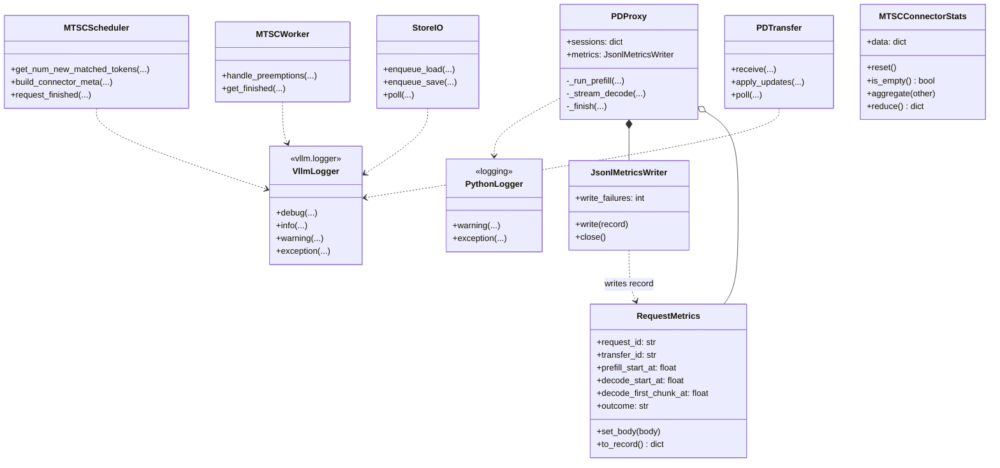
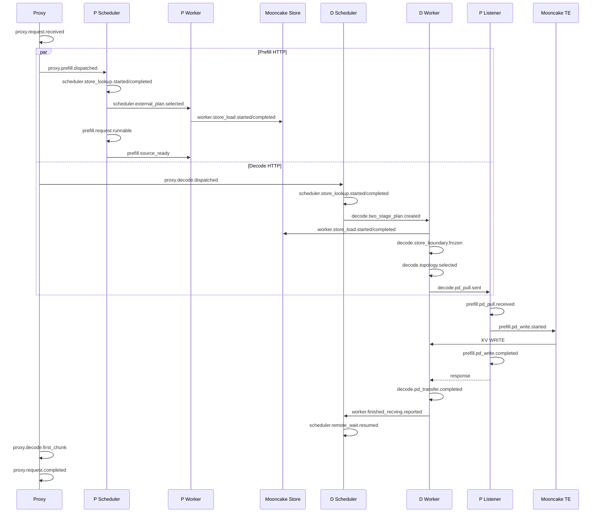

# MTSC Log Trace 设计

> 上位文档：[S00-整体设计](./S00-整体设计.md)  
> Proxy 设计：[S01-proxy设计](./S01-proxy设计.md)  
> Prefill 设计：[S02-prefill设计](./S02-prefill设计.md)  
> Decode 设计：[S03-decode设计](./S03-decode设计.md)  
> 参考实现：`HiSchedule/hischedule-integration/cache_connector/ucs_flow_logging.py`

## 1. 背景

### 1.1 问题

MTSC 的一个请求会跨越多个异步执行主体：

```text
Proxy
  -> P scheduler
  -> P TP/PP workers
  -> P Store load/save threads
  -> P listener and TE sender threads

Proxy
  -> D scheduler
  -> D TP/PP workers
  -> D Store load/save threads
  -> D bootstrap client and PD receiver loop
```

同一个 `transfer_id` 下，P/D HTTP 请求并发执行；Store lookup、Store GET、Prefill compute、D pull metadata、P source ready 和 TE WRITE 也可能交错发生。仅依靠普通的自由文本日志很难回答：

- 某个 request 当前停在哪个状态；
- Store lookup 是 miss、pending 还是失败；
- D 的 `L/H/A/T` 分别是多少；
- D 是否已经进入 `WAITING_FOR_REMOTE_KVS`；
- Store GET 完成后为什么没有开始 PD transfer；
- D 找到了哪些 P workers，等待哪一个 TP/PP response；
- P 是在等待 D pull，还是 D 在等待 P source ready；
- blocks 为什么仍然 pinned；
- latency 消耗在 queue、Store、bootstrap、等待 P 还是 TE WRITE；
- warning 属于哪个 request、transfer、engine 和 rank。

因此需要一套轻量、稳定、可关联的生命周期日志。它参考 UCS `FlowContext + flow_info + flow_warning` 的边界设计，但 MTSC MVP 只提供两种模式：

```text
off
trace
```

### 1.2 目标

Log Trace 需要满足：

1. 使用 `request_id + transfer_id` 串联 Proxy、P、D 的同一个逻辑请求；
2. 每条 worker 日志携带 engine、role、DP/TP/PP rank；
3. 对 Store lookup/load、PD transfer、async save 和 completion 提供成对打点；
4. 使用 monotonic clock 计算本进程 duration；
5. `trace` 模式输出 INFO 级生命周期事件；
6. `off` 模式关闭请求级 INFO trace，尽量降低热路径开销；
7. WARNING、ERROR 不受 mode 控制，在 `off` 模式下仍然输出；
8. 日志失败不得影响 inference、KV transfer 或 block cleanup；
9. 不记录 prompt/messages、生成文本、Authorization、原始 token IDs 和 GPU 虚拟地址；
10. 事件名、字段名和终态语义稳定，便于 grep、脚本分析和后续接入日志平台。

### 1.3 非目标

MVP 不实现：

- OpenTelemetry collector、span export 或第三方 tracing backend；
- 运行时按 request 动态打开 trace；
- trace sampling；
- Proxy 内部自动重试或 `attempt_id`；
- 使用日志代替 metrics；
- 依赖不同主机 wall clock 相减得到精确网络耗时；
- 在日志中完整打印 block IDs、block hashes、TE addresses 或 Store keys。

S01 中的 Proxy Request Metrics JSONL 仍负责“一请求一条”的终态摘要。`MTSC_FLOW` 是多事件生命周期流，两者关系为：

```text
Proxy Request Metrics
  -> stable per-request summary
  -> exactly one finalized record per Proxy request

MTSC_FLOW
  -> distributed lifecycle events
  -> multiple records per request and per worker
  -> used for diagnosis and timing breakdown
```

### 1.4 模式语义

配置项：

```json
{
  "mtsc_flow_log_mode": "off"
}
```

也可以由环境变量统一覆盖：

```text
MTSC_FLOW_LOG_MODE=off|trace
```

优先级：

```text
kv_connector_extra_config.mtsc_flow_log_mode
  > MTSC_FLOW_LOG_MODE
  > off
```

mode 在进程启动时解析并固定，非法值使进程启动失败，不在热路径动态读取环境变量。

```text
mode=trace
  -> lifecycle INFO enabled
  -> WARNING enabled
  -> ERROR enabled

mode=off
  -> lifecycle INFO disabled
  -> WARNING enabled
  -> ERROR enabled
```

普通的服务启动 INFO、配置 INFO 和 vLLM 自身日志不由该 mode 管理；mode 只控制 `MTSC_FLOW` 请求级 INFO 事件。

## 2. 日志数据结构

### 2.1 当前代码中的日志与 metrics 对象



该图描述当前代码，而不是 S04 的目标态：connector 路径目前通过模块级 `vllm.logger` 直接打关键 INFO/WARNING/exception；Proxy 使用标准 `logging`，并已通过 `RequestMetrics + JsonlMetricsWriter` 输出每请求 JSONL。`MTSCConnectorStats` 已定义，但 `MTSCConnector.get_kv_connector_stats()` 当前仍返回 `None`，尚未接入运行路径。

`FlowMode`、`TraceContext`、`TraceEvent`、`RequestTraceState` 和 `FlowLogger` 尚未实现，因此不再作为当前核心类出现在类图中。后续实现 S04 时，这些对象仍可作为目标抽象：`TraceContext` 应是异步 task 可安全复制的不可变 correlation context，`RequestTraceState` 只保存时间点和 once guard，不参与 vLLM 调度状态机。

### 2.2 公共字段

所有 `MTSC_FLOW` 事件使用以下公共字段：

```json
{
  "schema_version": 1,
  "record_type": "mtsc_flow",
  "timestamp_utc": "2026-09-21T12:00:00.123456Z",
  "event_seq": 1024,
  "level": "INFO",
  "event": "worker.store_load.completed",
  "component": "d_worker",
  "role": "decode",
  "request_id": "<d-request-id>",
  "transfer_id": "xfer-<request-id>",
  "engine_id": "<d-engine-id>",
  "dp_rank": 0,
  "tp_rank": 1,
  "pp_rank": 0,
  "pid": 12345,
  "status": "success",
  "reason": null,
  "elapsed_ms": 3.127
}
```

字段语义：

- `schema_version`：日志 schema 版本，字段语义不兼容时递增；
- `record_type`：固定为 `mtsc_flow`；
- `timestamp_utc`：事件 wall-clock 时间，只用于跨进程粗粒度排序；
- `event_seq`：进程内单调递增序号，用于恢复同一进程事件顺序；
- `level`：`INFO`、`WARNING` 或 `ERROR`；
- `event`：稳定的生命周期事件名；
- `component`：`proxy`、`p_scheduler`、`p_worker`、`d_scheduler`、`d_worker`、`store_thread`、`pd_listener` 等；
- `role`：`proxy`、`prefill` 或 `decode`；
- `request_id`：当前进程内的 vLLM/Proxy request ID；
- `transfer_id`：P/D 共享的 correlation ID，是跨进程关联主键；
- `engine_id`：P 或 D engine identity；
- `dp_rank/tp_rank/pp_rank`：当前事件产生者的并行 rank；
- `pid`：进程 ID，便于区分同 host 上的 scheduler/worker；
- `status`：事件结果；
- `reason`：失败、跳过或 fallback 原因；
- `elapsed_ms`：与该 completed event 对应的本进程 started event 的 monotonic duration。

未知字段统一输出 `-` 或 `null`，不因为某一层拿不到 engine/rank 而改变 schema。

MTSC 不增加 `attempt_id`。Proxy 不重试；客户端重试会产生新的 `request_id/transfer_id`。

### 2.3 请求关键字段

根据事件类型增加以下字段。

请求规模：

```json
{
  "model": "<model-id>",
  "prompt_tokens": 512,
  "max_tokens": 128,
  "stream": true,
  "computed_tokens": 64,
  "external_tokens": 448
}
```

两阶段边界：

```json
{
  "local_prefix_tokens": 64,
  "store_candidate_tokens": 256,
  "actual_store_tokens": 240,
  "target_external_tokens": 512
}
```

对应简写关系：

```text
L = local_prefix_tokens
H = store_candidate_tokens
A = actual_store_tokens
T = target_external_tokens
```

KV 规模：

```json
{
  "logical_blocks": 28,
  "physical_blocks": 56,
  "kv_groups": 2,
  "bytes": 117440512,
  "failed_blocks": 0,
  "invalid_blocks": 0
}
```

拓扑：

```json
{
  "p_tp_size": 2,
  "d_tp_size": 4,
  "p_pp_size": 1,
  "d_pp_size": 1,
  "is_mla": false,
  "target_p_tp_ranks": [0],
  "target_p_pp_ranks": [0],
  "required_targets": 1,
  "completed_targets": 1,
  "topology_signature": "<short-signature>"
}
```

Store：

```json
{
  "backend": "mooncake_store",
  "operation": "lookup|get|put",
  "keys": 12,
  "queue_depth": 3,
  "queue_wait_ms": 0.417,
  "io_ms": 2.831,
  "selection": "store|pd|local"
}
```

PD transfer：

```json
{
  "p_engine_id": "<p-engine-id>",
  "p_tp_rank": 0,
  "p_pp_rank": 0,
  "d_tp_rank": 1,
  "d_pp_rank": 0,
  "descriptors": 96,
  "blocks": 14,
  "bytes": 58720256,
  "zero_length": false
}
```

大数组不直接写日志：

- block IDs 记录 count、min/max 和稳定 digest；
- block hashes 记录 count 和 digest；
- Store keys 记录 count 和 namespace digest；
- target ranks 数量小时可记录 rank list，超过上限时只记录 count 和 digest；
- error message 截断到配置长度，默认 512 characters。

### 2.4 状态和结果枚举

`status` 使用稳定值：

```text
started
pending
success
miss
partial_failure
failed
timeout
cancelled
aborted
skipped
stale
no_op
fallback
```

状态转换事件可以增加：

```json
{
  "state_from": "STORE_LOADING",
  "state_to": "PD_CONNECTING"
}
```

`reason` 使用稳定 machine-readable token，例如：

```text
store_lookup_error
store_topology_mismatch
store_get_partial_failure
bootstrap_engine_not_found
tp_ratio_unsupported
pp_layer_uncovered
prefill_source_timeout
te_write_failed
completion_rank_missing
save_queue_full
request_cancelled
shutdown
```

自由文本异常放在 `error_message`，不能用自由文本替代稳定 `reason`。

### 2.5 输出格式

参考 UCS，实际日志采用单行、可 grep 的稳定 key-value 格式：

```text
MTSC_FLOW schema=1 ts=2026-09-21T12:00:00.123456Z seq=1024 level=INFO event=worker.store_load.completed component=d_worker role=decode req=d-123 transfer=xfer-123 engine=d0 dp_rank=0 tp_rank=1 pp_rank=0 status=success blocks=12 bytes=117440512 elapsed_ms=3.127 L=64 H=256 A=256 T=512
```

字段顺序固定：

```text
schema ts seq level event component role
req transfer engine dp_rank tp_rank pp_rank pid
stage state_from state_to backend operation
blocks bytes status reason elapsed_ms
remaining event-specific fields sorted by key
```

value 中的空白、换行和控制字符统一转义或规范化为单 token，避免一条事件拆成多行。`elapsed_ms` 固定保留三位小数。

WARNING 示例，即使 `mode=off` 也必须输出：

```text
MTSC_FLOW schema=1 level=WARNING event=decode.pd_transfer.completed component=d_worker role=decode req=d-123 transfer=xfer-123 engine=d0 tp_rank=1 pp_rank=0 status=timeout reason=prefill_source_timeout elapsed_ms=30000.114
```

### 2.6 Trace API

建议实现独立的 `mtsc_flow_logging.py`，不依赖 vLLM Request/Scheduler 具体类：

```python
class FlowMode(str, Enum):
    OFF = "off"
    TRACE = "trace"


def trace_enabled() -> bool:
    ...


def flow_trace(logger, event, context=None, **fields):
    ...


def flow_trace_lazy(logger, event, builder):
    ...


def flow_warning(logger, event, context=None, **fields):
    ...


def flow_error(logger, event, context=None, **fields):
    ...
```

行为约束：

- `flow_trace()` 和 `flow_trace_lazy()` 受 `trace` gate 控制；
- `flow_warning()` 和 `flow_error()` 不检查 trace mode；
- 关闭 trace 时，`flow_trace_lazy()` 不构造 context、不计算 digest、不遍历 blocks；
- formatter 和 logger 异常不得向 inference path 抛出；
- warning formatter 失败时必须 fallback 到普通 `logger.warning()`，不能静默吞掉 warning；
- error formatter 失败时必须 fallback 到普通 `logger.error()`；
- mode 是 process-local startup value，不为每条日志加锁。

调用方式：

```python
if trace_enabled():
    flow_trace(
        logger,
        "worker.store_load.completed",
        context,
        status="success",
        blocks=loaded_blocks,
        elapsed_ms=timer.elapsed_ms(),
    )
```

需要构造较重字段时使用 lazy API：

```python
flow_trace_lazy(
    logger,
    "decode.topology.selected",
    lambda: (
        context,
        build_topology_trace_fields(plan),
    ),
)
```

### 2.7 计时模型

每个异步 operation 的 owner state 保存 monotonic timestamps：

```json
{
  "created_ns": 0,
  "lookup_started_ns": 0,
  "lookup_finished_ns": 0,
  "store_queued_ns": 0,
  "store_started_ns": 0,
  "store_finished_ns": 0,
  "pd_started_ns": 0,
  "pd_finished_ns": 0,
  "save_queued_ns": 0,
  "save_started_ns": 0,
  "save_finished_ns": 0
}
```

所有 duration 使用：

```text
time.monotonic_ns()
```

计算：

```text
lookup_ms       = lookup_finished - lookup_started
store_queue_ms  = store_started - store_queued
store_io_ms     = store_finished - store_started
pd_wait_ms      = pd_finished - pd_started
save_queue_ms   = save_started - save_queued
save_io_ms      = save_finished - save_started
```

wall clock 只用于日志排序。不得使用：

```text
D wall_time - P wall_time
```

计算精确的跨主机 TE duration。P 记录自己的 `batch_transfer_sync_write()` duration，D 记录从发送 metadata 到收到 terminal response 的 duration，两者语义不同，字段分别命名为：

```text
p_te_write_ms
d_pd_roundtrip_ms
```

started 和 completed 必须由同一 state owner 计算。后台 thread 不从全局 map 猜测 start time；task 创建时将 context 和 start timestamp 一并传入。

### 2.8 Exactly-once 与日志降噪

关键终态事件使用 once guard：

```text
request.completed
store_lookup.completed
store_load.completed
pd_transfer.completed
store_save.completed
finished_recving.reported
finished_sending.reported
```

重复 callback、延迟 response 或多次 `get_finished()` 不能重复输出成功终态。延迟消息可以输出一次：

```text
status=stale reason=terminal_session
```

以下热循环不逐次打日志：

- scheduler 对 lookup pending request 的每次 retry；
- 每次空的 `get_finished()` poll；
- P listener 等待 source ready 的每次 event-loop tick；
- D 等待所有 target responses 的每次 poll；
- save/load queue 的每次空 dequeue。

只记录：

- 首次进入 pending；
- 状态发生变化；
- 终态；
- 超过 slow threshold；
- 必要时首次和每 N 次 sampled polling。

## 3. 需要插入的生命周期

### 3.1 全局请求时序



事件只声明当前组件能够真实观察到的事实。例如 Connector 不能精确观察 model kernel 的 Prefill 开始时间，因此记录 `prefill.request.runnable` 和 `prefill.source_ready`，不伪造 `prefill.compute.started`。

### 3.2 Proxy 生命周期

Proxy 创建 `request_id/transfer_id` 后立即建立 `TraceContext`。

插入事件：

```text
proxy.request.received
proxy.request.validated
proxy.route.selected
proxy.prefill.dispatched
proxy.decode.dispatched
proxy.prefill.completed
proxy.decode.headers_received
proxy.decode.first_chunk
proxy.decode.completed
proxy.request.completed
```

`proxy.request.received` 关键字段：

```json
{
  "endpoint": "/v1/completions",
  "model": "<model>",
  "stream": true,
  "max_tokens": 128,
  "prompt_tokens": 512
}
```

`proxy.route.selected` 关键字段：

```json
{
  "p_engine_id": "<p-engine-id>",
  "p_endpoint": "<normalized-endpoint>",
  "d_engine_id": "<d-engine-id>",
  "d_endpoint": "<normalized-endpoint>"
}
```

`proxy.prefill.completed` 和 `proxy.decode.completed` 包含各自 HTTP status、outcome 和 duration。`proxy.decode.first_chunk` 包含 Proxy 可观测 TTFT。

`proxy.request.completed` 与 S01 JSONL record 使用同一个 finalize once guard，包含：

```text
prefill_duration_ms
decode_headers_latency_ms
decode_ttft_ms
decode_duration_ms
total_duration_ms
outcome
```

以下情况使用 WARNING/ERROR，mode=off 仍输出：

```text
proxy.request.rejected
proxy.prefill.failed
proxy.decode.failed
proxy.client.cancelled
proxy.metrics_write.failed
```

### 3.3 Scheduler 公共生命周期

P/D scheduler 共用事件名，通过 `role` 区分。

插入位置：

1. request 首次进入 Connector；
2. `get_num_new_matched_tokens()` 首次发起 lookup；
3. lookup 从 pending 进入 terminal；
4. external tokens 决策完成；
5. `update_state_after_alloc()` 绑定 blocks；
6. `build_connector_meta()` 首次发布 request delta；
7. request 进入 `WAITING_FOR_REMOTE_KVS`；
8. `finished_recving` 被 scheduler core 消费；
9. `request_finished()`；
10. blocks 立即释放或延迟释放。

事件：

```text
scheduler.request.admitted
scheduler.store_lookup.started
scheduler.store_lookup.deferred
scheduler.store_lookup.completed
scheduler.external_plan.selected
scheduler.blocks.allocated
scheduler.metadata.published
scheduler.remote_wait.entered
scheduler.remote_wait.resumed
scheduler.request.finished
scheduler.blocks.release_delayed
scheduler.blocks.released
```

`scheduler.store_lookup.deferred` 只在第一次返回 `(None, False)` 时记录，不在每轮 retry 重复记录。

P 的 `scheduler.external_plan.selected` 记录：

```text
local computed tokens
Store hit tokens
tokens requiring Prefill compute
PD placeholder required
```

D 的 `scheduler.external_plan.selected` 记录：

```text
L
H
T
external_tokens = T - L
Store topology compatible
PD required
```

`scheduler.remote_wait.resumed` 必须在 worker completion 已聚合到全部 required workers 后记录，而不是任意一个 TP worker完成时记录。

异常事件：

```text
scheduler.store_lookup.failed
scheduler.metadata.rejected
scheduler.remote_wait.fallback
scheduler.completion.invariant_failed
```

### 3.4 Store lookup 生命周期

Store lookup 横跨 scheduler `LookupKeyClient` 和 worker rank 0 `LookupKeyServer`。两端分别计时，避免把 IPC queue wait 混入 Store backend latency。

Scheduler client：

```text
scheduler.store_lookup.started
scheduler.store_lookup.deferred
scheduler.store_lookup.completed
```

Worker lookup server：

```text
worker.store_lookup.received
worker.store_lookup.backend_started
worker.store_lookup.backend_completed
worker.store_lookup.responded
```

关键字段：

```text
query_blocks
required_namespaces
matched_blocks
matched_tokens
store_topology_signature
lookup_async
elapsed_ms
```

lookup miss 是 `INFO status=miss`，不是 warning。以下情况是 WARNING：

```text
Store RPC exception
response malformed
topology signature mismatch
future cancelled unexpectedly
lookup timeout
```

Store topology mismatch 对当前 inference 的行为是 fallback 到 PD，但 warning 仍需要暴露：

```text
event=worker.store_lookup.completed
status=fallback
reason=store_topology_mismatch
matched_tokens=0
```

### 3.5 Store load 生命周期

P/D Store load 使用相同事件，通过 `role` 和 D 的 `L/H/A/T` 字段区分。

插入事件：

```text
worker.store_load.queued
worker.store_load.started
worker.store_load.backend_submitted
worker.store_load.completed
worker.store_load.errors_reported
```

`queued` 在 `get_finished()` 将 request 首次放入 recv queue 时记录；`started` 在 recv thread 实际 dequeue 时记录，因此可以计算 `queue_wait_ms`。

`completed` 记录：

```text
requested keys/blocks/bytes
loaded keys/blocks/bytes
failed keys/blocks
queue_wait_ms
io_ms
elapsed_ms from queued to terminal
```

D 额外记录：

```text
decode.store_boundary.frozen
```

字段包含 `L/H/A/T`。即使 Store 全成功，也必须记录 `A=H`；部分失败时记录首个 invalid logical block 和 `A<H`。

Store GET completion 不能记录 `finished_recving`。D 必须继续记录：

```text
state_from=STORE_LOADING
state_to=PD_CONNECTING
```

只有整个 PD stage terminal 后才能产生 request-level `finished_recving`。

以下情况为 WARNING：

```text
batch_get exception
partial key failure
invalid replica/object descriptor
destination block invalid
disk staging budget exceeded
Store timeout
```

### 3.6 P 侧 Prefill 与 PD WRITE 生命周期

P scheduler/worker 插入事件：

```text
prefill.pd_placeholder.registered
prefill.request.runnable
prefill.source_ready
prefill.pd_pull.received
prefill.pd_wait.started
prefill.pd_wait.completed
prefill.pd_write.started
prefill.pd_write.completed
prefill.pd_response.sent
prefill.finished_sending.reported
```

两个异步条件分别记录：

```text
d_pull_received
p_source_ready
```

`prefill.pd_wait.started` 的 `waiting_for` 取值：

```text
d_pull
p_source_ready
```

如果 D pull 先到，P listener 记录 `waiting_for=p_source_ready`；如果 P source ready 先到，P request state 记录 `waiting_for=d_pull`。

`prefill.source_ready` 在 `request_finished()` 捕获 source block IDs，并且 metadata 已成功同步到 worker 后记录。不能在 Prefill request 仅仅 runnable 时提前记录。

`prefill.pd_write.started/completed` 在真正调用 `batch_transfer_sync_write()` 的线程中记录，字段包含：

```text
remote D endpoint digest
P/D TP/PP ranks
blocks
descriptors
bytes
zero_length
p_te_write_ms
```

零长度 handshake 使用相同事件：

```text
zero_length=true
blocks=0
bytes=0
status=success
```

P 的 block-free 生命周期：

```text
request_finished
  -> blocks.release_delayed
  -> wait PD terminal and Store save terminal
  -> prefill.finished_sending.reported
  -> blocks.released
```

以下情况为 WARNING/ERROR：

```text
pull metadata invalid
transfer_id not found
source ready timeout
topology mismatch
region alignment mismatch
TE WRITE failure
response send failure
session expired
```

### 3.7 D 侧两阶段加载和 topology 生命周期

D worker 在 Store terminal 后插入：

```text
decode.store_boundary.frozen
decode.bootstrap.query_started
decode.bootstrap.query_completed
decode.topology.selected
decode.pd_pull.queued
decode.pd_pull.sent
decode.pd_target.completed
decode.pd_transfer.completed
decode.coverage.validated
decode.finished_recving.reported
```

`decode.bootstrap.query_completed` 记录：

```text
p_engine_id
p_tp_size
p_pp_size
registered_workers
cache_hit for bootstrap directory cache
elapsed_ms
```

`decode.topology.selected` 记录：

```text
local D TP/PP rank
target P TP ranks
target P PP ranks
required target count
is_mla
replicated sender policy
suffix blocks and bytes
```

每个 P target terminal 时产生一条 `decode.pd_target.completed`，携带 P rank、status 和 target duration。request 聚合终态只产生一条：

```text
decode.pd_transfer.completed
```

它记录：

```text
required_targets
completed_targets
successful_targets
failed_targets
d_pd_roundtrip_ms
```

`decode.coverage.validated` 记录 local/Store/PD 分别覆盖的 blocks 以及首个 uncovered block。只有 coverage 成功或已经形成 invalid-block fallback 后，才能记录 `decode.finished_recving.reported`。

以下情况为 WARNING/ERROR：

```text
bootstrap engine missing
bootstrap rank registration incomplete
TP ratio unsupported
PP layer uncovered or duplicated
MLA configuration mismatch
P target response timeout
P response malformed
TE remote failure
coverage gap
completion rank missing
```

Store 全命中时仍记录完整 PD control 生命周期：

```text
decode.pd_pull.sent zero_length=true
decode.pd_transfer.completed blocks=0 bytes=0
```

### 3.8 Async save 生命周期

P/D async save 共用事件：

```text
worker.store_save.eligible
worker.store_save.queued
worker.store_save.started
worker.store_save.cuda_ready
worker.store_save.backend_submitted
worker.store_save.completed
worker.finished_sending.reported
```

关键字段：

```text
newly_computed_blocks
skipped_loaded_blocks
keys
bytes
queue_depth
queue_wait_ms
cuda_wait_ms
io_ms
status
```

正常 dedup hit 可以记录 `status=no_op`。save queue 过载导致 skip 时，inference 可以继续，但必须输出 WARNING：

```text
event=worker.store_save.completed
status=skipped
reason=save_queue_full
```

save 失败不改变当前 inference 结果，但必须进入 terminal 并解除 block pin。日志中同时记录 `worker.finished_sending.reported`，用于确认 cleanup 没有被失败路径阻塞。

### 3.9 Completion、取消和清理生命周期

completion 插入事件：

```text
worker.finished_recving.reported
worker.finished_sending.reported
aggregator.finished_recving.completed
aggregator.finished_sending.completed
scheduler.remote_wait.resumed
scheduler.blocks.released
```

worker 事件是 rank-local；aggregator 事件是所有 required workers 聚合后的 request-level completion。两者不能使用相同语义。

取消和终止事件：

```text
request.cancel.received
request.abort.started
request.abort.completed
request.timeout
request.session.expired
request.stale_message.discarded
connector.shutdown.started
connector.shutdown.completed
```

`request.abort.completed` 记录仍存在的资源数量：

```text
pending_store_tasks
pending_pd_targets
pinned_blocks
lookup_futures
```

非零残留使用 WARNING。shutdown 超过 drain timeout 后强制取消任务使用 ERROR，并输出未清理 request/transfer IDs 的 count 和 digest，不打印无限长列表。

### 3.10 Slow operation warning

即使最终成功，超过阈值的 operation 也输出 WARNING，并且不受 mode 控制：

```json
{
  "store_lookup_slow_ms": 100.0,
  "store_load_slow_ms": 500.0,
  "bootstrap_slow_ms": 100.0,
  "pd_transfer_slow_ms": 1000.0,
  "save_slow_ms": 1000.0,
  "remote_wait_slow_ms": 2000.0
}
```

示例：

```text
MTSC_FLOW level=WARNING event=worker.store_load.slow req=d-123 transfer=xfer-123 status=success elapsed_ms=712.335 threshold_ms=500.000
```

slow warning 和 completed trace 可以同时出现：

- `trace` 模式：先 completed INFO，再 slow WARNING；
- `off` 模式：只出现 slow WARNING。

每个 operation 只输出一次 slow warning，避免轮询期间重复刷屏。

### 3.11 验证要求

日志实现至少验证：

- `off` 模式不输出任何请求级 INFO `MTSC_FLOW`；
- `off` 模式仍输出 Store、topology、TE、timeout 和 cleanup WARNING/ERROR；
- `trace` 模式输出 Proxy、scheduler、worker、Store、PD 和 save 的关键状态转换；
- P/D 日志共享同一个 `transfer_id`；
- 每个 worker 日志包含正确的 DP/TP/PP rank；
- lookup pending 不会每个 scheduler step 重复刷日志；
- 多次 `get_finished()` 不会重复输出 terminal event；
- `elapsed_ms` 来自 monotonic clock，系统 wall clock 回调不会产生负值；
- P 的 `p_te_write_ms` 与 D 的 `d_pd_roundtrip_ms` 不混为一个指标；
- Store completion 不会被错误记录为 D request `finished_recving`；
- async save 失败仍记录 terminal 和 blocks release；
- formatter 异常不影响请求执行；
- warning formatter 异常会 fallback 到普通 warning，而不是静默丢失；
- 日志不包含 prompt、messages、生成文本、Authorization、完整 token IDs、GPU raw addresses；
- Proxy JSONL metrics 与 `proxy.request.completed` 使用同一 finalize once guard；
- cancel、timeout 和 shutdown 后可以从日志确认 session、future、queue task 和 pinned blocks 已归零。
