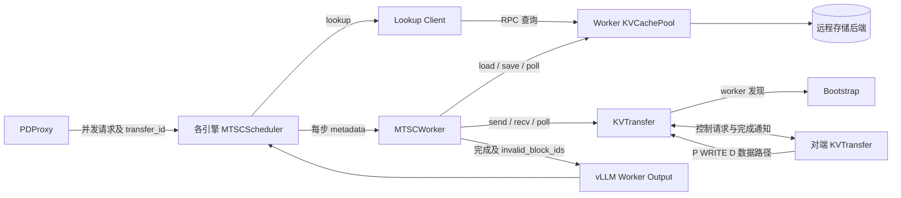
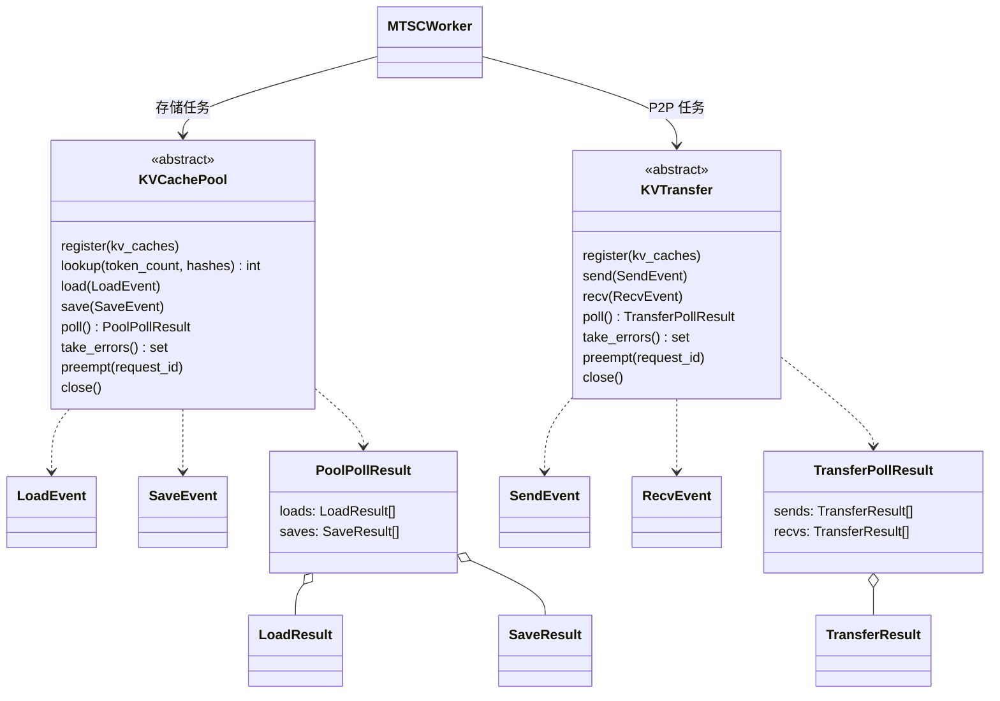
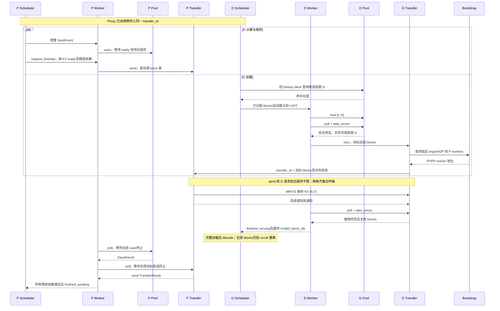

# MTSC KVCachePool 与 KVTransfer 设计

> 上位文档：[S00-整体设计](./S00-整体设计.md)  
> 接口草稿：[draft_design.py](../../mtsc/draft_design.py)

本文定义外部 KV 能力的抽象契约；现有 `StoreIO`、`PDTransfer` 是落地参考，尚未改为这些 ABC 的实现。实现差异见第 4、5 节。

## 1. 背景

MTSC 已通过 scheduler/worker 串联远程缓存和 P-D 直传：D 先加载远程缓存的命中前缀，再请求 P 补齐剩余 KV；P、D 均可保存计算产生的 KV。目前两条路径直接依赖 Mooncake Store 和 Transfer Engine，接口中还混合了存储任务完成与 request 结束后的 block 释放逻辑。

在保留现有两阶段加载、增量保存和安全回收行为的前提下，需要把 external 能力拆成两个独立接口：

- `KVCachePool`：远程 KV 缓存的包装层，后端可选 Mooncake Store、MongoDB、FileSystem 等。
- `KVTransfer`：worker 间已有 KV 的直接传输，当前采用 D 发起请求、P WRITE D。

目标是：接口只传必要元数据，不复制 KV tensor；调用方不维护 task ID 映射；队列、线程、Future 和底层 I/O 由实现选择。request 调度、block 分配和最终释放仍由 Connector 与 vLLM 管理。

## 2. 总体设计

### 2.1 核心特性

1. **存储与传输分离**：Pool 不处理 P-D 路由，Transfer 不处理缓存命中和持久化。
2. **按 request 管理**：结果直接携带本地 `request_id`；`transfer_id` 只用于跨 P/D 匹配。
3. **异步提交、非阻塞轮询**：load/save/send/recv 返回 `None`，通过 `poll()` 收取结果，即时完成也走同一通道。
4. **增量 save 合并**：同一 request 可多次保存，合并安全的 pending 范围，减少排队任务和存储调用。
5. **完成与成功分离**：失败也必须等相关内存访问停止后才报告完成；无效目标 block 单独上报。
6. **单写者与安全回收**：Pool load 终止后才启动 P WRITE；最终 block 释放需要满足 request 的所有依赖。

### 2.2 架构设计



图中 Worker/Transfer 节点代表本地与对端实例，实际 KV 数据方向固定为 P 到 D。scheduler 的查询通过轻量 lookup client 访问 worker Pool，不在 scheduler 初始化完整的 GPU I/O 对象。

### 2.3 组件职责

| 组件 | 职责 |
|---|---|
| `PDProxy` | 选择 P/D，向两侧传入同一 `transfer_id`，向 D 提供 P 的 bootstrap、engine 和 DP 身份 |
| `MTSCConnector` | 适配 vLLM hooks，将 scheduler/worker 的完成和错误状态接入 vLLM |
| `MTSCScheduler` | 查询可用前缀，绑定分配的 blocks，生成增量 metadata，决定 request 结束时的释放依赖 |
| Lookup Client | 包装查询 RPC 与可选的异步等待，隔离 scheduler 和 worker 的进程边界 |
| `MTSCWorker` | 编排 Pool-first 两阶段加载，收取结果，处理 fallback，聚合 request 的 block 释放条件 |
| `KVCachePool` | 注册本地 KV 内存，查询远程缓存，执行 load/save，管理 pending 合并及存储任务的安全终态 |
| `KVTransfer` | 注册传输内存与 endpoint，发现 P workers，匹配 send/recv，校验布局与覆盖，执行直传 |

### 2.4 类图



事件和结果均为简单 dataclass；后端实现继承相应 ABC。传输状态机与 Future 不对调用方暴露。

### 2.5 核心方法

| 方法 | 核心行为 |
|---|---|
| `register()` | 注册本地 KV tensor；group、layout、topology 等静态信息由后端初始化配置提供 |
| Pool `lookup()` | 只查询远程可用前缀，不分配 block、不搬运数据 |
| Pool `load()` | 将指定 token 范围加载到已分配 block，通常每个 allocation 生命周期一个逻辑任务 |
| Pool `save()` | 接收增量保存范围，同 request 的 pending 工作在安全条件下合并 |
| Transfer `send()` | P 发布已经 ready 的源 block 表，等待 D 请求后发送 |
| Transfer `recv()` | D 发现目标 P workers，提交目标 block 表，等待 P 写入和终态通知 |
| `poll()` / `take_errors()` | 收取安全终态与无效目标 block；Worker 决定 fallback 或最终上报 |
| `preempt()` / `close()` | 停止或等待相关 I/O，内存访问终止后才允许复用 block 或释放资源 |

### 2.6 E2E 时序图



P、D 均可独立 lookup/load/save。图中突出 D 两阶段加载和 P 源 block 释放；D decode 期间的增量 save 复用同一 Pool 协议。

## 3. 详细设计

### 3.1 数据契约

`BlockIds = tuple[tuple[int, ...], ...]`：外层按 KV group 排列，内层是有序的本地物理 block ID。事件使用不可变元数据快照，KV tensor 在注册后保持有效。

| 结构 | 必要字段与含义 |
|---|---|
| `LoadEvent` | `request_id`、完整 `block_ids` / `block_hashes`、token 范围 `[start_load,end_load)` |
| `SaveEvent` | `request_id`、完整 `block_ids` / `block_hashes`、token 范围 `[start_save,end_save)`、可选 `ready_event` |
| `LoadResult` | `request_id`、实际可用前缀终点 `loaded_tokens`、可选 `error` |
| `SaveResult` | `request_id`、本轮聚合保存的可选 `error` |
| `SendEvent` | 本地 `request_id`、跨侧 `transfer_id`、完整源 `block_ids` |
| `RecvEvent` | 本地 `request_id`、`transfer_id`、仅待接收的目标 `block_ids`、`bootstrap_addr`、`remote_engine_id`、`remote_dp_rank` |
| `TransferResult` | 本地 `request_id`、可选 `error`；由 sends/recvs 列表区分方向 |

Pool 根据 block hash 和静态布局配置生成存储 key；Transfer 不传 block hash，直接根据会话和物理 block 定位数据。`request_id` 不能在旧任务、结果或 block 错误尚未清理时复用。

### 3.2 Lookup 与单次 Load

`lookup(token_count, hashes) -> int` 返回远程可用的逻辑前缀长度，miss 返回 0，后端异常抛出。scheduler 侧的 client 可异步包装查询，并将查询失败按 miss 降级。lookup 结果是候选值，不能保证数据在 load 时仍存在。

一次 load 可以包含多个 group/chunk 子任务，推荐内部维护 `request_id -> load future`，由该 future 聚合全部子任务。`poll()` 必须等全部子任务终止，包括失败任务，保证不会继续写入目标内存，再返回一个 `LoadResult`。

Worker 根据实际终点 `A = loaded_tokens` 决定 PD 后缀，不能使用候选终点 H 提前启动 WRITE：

```text
0 <= L <= A <= H <= T
Pool load: [L,H)    实际可用前缀截至 A
P2P WRITE: [A,T)    覆盖剩余后缀及需要重写的 blocks
```

`loaded_tokens` 包含已有本地前缀 L；有效性按各 group 的缓存规则解释。加载失败 blocks 在同轮 `take_errors()` 收取，Worker 过滤被 PD 成功恢复的 blocks，只向 scheduler 上报最终无效部分。

### 3.3 增量 Save 与合并

同一 request 随 prefill/decode 进展可提交多个 save。推荐内部维护 `request_id -> save state`，包含 running 工作、pending events 和累计错误。常见连续范围只需一个 running 和一个合并后的 pending；不满足合并条件的快照保留独立工作。

```text
running: [0,64)
pending: [64,96) + [96,128) -> [64,128)
```

合并只修改 pending 元数据，不能改变执行中的快照。范围必须连续或重叠，最新 block/hash 表必须覆盖合并范围且保留原 token 到源 block 的对应关系；等待的 ready 信号必须覆盖全部源数据。不能跨抢占或 block 复用合并。只有完整且 ready 的缓存 chunk 被保存。

`SaveResult` 覆盖上一次结果收取后接受的全部 save。返回条件是 **所有相关工作终止、没有 pending event、没有源内存读取**，不能只检查现有 futures。较早的错误不能被后续成功覆盖；结果收取前新到达的 save 会扩展待完成工作，`poll()` 必须重新检查，避免返回过期完成状态。

request 继续运行时可多次收到 `SaveResult`，之后也可继续 save。Pool 不需要 `finish(request_id)`；request 结束与最终 block 释放由 Worker 聚合。

### 3.4 D 发起请求、P WRITE

1. P 在 KV 可被传输层安全读取后调用 `send()`，发布 ready 的完整源 block 表；此调用不等待接收方或 I/O。
2. D 调用 `recv()`，后端经 bootstrap 查找指定 engine/DP 的 workers，派生 TP/PP 配对及目标内存描述，发送控制请求。
3. P 等源发布与 D 请求齐备，按每组目标 block 数量，选取源表等长后缀执行 WRITE。
4. P 完成写入后通知 D；P 聚合全部预期目标的终态，D 聚合全部必要 worker 的响应与覆盖校验。

源和目标必须对应同一前缀终点，group/block 布局兼容；当前不支持任意中间区间。send 与 D 控制请求谁先到都可等待匹配。D 成功结果必须包含必要的本地布局转换与设备同步。目标为空时不搬运 KV，但仍需会话确认，使 P 能结束源会话；这一已有行为需在后端适配时保留。

### 3.5 完成、错误与 Block 生命周期

`poll()` 非阻塞且结果只收取一次；终态表示内存访问已停止，成功与否由结果判断。`take_errors()` 非阻塞取出并清空已轮询失败的物理目标 block ID。它只处理 load/recv 的无效目标，不因 save/send 失败而失效本地源 KV。

Worker 的 `_send` 表示 request 结束后的释放依赖，D 仅保存时也需要它。`_save_issued` 表示生成过保存工作，不等于当前正在执行 save。

```text
finished_sending = request 已结束
                  AND 所有已提交 save 终止（如需要）
                  AND P-D send 终止（如需要）
```

中间 `SaveResult` 只更新 Worker 的保存状态，不能直接进入最终 `finished_sending`。新 save 到达后重新标记保存未完成。request 结束时没有 outstanding save 的情况，也应利用已有状态完成释放判断。

`preempt()` 可以阻塞：取消 pending 工作，fence 无法安全取消的运行任务，清理未收取结果和错误后才允许复用 block。D 已发布目标内存时必须等待远端写停止；timeout、取消本地 Future 或忽略迟到响应均不能单独证明安全。`close()` 同样先 fence，再释放注册内存与后端资源。

## 4. 关键代码路径

| 功能 | 现有代码路径 | 接入新契约的变化 |
|---|---|---|
| vLLM hooks | [connector.py](../../mtsc/connector.py)：`register_kv_caches`、`get_finished`、`get_block_ids_with_load_errors` | 保持外部 hooks，由 Worker 消费 ABC 结果 |
| Lookup / 分配 | [scheduler.py](../../mtsc/scheduler.py)：`get_num_new_matched_tokens`、`update_state_after_alloc`；[store.py](../../mtsc/store.py)：`StoreLookupClient/Server` | 保留轻量查询 client，将服务端查询映射为 Pool `lookup` |
| 增量保存 | scheduler `_save` / `build_connector_meta` → worker `_accept_metadata` → StoreIO `enqueue_save` / `_save` | 分离 `SaveEvent`，在 Pool 内合并 pending 工作 |
| 两阶段加载 | [worker.py](../../mtsc/worker.py)：`get_finished`、`_actual_store_prefix`、`_suffix_blocks`、`_start_pd` | 使用 `LoadResult.loaded_tokens` 固化 A，再提交 `RecvEvent` |
| 源发布与直传 | scheduler `request_finished` → [pd.py](../../mtsc/pd.py)：`apply_updates`、`_serve`、`_write_one` | ready 源发布映射为 `send`；`receive` 映射为 `recv` |
| 完成聚合 | StoreIO `poll(finished_request_ids)` → worker `_aggregate_sends` → scheduler `update_connector_output` | 将 request-end gating 移至 Worker；中间保存结果不能直接透传 |
| 内存回收 | worker `handle_preemptions` → StoreIO `finish_preempted_loads/saves`、PDTransfer `finish_receives` | 由 ABC `preempt` / `close` 提供相应 fence 保证 |

当前 Store 为每个 request 保存一个 future 列表，直到 request 结束才上报保存完成，尚未合并 pending。当前 PD 使用 placeholder、ready/abort 更新和 request ID 完成集合；最小 send/recv 事件尚未替换这套协议。现有 Store load 后的 NPU 转换还调用 PD 方法，也需在独立后端适配时解耦。

## 5. TODO

- 落地 Mooncake Pool/Transfer adapter 与 backend 创建配置；保留 namespace、group mask、TP/PP 匹配和覆盖校验。
- 实现 save 合并及 Worker 保存状态聚合，覆盖结果未收取时新 save 到达、仅 D 保存、request 结束时已无在途保存等情况。
- 明确 Transfer 的抢占后恢复与永久取消：当前 P 抢占会保留早到的 D 等待者；需补足尚未 `send()` 的会话取消及迟到请求处理，不直接照搬 retire ID 的草稿语义。
- 完善 hybrid cache 的保存 metadata（当前 coordinator 使用 `prompt_tokens`）、token/chunk 对齐及占位 block 规则；将 NPU 布局转换抽取为共享能力，定义 Pool load 的可用布局保证。
- 为上述契约补充测试，包括多次 save 合并、错误累计、多子任务 fence、空 recv 握手、抢占和 shutdown；再验证一个 FileSystem 等替代后端。
